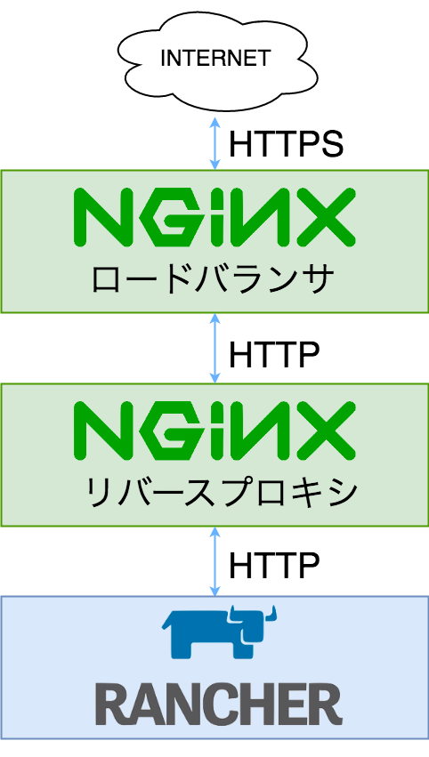

皆様のWebサーバのネットワーク構成はどのようになっていますか？
仮想マシンを多用する現在、リバースプロキシ/ロードバランサを使用していない構成はそう多くは亡いのではないのでしょうか。
その場合、一番最初にリクエストを受けるリバースプロキシ/ロードバランサはHTTPSでリクエストを受け、バックエンドとの通信はHTTPという構成もそう珍しくはありません。

今回、Rancher Serverをセットアップしたネットワークの構成は下図の様になっていました。


ロードバランサ役のnginxがHTTPSでリクエストを受けます。
証明書はLet's encryptを使用しており、ここでHTTPSを解きます。

ロードバランサは解いたリクエストをそのままリバースプロキシに投げます。リバースプロキシがリクエストURIに従い、さらにバックエンドサービスのサーバへとリクエストを送信します。

扨、[Rancherの公式ドキュメント](http://rancher.com/docs/rancher/latest/en/installing-rancher/installing-server/basic-ssl-config/)にを見ると、HTTPSで通信を行うセットアップの場合、nginx用設定のサンプルとして以下のような内容が示されています。

``` nginx
upstream rancher {
    server rancher-server:8080;
}

map $http_upgrade $connection_upgrade {
    default Upgrade;
    ''      close;
}

server {
    listen 443 ssl spdy;
    server_name <server>;
    ssl_certificate <cert_file>;
    ssl_certificate_key <key_file>;

    location / {
        proxy_set_header Host $host;
        proxy_set_header X-Forwarded-Proto $scheme;
        proxy_set_header X-Forwarded-Port $server_port;
        proxy_set_header X-Forwarded-For $proxy_add_x_forwarded_for;
        proxy_pass http://rancher;
        proxy_http_version 1.1;
        proxy_set_header Upgrade $http_upgrade;
        proxy_set_header Connection $connection_upgrade;
        # This allows the ability for the execute shell window to remain open for up to 15 minutes. Without this parameter, the default is 1 minute and will automatically close.
        proxy_read_timeout 900s;
    }
}

server {
    listen 80;
    server_name <server>;
    return 301 https://$server_name$request_uri;
}
```

今回これを参考にnginxの設定を行った結果、ハマってしまいました。

ポイントは18行目、以下の部分です。

``` nginx
proxy_set_header X-Forwarded-Proto $scheme;
```

これはリバースプロキシを行う場合のリクエストヘッダの設定で、**受けたリクエストのプロトコルをX-Forwarded-Protoに設定する**という内容です。
えぇ、見たままですね。

今回の構成の場合、ロードバランサはHTTPSを、リバースプロキシは**HTTP**を設定します。
つまり、rancherがリクエストを受け取った時点で、X-Forwarded-ProtoはHTTPに設定されているわけです。

Rancher Serverは、X-Forwarded-Protoを見てリンクのプロトコルを決定している様で、この場合RancherのUIのリンクがすべてHTTPで作成されることとなります。
ユーザはHTTPSでアクセスをしていますから、ブラウザは[混在アクティブコンテンツとしてブロック](https://support.mozilla.org/ja/kb/mixed-content-blocking-firefox)します。
これにより、RancherのUIは正常に動作しなくなり、最初に表示される画面とエラー画面以外に遷移できなくなります。

つまり、ホストの追加も、環境の追加も、もちろんカタログからアプリケーションの追加もできません。
何もできないのです。

これを避けるためには、リバースプロキシの設定で該当行を以下の様に設定します。

``` nginx
proxy_set_header X-Forwarded-Proto HTTPS;
```

あくまで常時SSLの場合にのみ有効ですが、これでRancherのUIも正常に動作するようになります。

