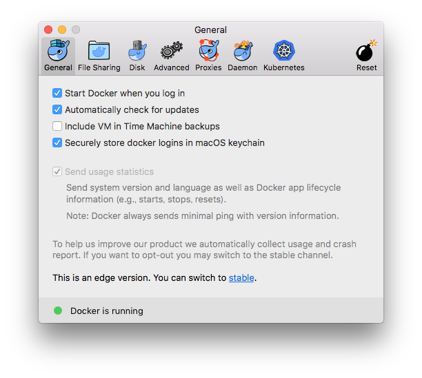
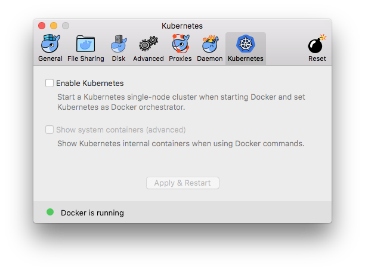
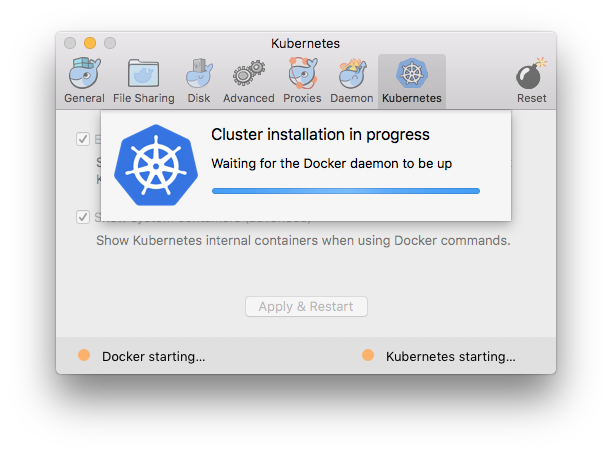
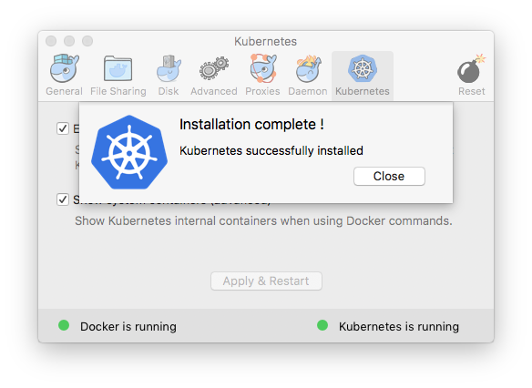
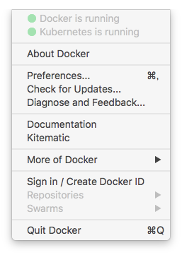
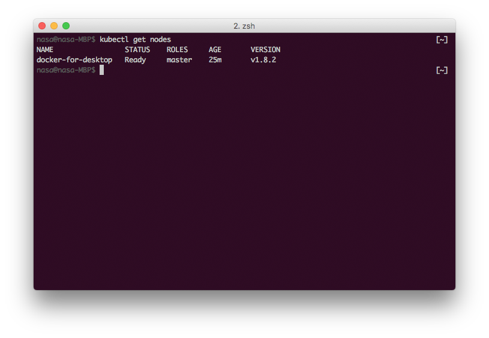

DockerCon EU 2017で、DockerがKubernetesを統合・サポートすると[発表されました](http://www.publickey1.jp/blog/17/dockerkubernetesdockercon_eu_2017.html)が、本日ついにKubernetesサポート版Docker for macが(Edgeリリースですが)リリースされました！

これにより、macを使用している場合は(おそらく過去最も簡単に)開発用Kubernetesクラスタを起動することができるようになりました！

この記事では、Docker for macでKubernetesを立ちあげる手順をまとめておきます。

## Kubernetesの起動手順
Docker for macのStable版を利用している場合、Edge版をインストールする必要があります。
[Install Docker for mac](https://docs.docker.com/docker-for-mac/install/)のページから、Edge Channelのインストーラをダウンロードし、インストールします。
Dockerを終了させておけば、Stable版を自分でアンインストールする必要はありません[^uninstall_stable]。
Edge版をインストールし、Dockerの設定画面を開くと、以下の様にKubernetesタブが追加されています！！



Kubernetesタブで、Kubernetesの有効化・無効化を簡単に切り替えることができます。



`Enable Kubernetes`にチェックを入れ(`Show system containers`はお好みで)、`Apply & Restart`ボタンを押すと、「Kubernetesの初回インストールは少し時間かかるけど、インストールする？」という確認画面が出るので、`Install`を押します。



一応プログレスバーが出るのですが、余り意味はありませんでした・・・
数分でインストールが終わります。



無事インストールが終了したら、`Close`を押したあと、設定画面を閉じます。

この時点で、DockerメニューにもKubernetesのステータスが表示されています。



今回私は`Show system containers`をオンにしたので、`docker ps`[^docker_ps]するとKubernetesの動作に必要なコンテナが起動しています。
DNS、API Server、Etcd、Scheduler、Proxyと最小限の構成ですね。

kubectlが自動でインストールされるのかどうかは・・・・わかりませんでした。(すでにインストール済みだったため)
kubectlがインストール済みの場合、自動でコンフィグが追加され、以下のコマンドでcontextを選択することで操作できるようになります。

```
$ kubectl config use-context docker-for-desktop
```



`kubectl get nodes`すると、確かに1ノード構成でクラスタが立ち上がっているのがわかります。

[^uninstall_stable]: Edge版の初回起動時にアンインストールされます
[^docker_ps]: `docker container ls`と打つのは面倒ですね

