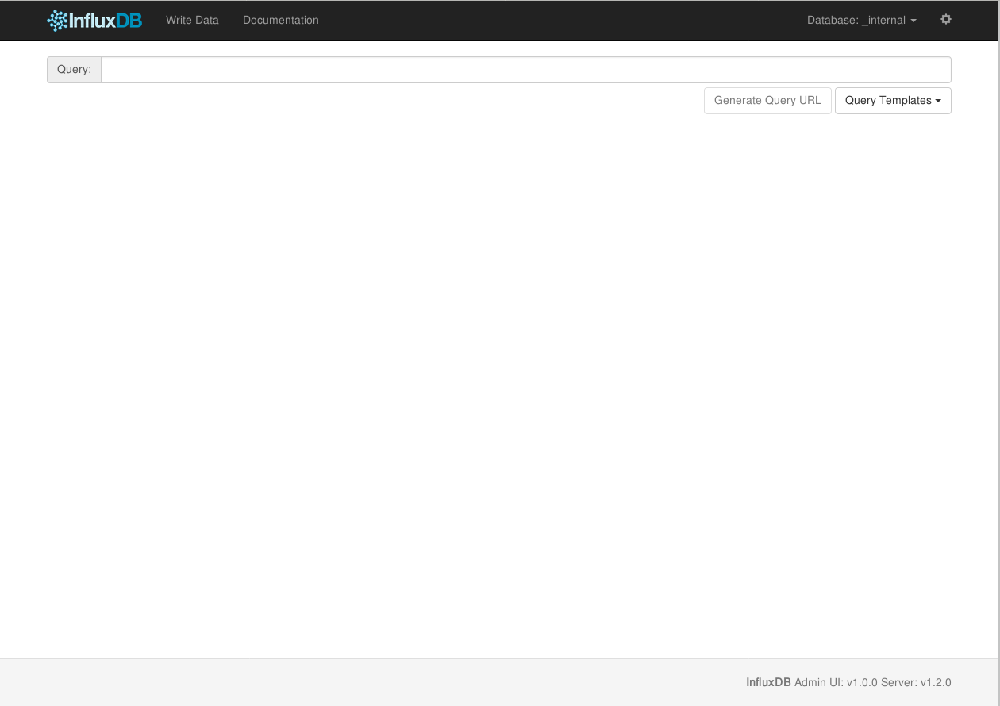
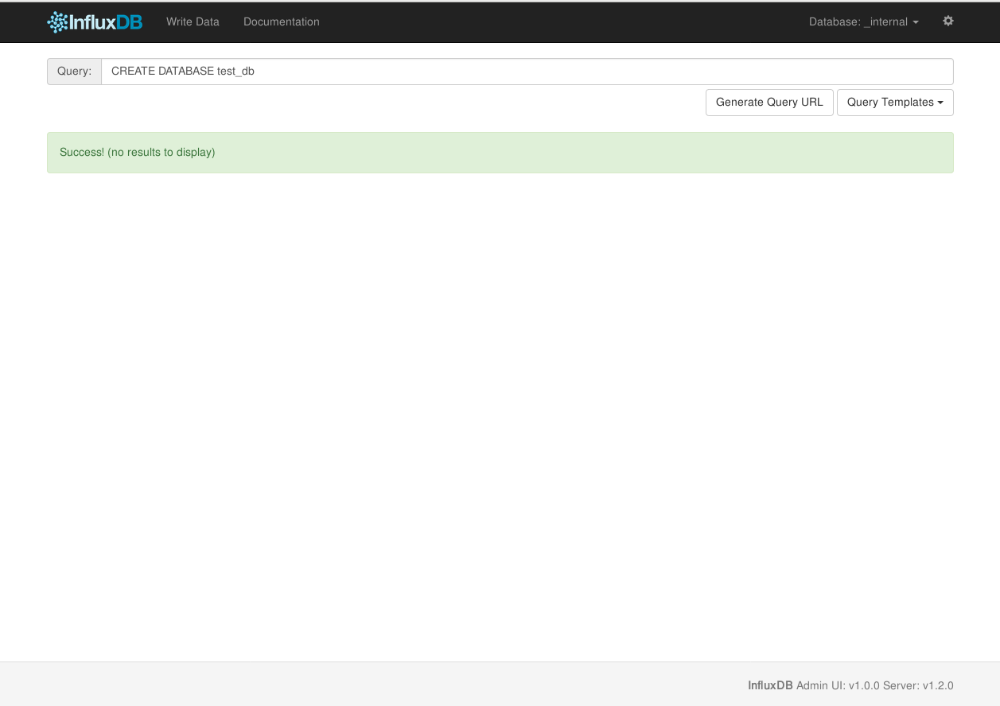
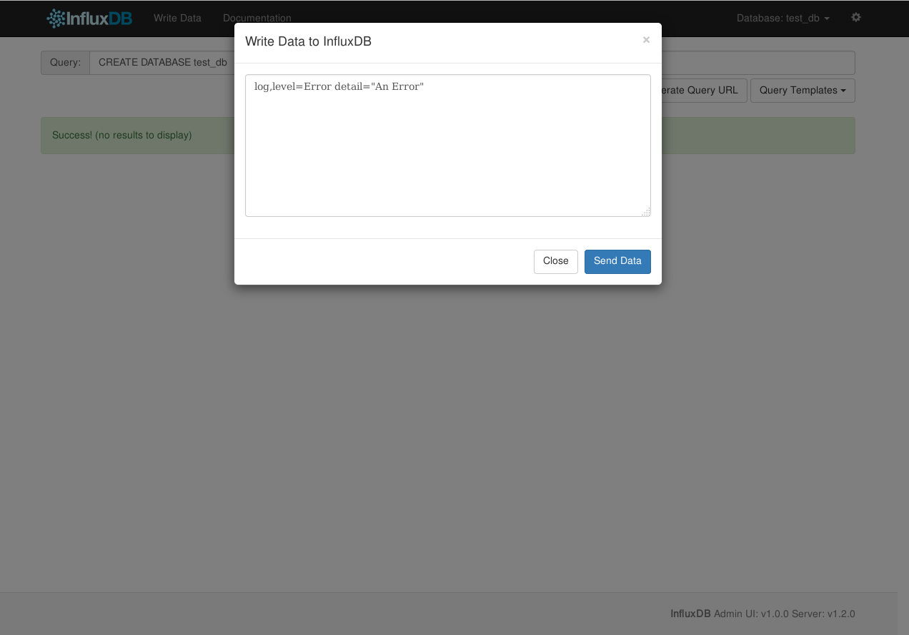
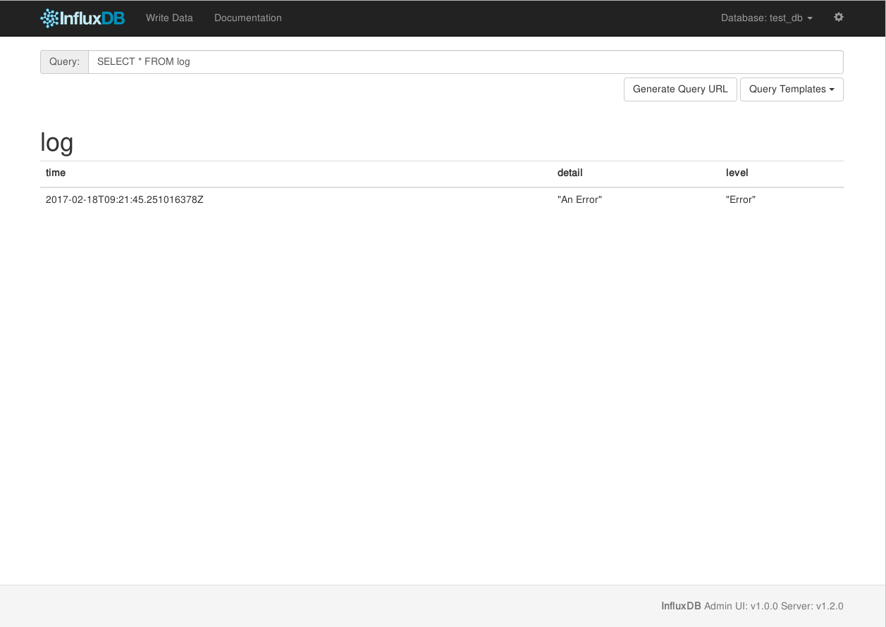

NoSQLを使うことも一般的になってきた昨今ですが、NoSQLの一種に、時系列データベース (Time Series Database; **TSDB**)と呼ばれるものが有ります。
TSDBはその名のとおり、時系列データを取り扱うことに特化したDBです。
サーバ監視したログデータや、センサデータなんかを取り扱うことが得意なDBということですね。

そのうち、[DB-ENGINES](http://db-engines.com/)の[DB-Engines Ranking of Time Series DBMS](http://db-engines.com/en/ranking/time+series+dbms)で一位を取っている*InfluxDB*を触ってみました。

InfluxDBの公式ドキュメントは[InfluxData | Documentation | InfluxDB Version 1.2 Documentation](https://docs.influxdata.com/influxdb/v1.0/)にあります。

# 参考にした資料・実行環境
今回は[Qiita/DockerのInfluxDBとGrafanaでdweet.ioのデータを可視化する](http://qiita.com/masato/items/eab9f76f21cbfd7c9b92)の前半を参考に、Docker上でInfluxDBを実行してみました。
なお、上記の記事中では、~tutum/influxdb~というイメージを使用していますが、現在はInfluxDBオフィシャルのイメージが提供されていますので、そちらを利用します。
最新の安定版を利用しますので、InfluxDBのバージョンは1.2.0です。

# InfluxDBコンテナを起動する
早速InfluxDBコンテナを起動してみます。
``` bash
$ docker pull influxdb
$ docker run --name influxdb_test -p 8083:8083 -p 8086:8086 influxdb
```

これだけです。簡単ですね。Exposeしているポートの中身は以下のようになっています。
* 8083: Admin Web インターフェース
* 8086: HTTP API

## Admin UIにアクセスする
Admin UIにアクセスしてみます。
InfluxDBにはWebアクセスできるUIがついています。

まずはコンテナのIPを調べてみましょう。
``` bash
$ docker inspect influxdb_test
```
HostConfig > NetworkSettings > Networks > bridge > IPAddress にコンテナのIPが記載されています。
今回は`172.17.0.2`だったとして進めます。

ブラウザを起動し、`172.17.0.2:8083`にアクセスします。


すると、上記のような画面が現れます。
この画面から、InfluxDBの基本的な操作を行うことができます。

## データベースを作る
初期状態では、`_internal`という、InfluxDB自体が使用するデータベースがあるのみなので、まずはデータベースを作成します。
データベースを作るには、SQLと同じような、`CREATE DATABASE`文を使います。WebUIのQueryに、以下のように入力します。
```
CREATE DATABASE test_db
```
セミコロンは必要ありません。また、InfluxDBは固定スキーマでは無いので、カラムの指定も必要ありません。


データベースの作成に成功すると、上の図のようにSuccess!と表示されます。

## データを挿入する
データベースができたので、データを挿入してみます。
作成したデータベースにデータを挿入するため、データベースの選択を行います。
画面右上の`Database: _internal`と表示されたところをクリックし、選択肢から先程作成した**test_db**を選択します。

選択後、いよいよデータを挿入します。
データの挿入は、タイトル横の**Write Data**から行います。
**Write Data**をクリックすると、データの入力画面が表示されます。
ココに、データをLine Protocolと呼ばれる形式でデータを記述します。
```
<measurement>[,<tag-key>=<tag-value>...] <field-key>=<field-value>[,<field2-key>=<field2-value>...] [unix-nano-timestamp]
```

MeasurementはRDBMSでいうところのテーブルのようなもので、データの系列を表現しています。
TagはIndexされる値で、key=valueの形式で記入します。メタデータなどに用います。
FieldはIndexされない値で、key=valueの形式で記入します。こちらが通常の値です。

InfluxDBでは、ある時点での値のセットをまとめて、**point**と呼びます。pointは時間、所属するMeasurement、0個以上のTag set、1個以上のField setから構成されます。

Fieldの値に使える型は4種類(Float, Integer, String, Boolean)です。
Integer型が有りますが、通常の数値(整数含む)は基本的にFloatで扱います。
また、文字列は最大64KBまでとなっています。

何らかのアプリケーションのログという体裁でデータを挿入してみます。
```
log,level=Error detail="An Error"
```


これでデータを挿入できましたので、Queryを発行して確認してみましょう。

## Queryを発行する
データを引き出すため、Queryを発行してみます。
WebUIのトップにある、Query窓にQueryを記述します。

SQLとそっくりな`SELECT`文を使います。
```
SELECT * FROM log
```
ココでもセミコロンはいりません。

入力し、エンターを押すと、以下のようにデータが出力されます。

Queryの場合はクエリストリングの`q=`の値にQuery文字列を入れます。
Writeの場合は、POSTのbodyにLine Protocolで書きます。
それぞれ、dbを指定する必要がある操作の場合は`db=`にデータベース名を書きます。

先程のQueryを実際にHTTPで叩くと、以下のようになります。
``` bash
$ curl 'http://172.17.0.2:8086/query?db=test_db&q=SELECT+*+FROM+log'
{"results":[{"statement_id":0,"series":[{"name":"log","columns":["time","detail","level"],"values":[["2017-02-18T09:21:45.251016378Z","An Error","Error"]]}]}]}
```

# まとめ
簡単に、InfluxDBの一通りの操作を行ってみました。
各言語向けの公式ライブラリも整備されているようです。

ログの集計等に便利そうです。

