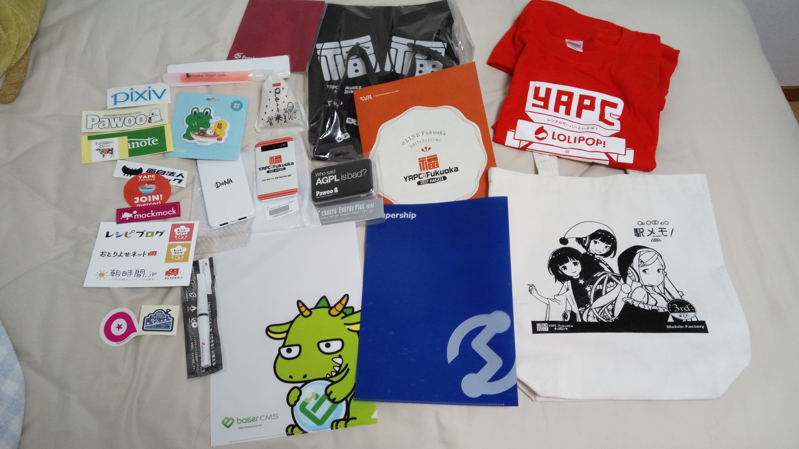

今回は言われました！「ブログを書くまでがYAPC!」
と言うことで、[YAPC::Kansai 2017 OSAKA](https://yapcjapan.org/2017kansai/)(行ってきたときの記事は[こちら](/article/yapc_kansai_2017))に引き続き、[YAPC::Fukuoka 2017 HAKATA](https://yapcjapan.org/2017fukuoka/)に行ってきました。
YAPCはPerlのイベントで、"Yet Another Perl Conference"の略です。twitterハッシュタグは前回に引き続き[#yapcjapan](https://twitter.com/hashtag/yapcjapan)でした。

福岡および九州は初めてでしたが、いや、暑いですね。
特にYAPCの翌日は非常に天気が良いものの、梅雨の湿気もあり、観光をしていて汗だくでした。

今回も大阪同様ホテルはとらず、適当にやっていくことに。
意外となんとかなるものです。

# YAPC::Fukuoka 2017 HAKATA
今回も例に漏れず(?)寝坊でオープニングには間に合わず。
今回はPerl6の話は余り多くなかった印象です。

セキュリティの話、コンテナの話、テストの話など、非常に多様なセッションがありました。

今回のノベルティはなぜかモバイルバッテリーが二つも入っていたり、米が入っていたり、染み抜きペンが入っていたりととても面白い内容でした。
あ、いつものサイリュームも入ってましたよ。

個人スポンサーノベルティはビーチサンダル。これからの季節に良いですね。

## LTをしてきました。
今回はLTもしてきました。
タイトルは「[嗚呼素晴らしきemacs](https://speakerdeck.com/nasa9084/wu-hu-su-qing-rasikiemacs)」です。

## ベストトーク賞
YAPCでは恒例のベストトーク賞ですが、今回は徳丸さんのゲストセッションがベストトーク賞に選ばれました。
しかしご多忙な徳丸さん。クロージングの時点ですでに帰還してしまってました。
仕方ないので徳丸さんの会社にお勤めの方が代理で受け取ることに。
なんと賞品を渡す人は徳丸さんのセッションを聞いていなかったようで・・・
ベストトークを聞いていなかった人が代理の人に賞品を渡すという、なんとも面白い事態でした。

ベストLT賞は[@codehex](https://twitter.com/codehex)さんで、YAPC::Okinawaの宣伝でした。

## 懇親会
懇親会ではPixivさんから抽選でプレゼントをいただきました。
Pawooのロゴ入りのモバイルバッテリー(これで今回三つ目)です。

# 次回のお話
次回YAPCは3月に沖縄で開催予定です。

