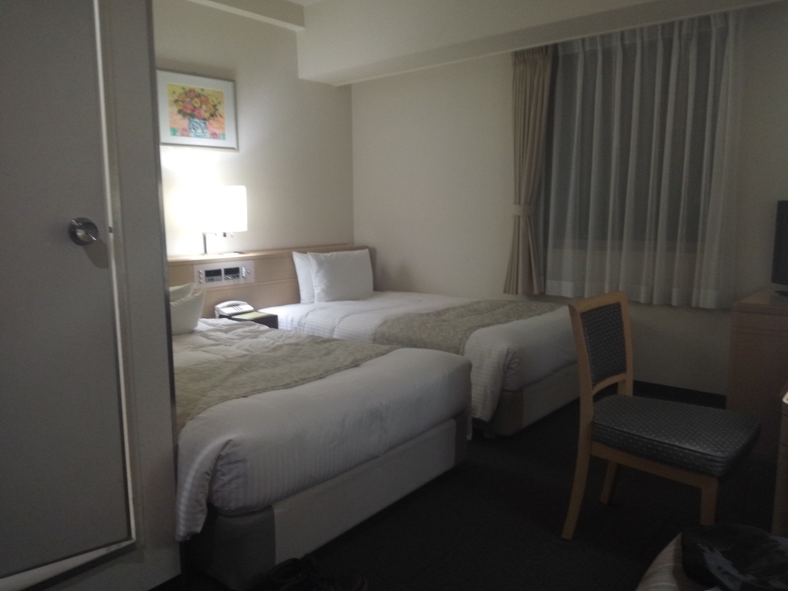
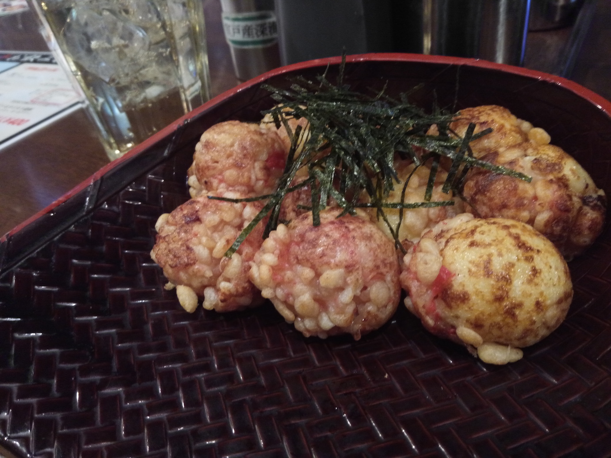
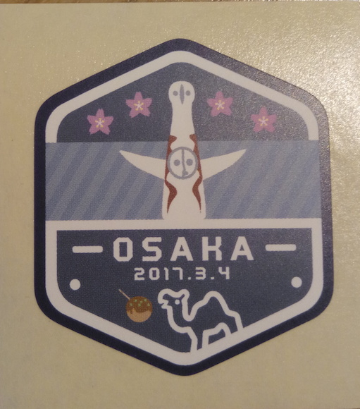

12月の[YAPC::Hokkaido 2016 SAPPORO](http://yapcjapan.org/2016hokkaido/)(行ってきた時の記事は[こちら](/article/yapc_hokkaido_2016))に引き続き、[YAPC::Kansai 2017 OSAKA](http://yapcjapan.org/2017kansai/)に行ってきました。

今回もブログを書くまでがYAPCとは言われなかった気がします。
YAPCはPerlのイベントで、"Yet Another Perl Conference"の略です。twitterハッシュタグは前回に引き続き[#yapcjapan](https://twitter.com/hashtag/yapcjapan)でした。

私にとって、大阪はもちろん、関西自体が初めてで、かなり余裕のあるスケジュールを組んだために、どう時間を過ごしていいか悩むといった自体に。
空港に降り立ち、まずどうしよう、という状態ですね。困った。

仕方がないので大阪出身の友人に、「大阪観光ってどこいったらいいのかな」と聞いてみたのですが、「まぁたこ焼き食べたりしたら？」と今ひとつ役に立たない返事。まぁ食べますけど！
それでも心斎橋とか難波に向かうとよいと教えてもらえたので、Googleマップ先生に頼りつつ、難波へ向かいました。

結果、何をしたかというと、札幌からの移動前に新しく購入したスマホ用のあれこれをビックカメラで購入するという、大阪まできて何をやっているのかというなんとも残念な行動となってしまいました。

# ホテル探し
今回、北海道から関西まで、勿論飛行機で移動したわけですが、実はホテルも取らずに(!)、YAPC以外は無計画での旅行でした。
とりあえずYAPC前日くらいはホテルに泊まらねば朝起きれない！ということで、ホテル探しをしました。
運良く会場([MOTEX ホール](http://www.motex.co.jp/))の近くに割と安く宿を取ることができました。

こちらがそのお部屋の写真。シングルの部屋を5,500円(500ポイント適用後)でとったのですが、入ってみてびっくり、ツインの部屋でした。
安かったものの、なんとなく豪勢な感じ。

夜ご飯は近くのお店でたこ焼きを食べました。
十八番というお店で、後で調べたら結構有名っぽいですね。美味しかった。
たこ焼きを塩で食べるというのは初体験でしたが、これもなかなかです。

# YAPC::Kansai 2017 OSAKA
開けて翌日。微妙に寝坊したおかげでオープニングには間に合いませんでした。

一番印象に残ったトークは「Vue.jsで作るSPAから学ぶMVVM、非同期処理、その光と影」ですね。
タイトルにVue.jsと入っているにもかかわらず、Vue.jsという言葉が出て来たのは一度きり、SPAの話のはずなのに、「SPAはやめよう」と、なんだかタイトルに釣られた感が半端ない内容でした。
勿論内容も素晴らしく、「ブラウザはドキュメントビューアなんだからリッチなインターフェースを作るものではない」「ブラウザでリッチなインターフェースを作るのはなんでもVimでなんとかしようとするようなもの」「とはいっても作らなきゃいけない時もある」という、SPAはやるべきじゃないけど、現状やらなきゃいけないことはどうすれば良いのか、その時MV\*はどのように構成したらいいのかといった、きちんと筋が通っていて、とても面白い話でした。

次に印象に残っているのが、「Webアプリケーションのキャッシュ戦略とそのパターン」です。
こちらも「キャッシュは使わないほうがいい」という、タイトル詐欺みたいな話でしたが、非常に納得のいく内容でした。

ベストトーク賞の投票で票を入れたのは「Webエンジニアに知ってほしいRDBアンチパターン」です。
内容もさることながら、やはり喋りが素晴らしいんです。とっても練習をしていると聞いています。

ランチタイムはスポンサー企業の方と昼食をいただきました。
今回交通費支援をいただいたので、その対価のようなものです。
実際には、企業に関わるお話は結局あまりしなかったのですが、会場の近くはあまり飲食店がない印象で、昼食を取るのも大変そうでしたので、大変助かりました。

YAPC::Kansai 2017 OSAKAのステッカーはこんな感じ。

札幌の時のものと並べてはるには、上下を揃えるのが難しい形状で、ちょっと難儀します。

# 次回のお話
次回YAPCは福岡で開催だそうです。[YAPC::Fukuoka 2017 HAKATA](http://yapcjapan.org/2017fukuoka/)
すでにチケットも発売されています。

その後は沖縄、東京が企画されているそうです。
是非回りたい。

