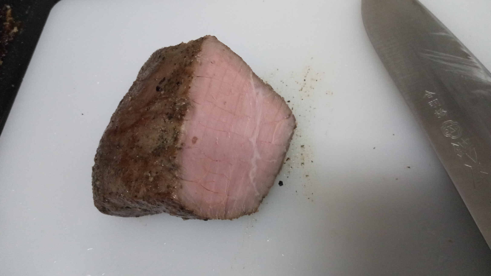

去る5月12日、肉の祭典であるところの[builderscon 低温調理肉会 2018 Spring](https://medium.com/@lestrrat/builderscon-%E4%BD%8E%E6%B8%A9%E8%AA%BF%E7%90%86%E8%82%89%E4%BC%9A-2018-spring-8c09ea955372)が開催されました。
その名の通り、Anovaで低温調理された肉をひたすら食うというイベントで、大変に楽しみにしていました。
が、家を出るぞ！という段になって[KubeCon](/i-went-to-kubecon-cloudnativecon-eu-2018/)の時にやらかしたぎっくり腰を再発し、行くことかなわず、気づいたら[Anova](https://amzn.to/2IXM4Gc)をポチってしまっていました。

<iframe style="width:120px;height:240px;" marginwidth="0" marginheight="0" scrolling="no" frameborder="0" src="//rcm-fe.amazon-adsystem.com/e/cm?lt1=_blank&bc1=000000&IS2=1&bg1=FFFFFF&fc1=000000&lc1=0000FF&t=nasa9084-22&o=9&p=8&l=as4&m=amazon&f=ifr&ref=as_ss_li_til&asins=B00XV556OQ&linkId=1a430911d48ae55d1c7045f4c8dc0b6f"></iframe>[^amzn]

そのAnovaが我が家に届いたので、真空低温調理のHello Worldとも言えるローストビーフをつくりました。

ネット上でブログ記事とか見てると、筒状の箱に入っている写真も多いのですが、最近は普通の箱に入ってくるようです。

中に入ってた紙には基本的な加熱時間なんかも書いてあります

Anovaさんとご対面。かれこれ一年近く買うか悩んでたので、ようやく、といったお気持ちです。

我が家にあった鍋だと、使えなくはないのですがもう少し余裕がほしいと感じたのでAnovaさんの異名を持つ[@lestrratさん](https://twitter.com/lestrrat)の[ブログ記事を参考](https://medium.com/makisanch/%E3%83%91%E3%83%B3%E3%83%89%E3%83%A9%E3%81%AE%E7%AE%B1-anova%E3%81%AB%E3%82%88%E3%82%8B%E4%BD%8E%E6%B8%A9%E8%AA%BF%E7%90%86-%E3%82%92%E9%96%8B%E3%81%91%E3%81%9F-a619877bd388)にして、バケツを購入してきました。
近所(と言っても徒歩10分からのバスで10分程度かかる)ホームセンターで、[トンボ ニューセレクトバケツ15L](https://amzn.to/2slSuDG)を購入(余談ですが、このバケツは食品衛生法適合商品なので調理に使うことに何の問題もありません)。

お湯を張ってanovaをセット。温度表示も摂氏に変更しました。
58度にセットして余熱しておきます。

今回調理したのはこちらの牛肉モモブロック862円。近所の西友で購入しました。

適当に筋を取ってからスパイスをまぶしていきます。
今回はローストビーフ用スパイスなるものが牛肉に付属していたので、それを使ってみました。

[IKEAのジップロック的な袋](https://www.ikea.com/jp/ja/catalog/products/60340412/)に入れて、空気を適当に抜きました。[^air]

肉を投入。クリップなんかで袋を止めると良い、みたいな記事が多かったのですが、ぱっと使えそうなクリップが無かったのでどこのご家庭にもあるであろう緑の養生テープでとめておきました。
この状態で2時間やっていきます。

できあがったものがこちら。見た目は良くないです。

フライパンで焼き目をつけていきます。
ガスバーナーがほしい。

切ってみました。素晴らしいピンク色。

スライスしたものがこちら。ローストビーフを良い感じに薄くスライスするの、難しいですね。
誰かこつを教えてください。

最終的に御飯の上でドーンな感じになりました。
温玉もanovaでやったやつ。ちょっと堅かった気がします。

おいしかった。

[^amzn]: 私はAmazonからではなく、[公式](https://anovaculinary.com/)から買いました。公式からの方が安かったので。
[^air]: 袋を水につけて(水が入らないように)、空気を抜くとそこそこ真空っぽい感じになります。

