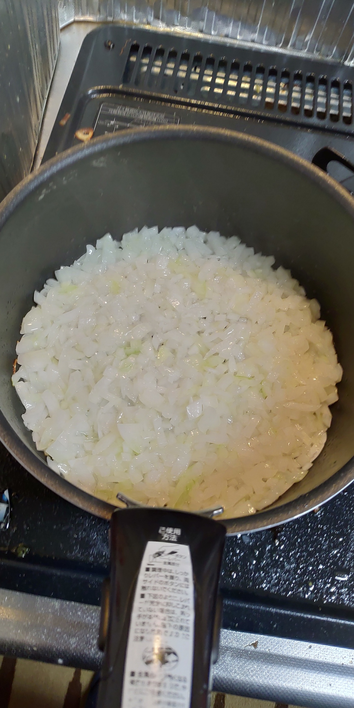

連休も終わりで、明日から出社するのがつらいのでファイナルカツカレーを作りました。
ファイナルカツカレーは要するに、ファイナルカレーにカツを乗せたものです。
ファイナルカレーは[いちばんおいしい家カレーをつくる](https://amzn.to/2BdlmG1)に書かれているカレーで、我らがバイブルである[めしにしましょう(4)](https://amzn.to/2BcQ3en)で紹介されています。
素晴らしいカレーであるとのことなので、やはりカツは素晴らしいカツを乗せたいものと思いますので、[超級カツ丼](/super-katsudoon/)の時にもやった、低温調理カツでやっていきます。

まずはタマネギを炒めていきます。これは一個分です。結構大きめのタマネギを買ってきました。
割とざっくりした粗みじん切りです。昨日包丁を研いだので目が痛くない。
強火で炒めて、焦げ付きそうになったら少し水を足す、という作業を繰り返します。

良い感じになったら香味野菜類を追加します。にんじん・セロリ・ニンニク・ショウガ・ホールトマトですね。めしにしましょうではミキサーでやっていく風に書かれていましたが、我が家にはミキサーが無く、このために買うのも何かと思ったので、にんじんはみじん切り、セロリとニンニク・ショウガはすりおろしてみました。ニンニクをすりおろす小さいおろし金でセロリみたいな大きいものをすりおろすのはつらいです。ホールトマトは缶でしか売ってなかったので余りました。どうしよう。
ここでバターをちょいと加えます。切れてるバターが便利でした。

水分が飛んできたらスパイスを足します。ターメリック・レッドチリ・クミン・コリアンダーです。これらは[基本のカレー](https://getnews.jp/archives/1781558)を作るのにも使える、基本的なスパイスなので、まぁ買っておいても良いでしょう。我が家は以前基本のカレーを作るのに買ったので、冷蔵庫に入ってました。

もうペーストです。ドライカレーとかの方が近い見た目。鍋を振るとひっくり返せます

肉です。豚肩ロースを適当な大きさに切り、梅酒と少々の醤油につけたものです。1時間くらい前につけて冷蔵庫にぶち込みました。梅酒は自家製です。今年つけたのを使いました。カツを乗せるので肉はいらないかとも思ったのですが、一応。

ペーストに肉をぶち込みます。つけ汁もそのまま。ちょっと緩くなります。
このまま少し炒めます。

良い感じになったのでコンソメ汁を投入。300mlのお湯にコンソメキューブを溶かしたものです。300ml入る良い感じのマグカップが無くて難儀。ローリエとはちみつ、醤油を加えて煮込みます。45分ほど煮込んだら、カレールゥを適当に突っ込みます。

煮込んでいる間にカツをやっていきます。カレーにカツをのせることで人間は幸せになるのです。これは昨晩仕込んだ豚肩ロースで、[Anova](https://anovaculinary.com/)を使用して、62度で24時間やったものです。めしにしましょうではカツをやるのに63度12時間でしたが、24時間やるつもりだったので1度下げました。それにしてもまずそうである。

切ったもの。断面は素晴らしいですね。カツにしましょう。

カツです。

断面。スマホです。むしろこのまま食べたくなってきます。

実は以前にも一度、[五島軒](http://www.gotoken.hakodate.jp/)のカレー缶を使ってカツカレーを作ったのですが、超級カツを乗せるとカレーが見えなくなるのが欠点です。左上のお茶はジャスミン茶です。沖縄でさんぴん茶を飲んでから飲めるようになりました。というかむしろハマってます。

ファイナルカツカレーは、罪の味がします。人間が幸せになるためにはやはりカレーにカツをのせねばならないと、そう感じるものです。ファイナルカレー自体は少し薄い味というか、もういっこカレールゥを足してもよかったかもしれないです。

