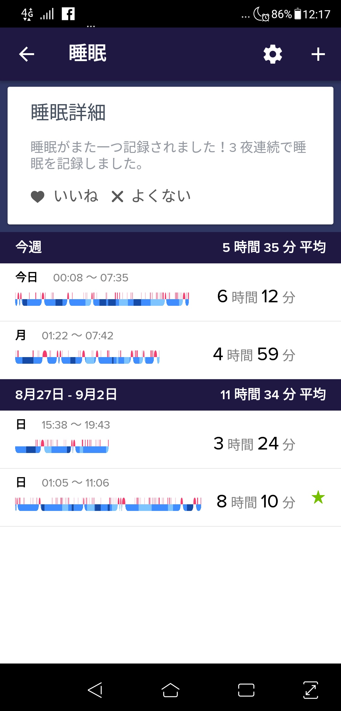
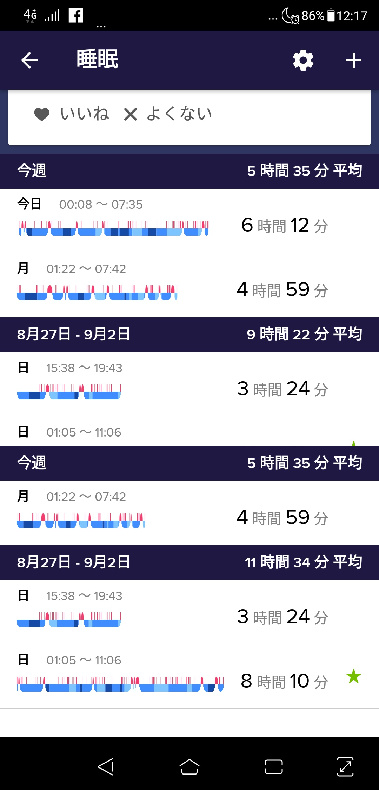
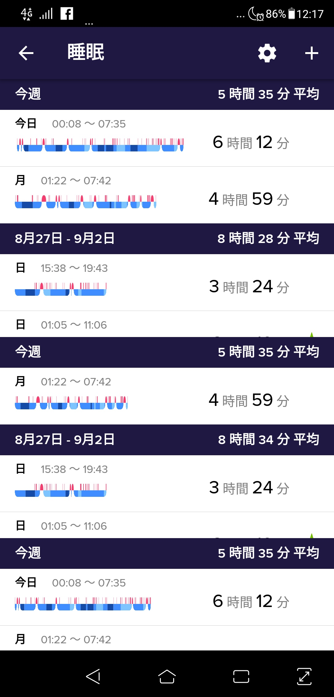

[fitbit versa](https://www.fitbit.com/jp/versa)を[使い始めて](/fitbit-versa/)3日ほど経ったので、現時点での感想をば。

* 電池の持ちは前情報通り1日で20%〜25%減る程度
    * 常時接続・Keep-AliveウィジェットはともにON
    * 夜にお風呂/シャワー上がってから、翌日お風呂/シャワーに入るまで、で1日。
        * お風呂/シャワーの間に充電100%
* 画面つける動作の反応が悪い、という情報があったが、そんなに気にならない
* 歩数計は少し過敏な様で、実際歩いた歩数より多い気がする
    * PCでの作業でも反応してる気がする
* 本体が防水でも、バンドが水を吸うと水に過敏になる
    * 明日からはCLASSIC BANDに取り替えてみる
* 結構変な方向を向いてしまう
    * ベルトをもう一つ締めれば回らなくなるけど、今度は少しきつい
* [安い画面保護ガラスフィルム](https://amzn.to/2LVLB40)を買った
    * 一部のレビュー通り、縁が若干浮いている様だけど、気にならないレベル
* 腕時計をつける習慣が無かったことは、お風呂の時以外常時つけていると案外気にならない
* Androidアプリは若干バグってる
    * 後述。
* versa上で動くアプリはあんまり無い
    * もっと増えたら楽しいのに・・・・(しかしどんなアプリが欲しいかというと思いつかない)
* versaの時計盤の種類も(よさげなのは)そんなに多くない
    * まぁ、頑張ろう
* 階数カウントは何を基準にカウントしてるのか謎。
* 天気予報、スマホ側で設定できる画面があるけど結局現在地しか表示できてない。
    * よくわからん。
* アラーム、もう少し長く鳴って欲しい

## Androidアプリのバグ

Android用のfitbitアプリが若干バグってました。すでに報告済みですが、まぁパッとは治らない様子。仕方ない。
具体的には、睡眠のページを開き(このときは問題ない)、睡眠の日別詳細を開いて戻ると、なんとデータの一覧が増殖する。
尚動作環境はZenfone 5Z、Android 8.0.0。

睡眠のページ。問題はなさそうに見える。

睡眠の日別詳細ページを開いて戻ってきた画面。同じデータだが、画面表示が増えている。

もう一度詳細を開いて戻ってきた画面。増える。増える・・・。

