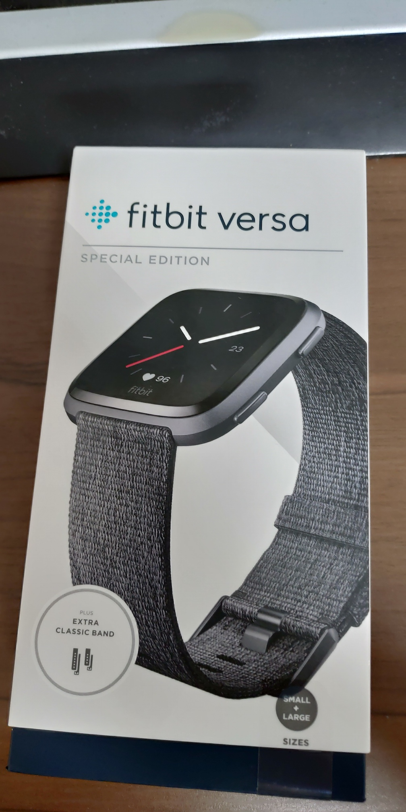
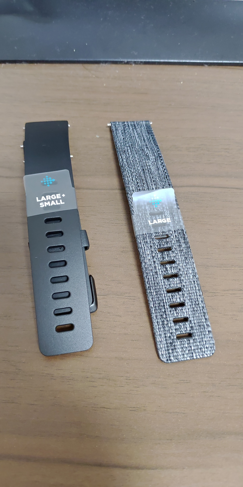
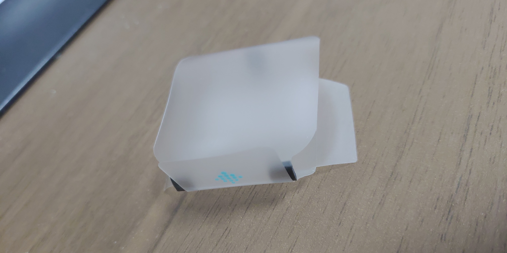
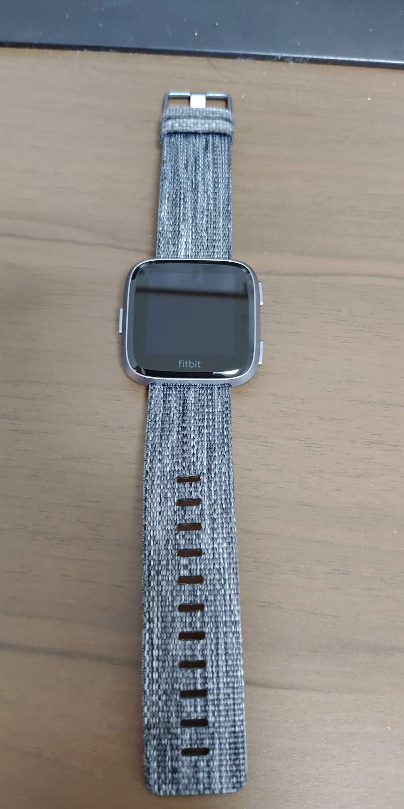

スマートウォッチ的なものが欲しいなーと思ったので、[fitbit versa](https://www.fitbit.com/jp/versa)を購入しました。
fitbit versaはその名の通り、[fitbit](https://www.fitbit.com/jp/home)が今年(2018)の6月に発売したスマートウォッチです。トップの写真からもわかるように、若干[Apple Watch](https://www.apple.com/jp/watch/)に似ています。
元々、[Huawei Watch](https://www.google.com/search?q=Huawei+Watch+1&safe=off&client=firefox-b-ab&source=lnms&tbm=isch&sa=X&ved=0ahUKEwibufDF_ZndAhVGGsAKHd0QA0oQ_AUICygC&biw=1366&bih=706)が欲しいなーと数年前に思っていたんですが、(当然ながら)[新しいモデル](https://consumer.huawei.com/jp/wearables/watch2/)が出ており、これがまた初代のHuawei Watchとは全く方向性の違うスポーツタイプ。これはちょっと・・・と言うことで[Pebble](https://gigazine.net/news/20151004-pebble-time-round/)もいいな、と探してみると、いつの間にやらサポートが終わってしまっていました。よくよく調べると、Pebbleは[fitbitに買収された](http://healthcare.itmedia.co.jp/hc/articles/1612/23/news005.html)とのことでした。かといってApple Watchを買うかというと、私は[Android](https://www.android.com/)ユーザですから、そういう選択肢はありませんでした。

そうこう考えながらいろいろ検索したりなんかしていたんですが、fitbit versaが実質的にPebbleの後継であるという情報を見たり[聞いたり](http://rebuild.fm/209/)しました。お値段もお手頃で、これならまぁいざ微妙でも、買い換えもできるかな、という気持ちもあり、購入に踏み切りました。(fossilの新しいやつもよさげなんですが、ドルで見た金額と円で見た金額が大幅に違って萎えました)

外箱はこんな感じです。fitbit versaは、通常モデル(シリコン？ゴム？のバンド)が3種類と、SPECIAL EDITION(布バンド)が2種類の計5種類で展開されています。元々海外モデルではSPECIAL EDITIONにのみNFCが搭載されているという違いがあったようなのですが、日本版では機能的違いは無いようです。
通常モデルの黒と、SPECIAL EDITIONのグレーですごく悩みました。本体の色はグラファイトの方が良さそうだし、バンドも布の方がよさげに見えたんですが、布バンドは濡れたら乾くまで時間かかりそうなので、ゴムバンドのほうが良いのかな・・・と・・・(店頭で悩み続けたので若干怪しかったかも？)。でもまぁ、本体の色はブラックよりグラファイトの方がよさげでしたし、ゴムバンドは純正の交換バンドとして売ってるから、後で買うこともできるか、ということでSPECIAL EDITIONのグレーにしました。今回ビックカメラで買ったんですが、ビックカメラではカードの様なものをレジに持って行くんです。で、商品を受け取ってみたら箱の右下に「PLUS EXTRA CLASSIC BAND」の文字・・・。

帰ってから開封してみたら、案の定通常モデルと同じクラシックバンドが付属してました。ついてるなら早めに言ってほしかった・・・あれだけ店頭で悩んだ私の時間とは・・・。!

本体の画面を保護していたフィルムを取ってみて気づいたんですが、小さなクッションのようなものがついてました。ボタンが押ささらない様にとの配慮なんでしょうけど、こういう細かい気遣いは初めて見たので少しだけ感動しました。

非常に軽く、そしてエッジが削られているので薄く見えるため、非常にスマートです。写真で見る限りではベゼルが結構幅広なのが気にかかった(最近はZenfone 5Zを使っていることもあり、ベゼルは小さい方がいいなーと思っていた)のですが、実際画面をつけてみると、意外と気になりませんでした。

元々腕時計など、腕に何かをつけるという習慣がないので、どうなるかわかりませんが、しばらく使ってみようと思います。

