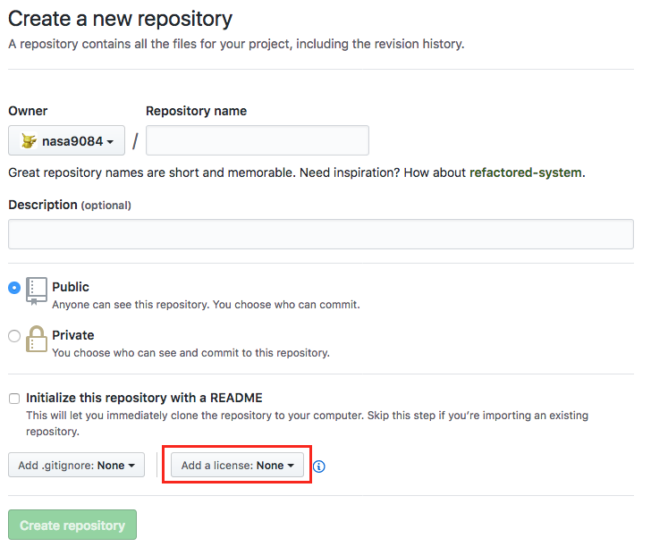

When we create a new repository on [GitHub](https://github.com), we can choose an open source license.



We choose an OSS license, then, `LICENSE` file is put into the new repository.

Now, I'm usually using [`hub`](https://hub.github.com/) command to create a new repository.
I'll do below to create:

``` shell
$ mkdir my_new_repository
$ cd my_new_repository
$ git init
#
# ... some code writing and commit ...
#
$ git create # git command is aliased to hub
$ git push -u origin master
```

In this flow, I can write description for repository[^desc], set homepage[^homepage], make the repository private[^priv], but I **CANNOT** choose LICENSE.
I can choose and create LICENSE file on the GitHub web page, or I can copy from my other repositories because its content is fixed.
However, I don't do that.

Thus I created [`git-license`](https://github.com/nasa9084/git-license), which is subcommand for git.
As you know, when you put `git-XXX` executable into your PATH, you can use `git-XXX` command as subcommand of git like `git XXX`.

`git-license` is written in Go.
So its executable is only one binary, and it means very easy to start using.
If you have already had Go environment, you can install with:

``` shell
$ go get github.com/nasa9084/go-license
```

If not, you can download binary for your os from [Releases page](https://github.com/nasa9084/git-license/releases).

The command creates LICENSE file you choose using [GitHub Licenses API](https://developer.github.com/v3/licenses/), so network connection is required.

If there's some bugs, comment, or enhancement, please feel free to make issues or make Pull Request.

[^desc]: with `-d` option
[^homepage]: with `-h` option
[^priv]: with `-p` option

