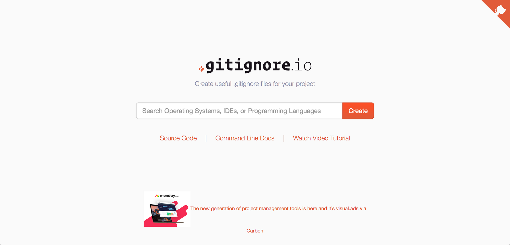

割とみんな知ってるのかもしれないですが。

`git-xxx`という名称で実行可能ファイルをパスの通ったところに配置すると、`git xxx`という`git`のサブコマンドの形で実行することができるようになります。これを利用したのが拙作[git-license](https://github.com/nasa9084/git-license)で、`git license [option] license_name > LICENSE`の形で実行すると`LICENSE`ファイルを簡単に作成することができます。
その他、`git config`でエイリアスを指定して、サブコマンドとして登録することも可能です。

同様にして、`git ignore`で`.gitignoreファイルを簡単に取得できるようにしてみましょう。

おそらく現代では多くの人が`.gitignore`の生成やテンプレート化をして、あるいはテンプレート化されたものを利用しているのではないでしょうか。GitHubのWUI上でリポジトリを作成するときにも生成することができますし、そのさい使用される`.gitignore`ファイルとして[github/gitignore](https://github.com/github/gitignore)が提供されています。

今回紹介するのは[gitignore.io](https://www.gitignore.io)というサービスです。



gitignore.ioはその名の通り、`.gitignore`ファイルを生成するサービスです。
基本的な使い方は非常に簡単で、ブラウザでアクセスして、テキストボックスに必要な言語、OS、エディタやIDEなどを指定していくだけです。指定が終わったら**Create**ボタンを押すことで、選択した対象用の`.gitignore`テンプレートを全て含んだ`.gitignore`ファイルが作成されます。これを保存すれば良いですね。

しかし、その他の作業をコマンドラインから行なっていると、いちいちブラウザでアクセスして、マウスで操作して・・・というのが非常に面倒に感じます。

大丈夫です！gitignore.ioではもちろんAPIを提供しています(というか、WUIで生成された`.gitignore`のURLがそのままAPIのURL)。
次のように実行してみます。

``` shell
$ curl https://www.gitignore.io/api/go,emacs,macos
```

`https://www.gitignore.io/api/`の後ろに、カンマ区切りで必要なものを列挙して行くだけで、簡単にコマンドラインから`.gitignore`ファイルを取得できます。

ここまでやったらもう少し簡単にしたいですね？いちいちURLを打つのは面倒ですし、忘れてしまうかもしれません。せっかくなので`git`のサブコマンドとして`git ignore`とできるようにしてみましょう。次のコマンドを実行してみます。

``` shell
$ git config --global alias.ignore '!gi() { curl -L -s https://www.gitignore.io/api/$@ ;}; gi'
```

もしくは、`~/.gitconfig`ファイルの`[alias]`のセクションに次のように設定しても良いでしょう。

``` ini
[alias]
ignore = !curl -L -s https://www.gitignore.io/api/$@
```

`$@`は引数をそのまま渡すという変数です。このように設定をすることで、`git ignore`としてgitignore.ioのAPIを利用することができるようになります。実際に使用する時は次のように使用します。

``` shell
$ git ignore go,emacs,macos
```

言語や環境のリストは全てまとめて一つの引数のため、カンマの後にスペースを入れないことに注意です。指定できる環境の一覧は`git ignore list`とすることで表示できます。

標準出力をそのままリダイレクトして、`.gitignore`ファイルに書き込めばプロジェクトの初期設定として使用できるでしょう。


