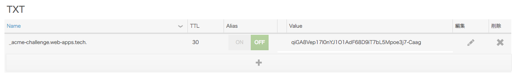

先日twitterでサポートされたと発表されたLet's Encryptのワイルドカード証明書ですが、本日未明、正式にcertbotがワイルドカード証明書に対応したと[発表されました](https://community.letsencrypt.org/t/acme-v2-and-wildcard-certificate-support-is-live/55579)![^0.22.0]

早速ですが、実際にワイルドカード証明書を取得してみます。

尚、今回対象とした環境は以下のとおりです。

* CentOS 7
* リバースプロキシとしてnginx
* DNSはGehirn DNS

では、作業していきます。

CentOS 7でcertbotを使用する場合、大抵はyumでcertbotをインストールしていると思いますので、まずはアップデートします。

``` shell
$ sudo yum update
```

出力は省略しますが、certbotが0.22.0にアップデートされます。
0.22.0はワイルドカード対応バージョンですので、問題ないですね！

公式のマニュアルでは、[dns-pluginを使うよう書いてあり](https://certbot.eff.org/lets-encrypt/centosrhel7-nginx)ますが、Gehirn DNSのプラグインは無いため、今回は手動で行きます。
以下のコマンドを実行します。

``` shell
# certbot certonly --manual --preferred-challenges dns -d *.web-apps.tech --server https://acme-v02.api.letsencrypt.org/directory
Saving debug log to /var/log/letsencrypt/letsencrypt.log
Plugins selected: Authenticator manual, Installer None
Enter email address (used for urgent renewal and security notices) (Enter 'c' to
cancel): nasa.9084.bassclarinet@gmail.com
Starting new HTTPS connection (1): acme-v02.api.letsencrypt.org

-------------------------------------------------------------------------------
Please read the Terms of Service at
https://letsencrypt.org/documents/LE-SA-v1.2-November-15-2017.pdf. You must
agree in order to register with the ACME server at
https://acme-v02.api.letsencrypt.org/directory
-------------------------------------------------------------------------------
(A)gree/(C)ancel: a

-------------------------------------------------------------------------------
Would you be willing to share your email address with the Electronic Frontier
Foundation, a founding partner of the Let's Encrypt project and the non-profit
organization that develops Certbot? We'd like to send you email about EFF and
our work to encrypt the web, protect its users and defend digital rights.
-------------------------------------------------------------------------------
(Y)es/(N)o: y
Starting new HTTPS connection (1): supporters.eff.org
Obtaining a new certificate
Performing the following challenges:
dns-01 challenge for web-apps.tech

-------------------------------------------------------------------------------
NOTE: The IP of this machine will be publicly logged as having requested this
certificate. If you're running certbot in manual mode on a machine that is not
your server, please ensure you're okay with that.

Are you OK with your IP being logged?
-------------------------------------------------------------------------------
(Y)es/(N)o: y

-------------------------------------------------------------------------------
Please deploy a DNS TXT record under the name
_acme-challenge.web-apps.tech with the following value:

qiGA8Vep17l0nYJ1O1AdF68D9iT7bL5Mpoe3j7-Caag

Before continuing, verify the record is deployed.
-------------------------------------------------------------------------------
Press Enter to Continue
```

上記のようにTXTレコードを追加するようにメッセージが出たら、指定された値をDNSに追加します。
Gehirnでは以下のような形になります。



追加したら、digコマンドを使用してDNSレコードが浸透()したことを確認できるまで待ちます。

``` shell
$ dig -t txt _acme-challenge.web-apps.tech

(前略)

;; ANSWER SECTION:
_acme-challenge.web-apps.tech. 30 IN	TXT	"qiGA8Vep17l0nYJ1O1AdF68D9iT7bL5Mpoe3j7-Caag"

(以下略)
```

certbotを実行している端末に戻り、Enterで進みます。

``` shell
Waiting for verification...
Cleaning up challenges

IMPORTANT NOTES:
 - Congratulations! Your certificate and chain have been saved at:
   /etc/letsencrypt/live/web-apps.tech/fullchain.pem
   Your key file has been saved at:
   /etc/letsencrypt/live/web-apps.tech/privkey.pem
   Your cert will expire on 2018-06-12. To obtain a new or tweaked
   version of this certificate in the future, simply run certbot
   again. To non-interactively renew *all* of your certificates, run
   "certbot renew"
 - If you like Certbot, please consider supporting our work by:

   Donating to ISRG / Let's Encrypt:   https://letsencrypt.org/donate
   Donating to EFF:                    https://eff.org/donate-le
```

上手くいくと、上記のように `Congratulations!`が含まれたメッセージが出力されます。
fullchainが`/etc/letsencrypt/live/<ドメイン名>/fullchain.pem`に、キーファイルが`/etc/letsencrypt/live/<ドメイン名>/privkey.pem`に保存されます。

自動更新の設定はまた別の記事で。

[^0.22.0]: 実際は一週間ほど前にリリースはされていたようです

