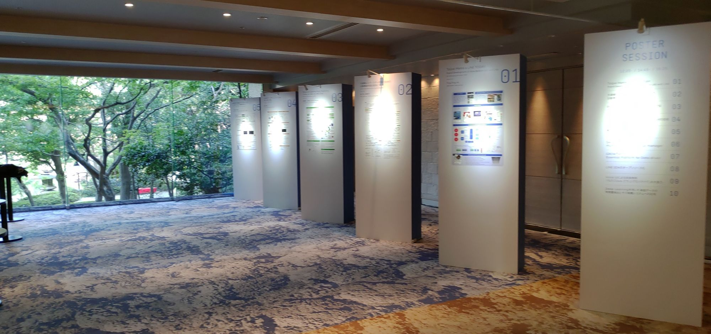

[LINE DEVELOPER DAY 2018](https://linedevday.linecorp.com/jp/2018/)はLINEの技術に関して紹介するイベントで、2018年11月21日に開催されたので、参加してみました。

開催地は白金台の八芳園です。初めて来たのですが、厳かな日本庭園なんですね。ちょっと気後れしてしまいます。

八芳園の入り口にはDEVELOPER DAYのロゴ入り暖簾が下がっていました。

会場の建物に向かうには庭園を抜ける必要があり、八芳園を少しですが楽しめるのはなかなか良かったように思います。

受付は外にあり、非常に良い雰囲気でした。雨だったとしても建物の中でやれる様なプランはあったのでしょうが、雰囲気が大きく変わっていたと思いますので、雨じゃ無くて良かったですね。

GitHubのイベントに行ったときなんかも思ったのですが、会場の壁でこういうことをできるのは企業主体のカンファレンスのすごいところだなーと思います。
これだけで雰囲気が結構違うとは思うんですが、コミュニティ主体だとここにお金をかける意味はあんまり無いので、やろうという話にもならないことが多い気がします。

写真を撮った時点ではまだオープニングセッションの最中だったので稼働はしていなかったのですが、会場では通常の発表の他、ポスターセッションも行われるようでした。

カメラを向けても止まってはくれなかったのでちょっとぶれちゃってますが、歴戦のカンファレンススタッフであるとりいさんもスタッフ参加とのこと。

LINE DEVELOPER DAY 2018は参加費無料で、約1300人の動員(予定)だそうです。

