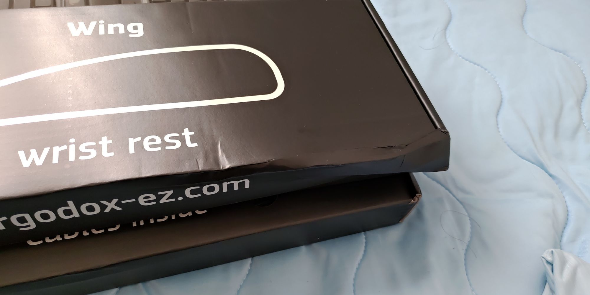

割と今更感もなくはないのですが、Ergodox EZという分割キーボードを購入しました。
Ergodoxは基本的には自分でパーツを揃えて組み立てる、いわゆる自作キーボードの一つですが、オープンソースで設計などが公開されており、その設計を使って完成品を販売しているのがErgodox EZです。
今回は[公式サイト](https://ergodox-ez.com/)から購入しました。

構成は次のようなものです。
* Color: BLACK
* Tilt kit/Wing Rest: YES
* Keycap: Blank
* Switches: Cherry MX Blue

以上で$325、日本円で37,125円でした。送料がかかるという情報も多かったのですが、送料は無料で、関税が2000円ちょいくらいかかりました。

wing restの箱は凹んでいました。。。
まぁ、ペラッペラのビニールだけの状態で渡航して来たので、こんなものでしょう。
箱自体はしっかりしており、多少凹んでも中の本体には影響ありませんでした。

いつ使うのかよくわからないワッシャーと、キートップ・スイッチの交換に使う道具、謎のステッカーがついていました。
web上には日本語の情報がなく、ごく最近のことだと思うのですが、現在販売されているErgodox EZには[CIY](https://ergodox-ez.com/pages/change-it-yourself)という機構が組み入れられています。キースイッチが半田付けされておらず、いわゆるソケットのようなものに刺さっているため、自分でキースイッチを交換できる、というものです。
このため、自作のErgodoxか、キーボードの故障を覚悟の上での改造のみで可能だった、一部のキースイッチのみ交換する、などが簡単に行えるようになっています。

現在は会社で使っています。
やはりエンターキー周りがなれず、slackでちょいちょい誤爆しますね。
できるだけJIS配列に近づけた構成にしており、現在のファームウェアは[nasa9084/qmk_firmware](https://github.com/nasa9084/qmk_firmware)のdevelopブランチで管理しています。
今の所レイヤーはうまく使いこなせていないため、いいかんじの知見があれば教えてほしいところです。

ファームウェアのコンパイル時、arch linuxの場合、`sudo pacman -S avr-libc`する必要があったほか、macosの場合、`brew install avr-gcc`する必要があったのですこしハマりました

