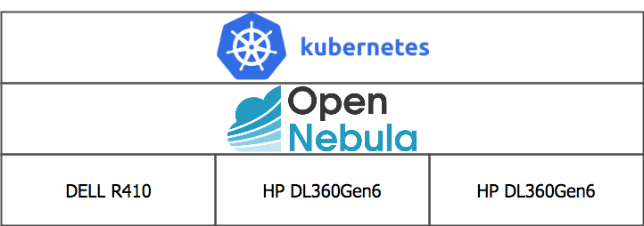

趣味でサーバー運用をしています。札幌在住の大学生時代から運用を開始し、引っ越しに伴い朝霞へ移設、現在はコミュニティで使用している自宅外のラックへ移設されましたが、変わらず動いています。
この「趣味サーバー」は購入当初からKVMをベースとした([OpenNebula](https://opennebula.org/)を使用しています)プライベートクラウド基盤として使用してきました。今も変わらずベースはOpenNebula/KVMなのですが、この度晴れて[Kubernetes](https://kubernetes.io/)を中心とした構成に組み替えたのでご紹介します。
尚、サーバ台・電気代・インターネット代を除くソフトウェア料金は基本的に無料で済んでいます。

## 物理層

このプライベートクラウド基盤は3層で構成されています。

その最も下の層が物理層です。その名の通り物理サーバそのものですね。物理サーバとしてDELLのR410(ヤフオクで1万弱で購入・4コア8スレッド×2、メモリ16GB)とDL360Gen6一号機(会社の処分品をもらってきた・4コア4スレッド×2、メモリ24GB)、DL360Gen6二号機(会社の処分品をもらってきた・4コア8スレッド×2、メモリ24GB)の三台で、それぞれubuntu 16.04LTSがインストールされています。落ち着いたら18.04LTSにアップデートしたい。
基本的に電源やLANは冗長化されておらず、電源やNICに問題があると即死亡となります。

## VM層

物理層の上に構成されているのがVM層です。OpenNebula/KVMを使用しており、Web UIからポチポチッとVMを作成できます。今回Kubernetesで整える前は、VMとして[nginx](https://nginx.org/en/)インスタンスを作成し、外からの80/443ポートへのアクセスを捌くリバースプロキシとして使用していました。本ブログも長らく単体VM上の[Docker](https://www.docker.com/)コンテナとして稼働していました。基本的にVMにはCentOS 7をインストールしています。
今回の構成変更で、VMは基本的にKubernetesのノードとして使うように変更、直接VM上で動作しているのはオブジェクトストレージを提供する[minio](https://www.minio.io/)とブロックストレージを提供する[GlusterFS](https://github.com/gluster/glusterdocs/)のみとなりました。
尚、GlusterFSクラスタの構成には[heketi](https://github.com/heketi/heketi)を使用しました。

## コンテナ層

最も上の層がコンテナ層です。ここまでの話からわかるように、Kubernetesクラスタを構成しています。四台のCentOS 7をクラスタノードとして使用、Kubernetes自体の構成管理は[kubespray](https://github.com/kubernetes-incubator/kubespray)を使用しています。現在はKubernetes 1.11.1です。本ブログもKubernetes上のコンテナとして動いています。
Persistent VolumeとしてVM上に構成したGlusterFSを使用、本ブログ等のバックアップ先としてminioを使用しています。
当初はVM上に構成したnginxインスタンスをそのままリバースプロキシとして使用していましたが、本ブログを含めたアプリケーションを順次Kubernetesクラスタ上のコンテナとして移設していった結果、nginxのVMだけ別になっていることに不便を感じるようになりました(リバースプロキシの設定は手作業で設定しなければなりませんし・・・)。しかし、VM上のnginxリバースプロキシを廃するためには、二つの問題点がありました。

* 素Kubernetesでは[`Ingress`](https://kubernetes.io/docs/concepts/services-networking/ingress/)が使用できないため、ホスト名ベースの振り分けが出来ない
* [Let's Encrypt](https://letsencrypt.org/)の証明書を管理するVMがいなくなる

これらを解決しないことにはnginx VMを削除できません。
解決のためにまず、`kind: Ingress`を使用するための実装として[ingress-nginx](https://kubernetes.github.io/ingress-nginx/)を[使用することにしました](/ingress-nginx-on-prem/)。`Ingress`が使用できるようになることで、クラスタ外のリバースプロキシを挟まずともホスト名ベースの振り分けが出来るようになります。
ingress-nginxは`Service type: NodePort`でも使用できるのですが、折角なので`Service type: LoadBalancer`を使用したいですよね？`type: LoadBalancer`を使用するための実装として[MetalLB](https://metallb.universe.tf/)を[使用することにしました](/type-loadbalancer_by_metallb/)。これにより、ingress-nginxに対してクラスタ外のIPアドレスを割り当てることが出来るようになります。

次に、Let's Encryptの証明書を管理するため、[cert-manager](https://github.com/jetstack/cert-manager)を導入しました。cert-managerはkubesprayの導入時にアドオンとしても導入することが出来、今回はkubesprayのアドオンとして導入しました。これはその名の通り、証明書をKubernetesのリソースとして管理することが出来るツールです。最初はLet's Encryptのacme api v02に上手くアクセスできない、ワイルドカードでの証明書取得が出来ないなど躓きましたが、Let's Encryptに上手くアクセスできない問題は最近のkubesprayで比較的新しいバージョンのcert-managerを導入することで解決できました。ワイルドカードでの証明書が取得できない問題は、元々webroot(HTTP01)で証明書を取得していたのが原因のため、DNS01へ切り替えました。[Gehirn DNS](https://www.gehirn.jp/dns/)を使用していましたが、上手くいかなかったため[Cloudflare DNS](https://www.cloudflare.com/ja-jp/)に切り替え、事なきを得ました。

これらにより、nginx VMを廃し、ルーターでの80/443のNAPT設定をすべてKubernetesクラスタへと向けることが出来るようになりました(OpenNebulaやminio等へのアクセスは`type: ExternalName`を使用)。
VMがぐっと減り、ストレージ用途以外のVMを直接触らなければいけないことも減りました。めでたしめでたし。

## 使っているものまとめ

* [Ubuntu](https://www.ubuntulinux.jp/home)
* [CentOS](https://www.centos.org/)
* [Kubernetes](https://k8s.io) ([GitHub](https://github.com/kubernetes/kubernetes))
* Kubespray ([GitHub](https://github.com/kubernetes-incubator/kubespray))
* [OpenNebula](https://opennebula.org/) ([GitHub](https://github.com/OpenNebula/one))
* [Minio](https://www.minio.io/) ([GitHub](https://github.com/minio/minio))
* [GlusterFS](https://www.gluster.org/) ([GitHub](https://github.com/gluster/glusterfs))
* heketi ([GitHub](https://github.com/heketi/heketi))
* [MetalLB](https://metallb.universe.tf/) ([GitHub](https://github.com/google/metallb))
* [ingress-nginx](https://kubernetes.github.io/ingress-nginx/) ([GitHub](https://github.com/kubernetes/ingress-nginx))
* cert-manager ([GitHub](https://github.com/jetstack/cert-manager))

* [Let's Encrypt](https://letsencrypt.org/)
* [Cloudflare](https://www.cloudflare.com/ja-jp)

