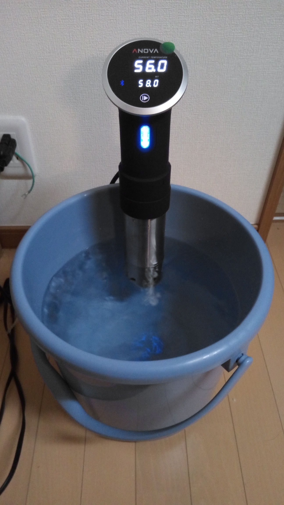

[めしにしましょう](https://amzn.to/2J8onek)に出ていた、超級カツ丼をAnovaを使ってやってみました。
<iframe style="width:120px;height:240px;" marginwidth="0" marginheight="0" scrolling="no" frameborder="0" src="//rcm-fe.amazon-adsystem.com/e/cm?lt1=_blank&bc1=000000&IS2=1&bg1=FFFFFF&fc1=000000&lc1=0000FF&t=nasa9084-22&o=9&p=8&l=as4&m=amazon&f=ifr&ref=as_ss_li_til&asins=B01N8Q8DA7&linkId=acf882d00d695d1ad1796d9ee199c920"></iframe>

まずはお湯を予熱しておきます。58度です。
給湯器で温度を上げたお湯を使うと調理開始が早くなる、ということを学びました。

今回のお肉はこちら。近所の西友で97円/100gのアメリカ産豚肩ロース522gです。

適当にIKEAのジップロックっぽいやつに入れて空気を抜いておきます。
[前回](/anova-hello-world/)に比べて重いせいか大きいせいか、あまり上手く空気を抜けませんでした。
ちょっと不安だったものの、まぁイケるでしょとそのままやっていきです。

投入。今回は24時間(!)やっていきます。

24時間たったお肉がこちら。おいしくなさそう。

タマネギをスライス(スライサーなどないので包丁で薄切り)していきます。指を少しそぎました。痛い。

肉は四分割しました。
ブロックの向きによっては二枚でも良かったんですが、油の方向的にこうなりました。

衣をつけた様子。塩こしょうを振って、小麦粉→卵→パン粉→卵→パン粉です。

揚げました。200度の油で20秒です。

卵でとじて御飯の上にドーンしたのがこちら。卵でとじる作業は戦争なので写真を撮っていませんでした。

アツい。

大変柔らかく、おいしかったです。
一部筋っぽいのが残ってたところもあったので、下処理とかした方が良かったのかもしれないですね。
あと、二人分にしては多かったので次はもう少し人数を確保した方がよいと思いました。

