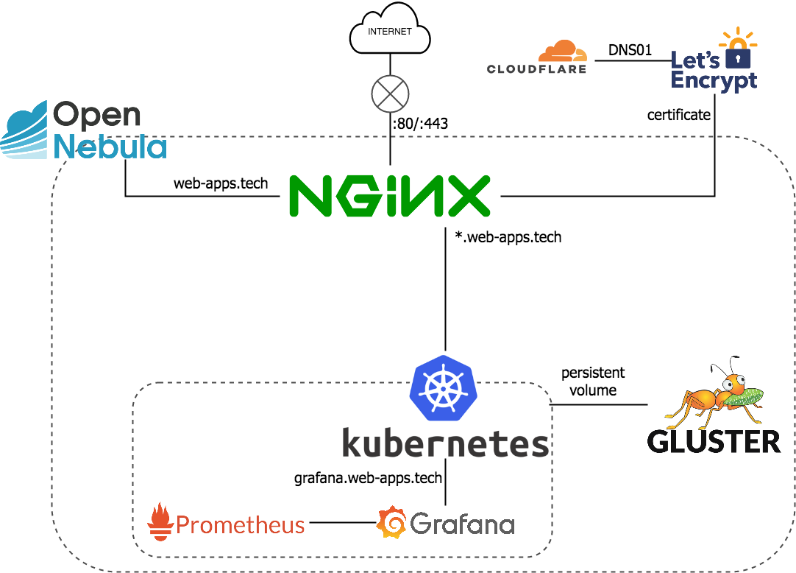

## TL;DR

* `Service type: ExternalName`を使用する

## External Service

[Kubernetes](https://k8s.io)では、[`Ingress`](https://kubernetes.io/docs/concepts/services-networking/ingress/)を使用することで、ホスト名ベースのロードバランシング/リバースプロキシを行うことが出来ます。その際、プロキシ先としてKubernetes上の[`Service`](https://kubernetes.io/docs/concepts/services-networking/service/)を指定するのですが、場合によってはKubernetesクラスタ外のサービスをプロキシ先としたい場合があります。例えば、弊宅の環境では、次の様にプロキシしています。



基盤であるOpenNebulaのダッシュボード以外は`*.web-apps.tech`として、Kubernetesへとルーティングしています。

ところで、本ブログは現在Kubernetes上へ移行作業中です。今のところはまだ、Kubernetes上へ載せていません。しかし、折角プロキシの設定が減っているので、`blog.web-apps.tech`も`Ingress`リソースとして管理したいです。

そこで使用できるのが`Service type: ExternalName`です。`ExternalName`として外部サービスを登録することで、`Ingress`のバックエンドとして使用できるようになります。


## 設定

設定はごく簡単で、次の様にします。

``` yaml
---
apiVersion: v1
kind: Namespace
metadata:
  name: external-services
---
apiVersion: v1
kind: Service
metadata:
  name: ghost
  namespace: external-services
spec:
  type: ExternalName
  externalName: 192.168.1.41 # 本ブログのローカルIP
```

今後も何かの拍子でKubernetesに載せたくないサービスが増える可能性もあるため、`external-services`として名前空間を分離しました。このように設定すると、`kubectl`からは次の様に見えます。

``` shell
$ kubectl get svc --name external-services
NAME      TYPE           CLUSTER-IP   EXTERNAL-IP    PORT(S)   AGE
ghost     ExternalName   <none>       192.168.1.41   <none>    54m
```

後は、普通にIngressの設定をするだけです。

``` yaml
---
apiVersion: extensions/v1beta1
kind: Ingress
metadata:
  name: ghost
  namespace: external-services
spec:
  rules:
    - host: blog.web-apps.tech
      paths:
        - path: /
          backend:
            serviceName: ghost
            servicePort: 2368
```

これで無事、`Ingress`リソースとして管理されたサブドメイン`blog.web-apps.tech`でクラスタ外のブログサービスへアクセスできるようになりました。

