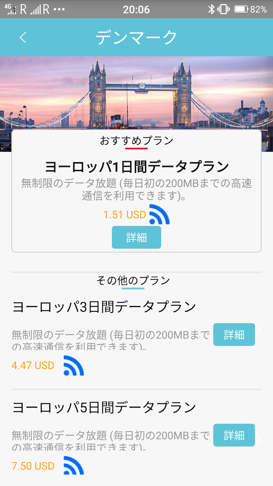

先日、[初めて海外に行ってきた](/i-went-to-kubecon-cloudnativecon-eu-2018/)んですが、その際、[slimduet](https://www.slimduet.net/)というeSIM(ソフトウェア的な設定で通信事業者を変更出来るSIM)を使用してネットワーク通信をしたので、設定方法などをまとめておきます。

## 前提

端末は[FREETELのKiwami 2](https://www.freetel.jp/product/smartphone/kiwami2/)(Androidのバージョンは6)、行き先はデンマーク/コペンハーゲンです。

## 設定

### SIMを購入する

slimduetを使用するには専用のeSIMが必要ですので、[公式サイト](https://www.slimduet.net/)やAmazon(記事執筆時点では在庫なし)から購入しておきます。

SIMカードの価格はは2000円を切る程度です。

### slimduetのアプリをインストールする

slimduetを使用するには、専用のアプリをインストールする必要があります。
Google Playで[slimduet](https://play.google.com/store/apps/details?id=com.greenroam.slimduet)と検索し、インストールします。

勿論、この段階では別途データ通信が出来る必要があります。

### プランを購入する

slimduet SIMを端末に挿入してから、行き先に併せたプランを購入します。
この段階では、Wi-Fiなどのデータ通信が出来る必要がありますので、空港やホテルのWi-Fi等を使用するか、日本国内にいる内に購入しておきます。

slimduetアプリを起動すると、行き先の検索画面が表示されますので、行き先を入力し検索します。
今回はデンマークですので、「デンマーク」と入力し、**検索バー横のルーペボタンを押します**(キーボードの**Go**や**Done**、エンターなどでは検索されないので注意)。

おすすめプラン、ということでデンマークで使えるプランが表示されますので、選択します。

国別プランを選択すると画面が変わり、1日間、3日間などのプランが表示されますので、日程にあわせた期間のプランを選択します。

クレジットカードなどで購入手続きをした後、画面下部の「私の電話番号」を押し、購入したプランが表示されていることを確認します。

また、この段階でSMSで購入したプランについてメッセージが来るはずです。

### 電話番号を切り替える

自動電話番号切り替えに対応した端末では、プランの「詳細」から、「携帯電話番号の切り替え」を押すことで切り替えることが出来ます。

Kiwami 2は対応していないため、SIM Toolkitを使用して番号の切り替えを行います。
AndroidのアプリドロワーからSIM Toolkitを起動します。

SIM Toolkitを起動すると、SIMの一覧が表示されるので、slimduetかな？と思われるものを選択します。

SIMを選択したら、「携帯電話番号を切り替え」、「ご利用する携帯電話番号を選択してください」の順で選択します。
「携帯電話番号を切り替え」のあと、「設定」を選択したくなりますが、こちらではないため注意します(図の赤枠で示した部分を選択します)。

購入したプランが表示されますので、選択します。

### APNの設定をする

電話番号の切り替えが出来たら、APNの設定をします。
Androidの設定から、「SIMカードとモバイル通信」の設定画面を開きます。

「モバイルネットワーク設定」を開き、データ通信を有効にする、データローミング、にそれぞれチェックを入れます。

「アクセスポイント名」の設定画面を開き、右上の **+** からAPNの設定を追加します。
名前は適当なもの(slimduetなど)を入力し、APNを `uinternet`として保存します。

保存したら、作成したAPN設定を選択します。

この時点でデータ通信が出来るようになっているハズです。

この時点でデータ通信が出来ない場合、通信事業者を適切なものに設定する必要がある可能性があります。

