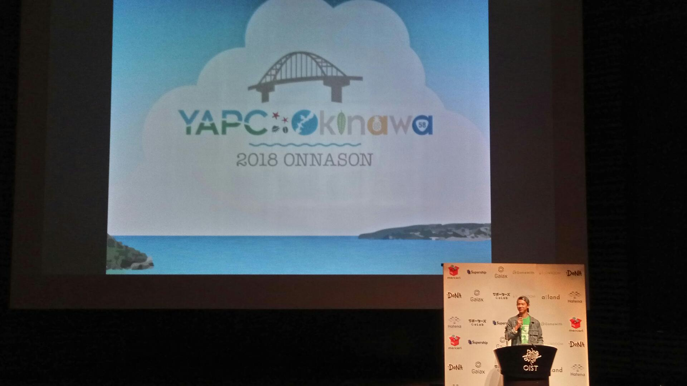
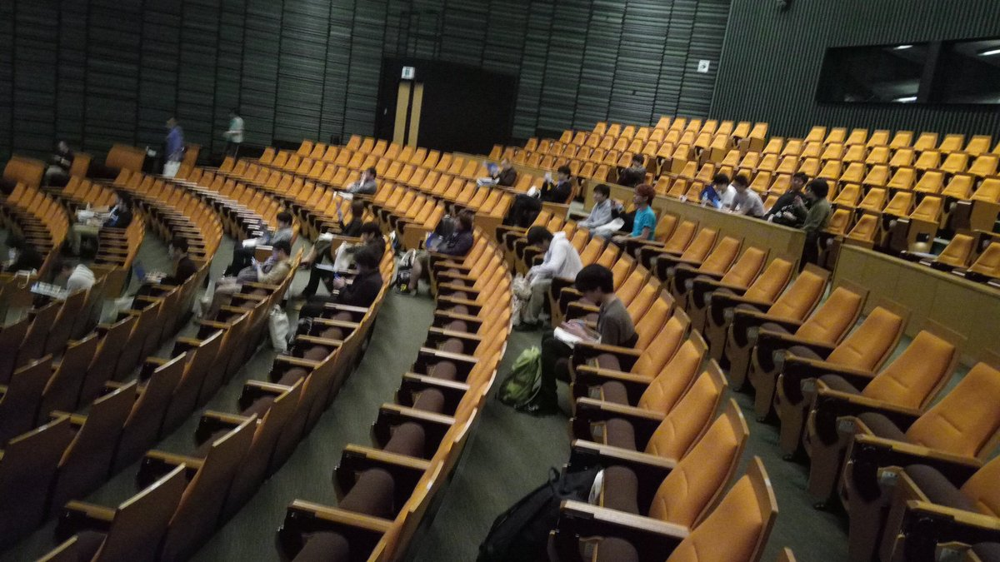
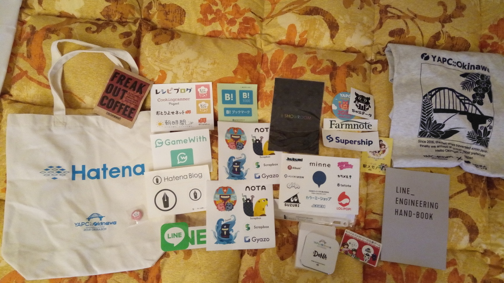
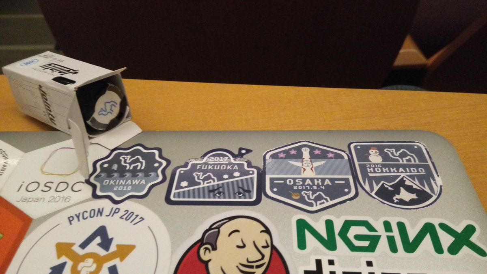

[YAPC::Fukuoka 2017 HAKATA](https://yapcjapan.org/2017fukuoka/)(行ってきたときの記事は[こちら](/yapc_fukuoka_2017))に引き続き、[YAPC::Okinawa 2018 ONNASON](http://yapcjapan.org/2018okinawa/)に行ってきました。
YAPCはPerlのイベントで、"Yet Another Perl Conference"の略です。twitterハッシュタグは前回に引き続き[#yapcjapan](https://twitter.com/hashtag/yapcjapan)でした([#yapcokinawa](https://twitter.com/hashtag/yapcokinawa)もよく使われていたようです)。

沖縄は昨年6月に[OSC 2017 Okinawa](https://www.ospn.jp/osc2017-okinawa/)で行って以来二度目です。
YAPC当日はすごい雨で、YAPC::Hokkaidoで大雪だったことを思い出し、「端っこでYAPCをやると何かが起きるのでは」などと言われる具合でした。

今回は直前までホテルが取れなかったものの、過去のYAPCでホテルを取らずに行って適当になんとかなったので、なんとかなるだろうと思っていましたが、直前に東横インを確保できたので、宿無し旅行ではありませんでした。

## YAPC::Okinawa 2018 ONNASON
今回は会場が[OIST](https://www.oist.jp/ja)だったため(OISTは那覇市内から車で約一時間)、多くの人がスタッフが手配した往復バスでの参加となりました。
そのため、寝坊する人は少なく(いなくはなかったようです)、私もオープニングから参加できました。

オープニングは[CodeHex](https://twitter.com/codehex)氏。

オープニングを行ったA会場は非常に広く、なんと全席にコンセントがついているという素晴らしいホールでした。

ノベルティはこんな感じ。特筆すべきはDeNAさんのQi充電器でしょうか。しかし私はQi対応端末を持っていないので使えないのが残念・・・・
毎度恒例、ネコトーストラボさんのサイリュームもあります。

YAPC::Hokkaidoから行われてきたチェックインスタンプラリーもココで一区切り。
コンプリート特典として、JPAのラクダさんのシャチハタスタンプをいただきました。

トークでは、「レイヤー0(電波)からレイヤー8(交渉事)までできる人を募集しています」や、「無曖昧でない」など、会場がどっと沸く名言(迷言？)がいくつか飛び出ました。

個人的には、[@moznionさん](https://twitter.com/moznion)のInlineモジュールの話や、[新屋さん](https://twitter.com/sinya8282)の正規表現の話が非常に面白かったと思います。
特に、正規表現の話ではバックトラックと曖昧な正規表現の相性が悪い、といった技術的な話にとどまらず、文脈自由文法など、計算理論にまで踏み込んだトークとなっており、OISTという会場でのトークに相応しい素晴らしい内容だったと思います。

## 次回のお話

次回YAPCは[東京](http://yapcjapan.org/2018tokyo/)だそうです！現在はまだテザーサイトがある程度で、日程、会場は調整中とのことでした。

