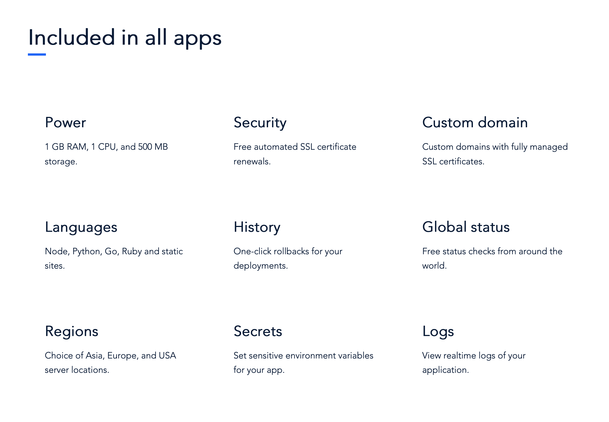
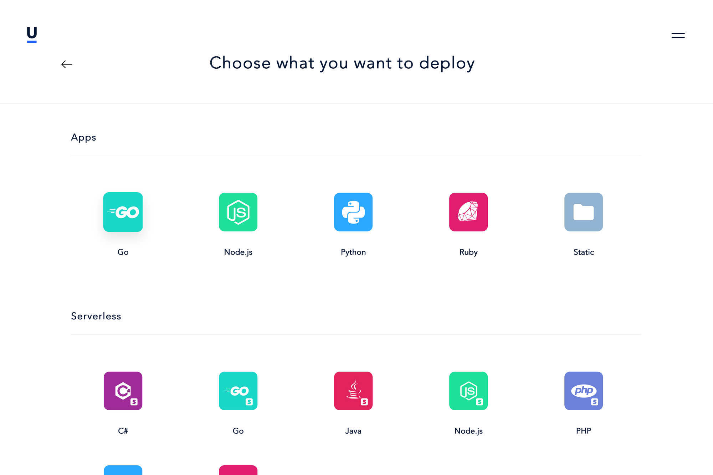
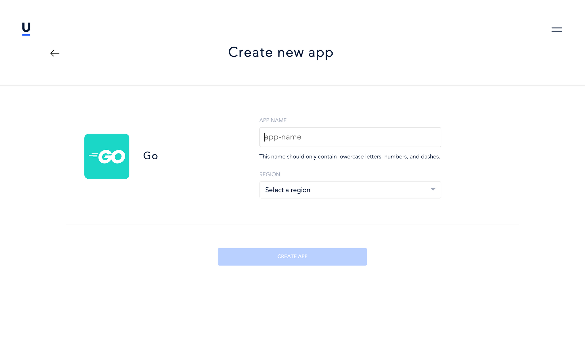
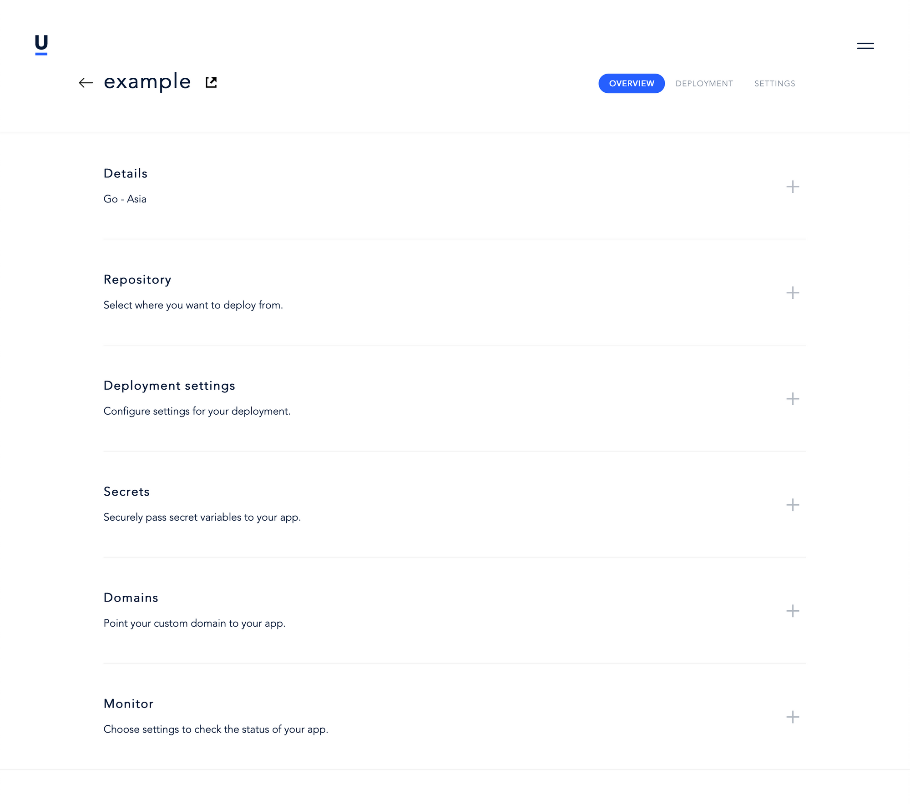

[Unubo](https://unubo.com)というPaaSっぽいものが出てきたようなので触ってみました。 まだリリースされたばかりのようで、クレジットカードの登録もせずに無料で使用できます。

とりあえず適当にリポジトリを作って動かしてみました。 登録・ログインを済ませたら、使用したい機能を選択します。今回はGoのアプリケーションなので、AppsセクションにあるGoのアイコンを選択しました。

次の画面でアプリケーション名を入れ、デプロイ先のリージョンを選択します。 DBと接続する場合はDBと同一リージョンじゃなきゃ接続できないそうです。

最後に、細かい設定をできる画面になりますので、必要な情報を入力します。
ここでは、とりあえずGitHubとの連携をして、リポジトリを選択するだけであとは放置します。

最後にDeployボタンをポチッとしてデプロイされるのを待ちます。
どうやら、Deploy成功からアクセスできるようになるまで若干タイムラグがあるようなので、気長に待ちましょう。

有料プランが出てから価格設定や無料枠がどうなるかわかりませんが、まぁぼちぼち便利に使えそうですね。

