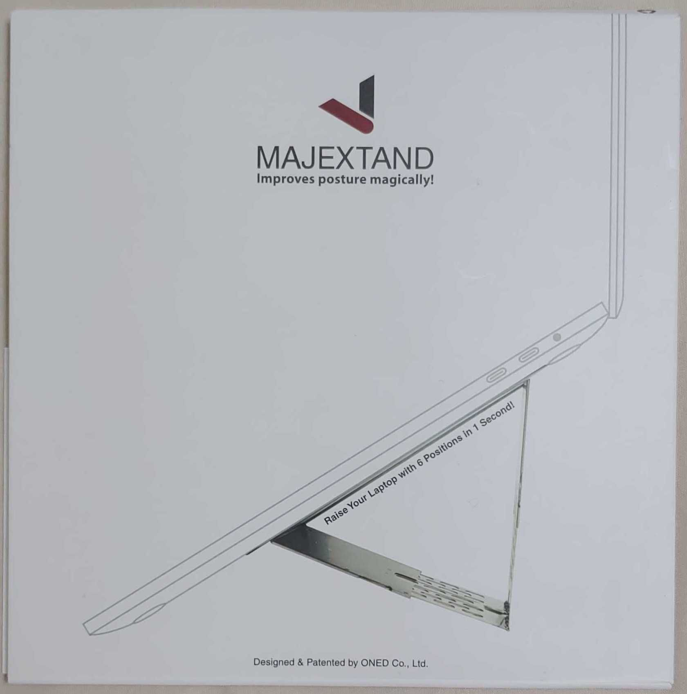
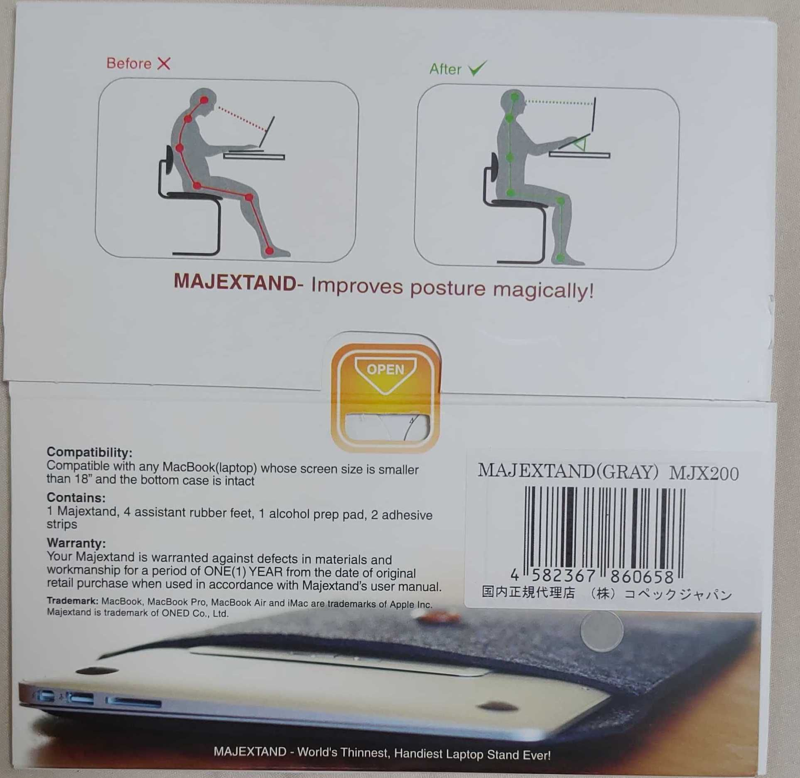
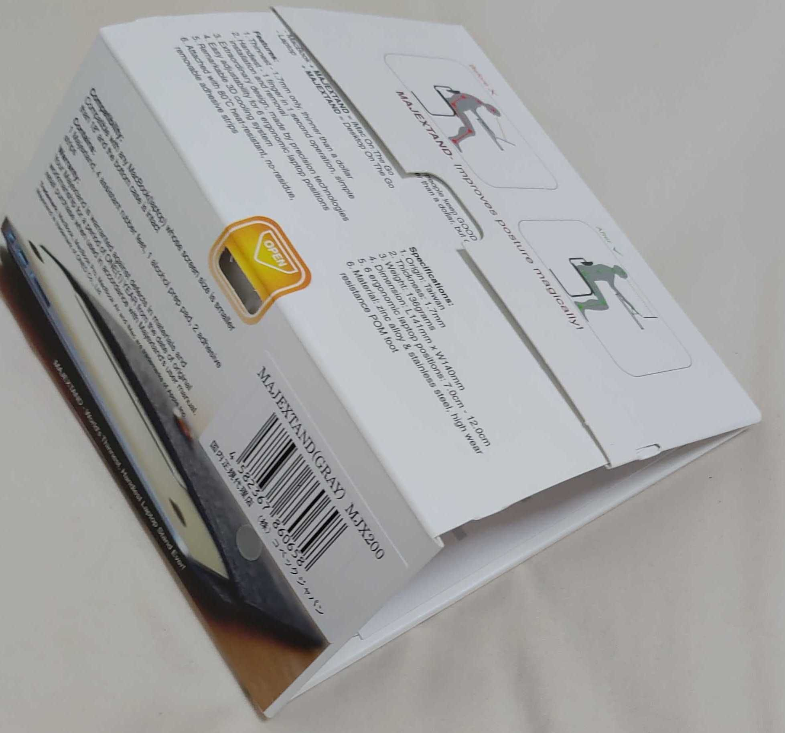
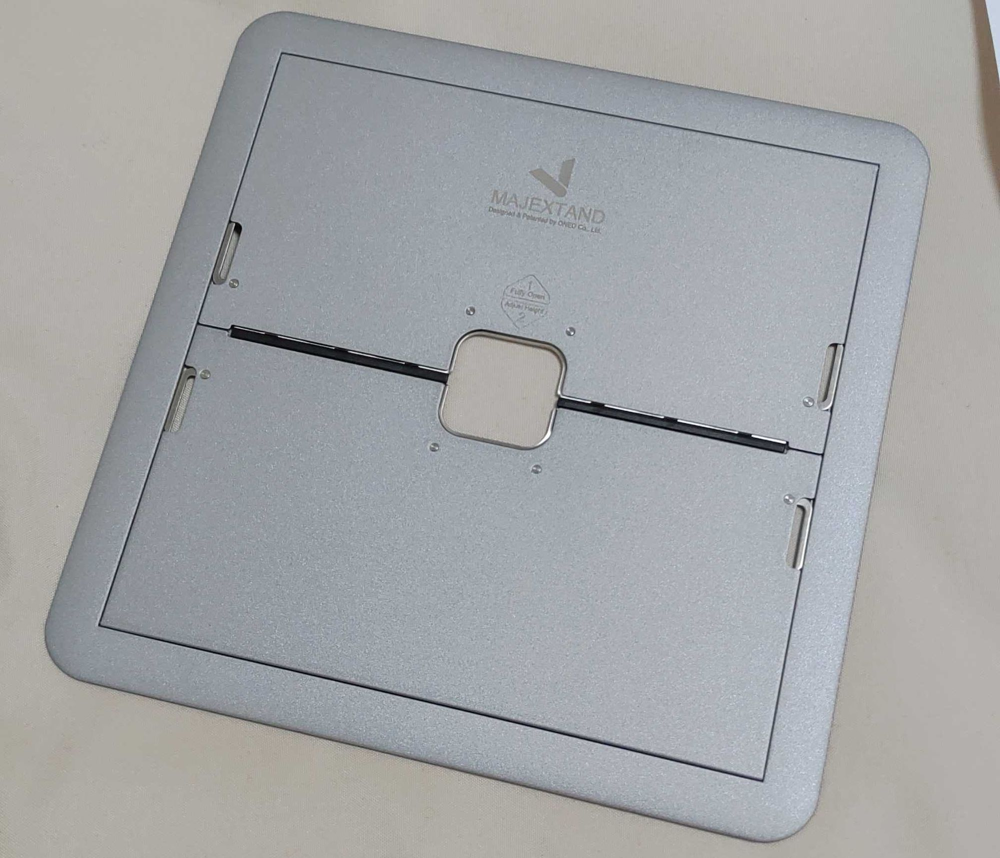
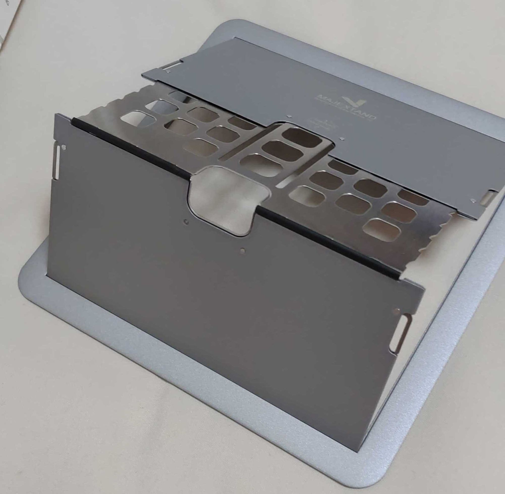
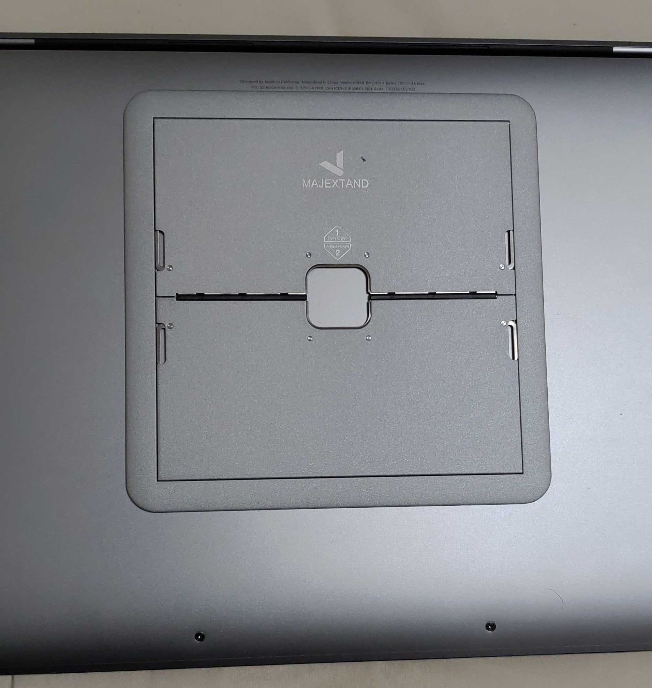

ラップトップスタンド、というものをご存知でしょうか。いわゆるノートPCを傾けたり、高さを変えるために使用するアイテムです。折りたたみができるものや、PCに貼り付ける小型のものなんかもあります。
貼り付け型のものとしては、[Kickflip](https://amzn.to/2CRmzAv)が人気です。
今回紹介するのも貼り付け型で、その名も[Majextand](https://amzn.to/2CNbNeD)といいます。
特徴としてはとにかく薄い。そしてその薄さにも関わらず、6段階の高さ調整ができる、という点です。

まずはパッケージ。すっきりとしたパッケージです。商品名をggって出てくるブログに掲載された写真では何やら筆文字で書かれているようなパッケージが見られますが、現行品ではなくなったようです。

裏面はこんな感じ。スタンドを使用して画面を高くすることで猫背を防ぎ、頚椎の姿勢を正します。また、18インチ以下のラップトップであれば基本的には使用できます。非常に薄いため、インナーケースなどに入れる場合にも引っかかりません。

パッケージ自体にテープなどは使用されておらず、Majextand本体と同じように引き出す形となっています。パッケージ自体が本体と同じような構造になっているのは素敵な感じがしますね。

本体を取り出しました。非常に薄く、切れ目が入ったただの鉄板と言われても信じてしまいそうです。測ってはいないのですが、他のレビュー記事によるとだいたい10円玉と同じ厚さとのこと。薄い。
しかし、薄さに対して、若干重い気はします。スタンドという用途ですから、強度を確保するには仕方ないのかもしれませんが。

このように引き出して使います。(本当は手前をまず引き出して、奥側は高さ調整のために使う)

MacBook Pro (13-inch, 2018)のスペースグレーの底面に貼り付けるとこんな感じ。両面テープは非常に強く、意図的に剥がさなければ剥がれてしまうということはなさそうです。
今回購入したMajextandはグレーで、MacBookのスペースグレーとは若干色味が違いますが、すごく目立つということはなく、安心しました。

購入したばかりでまだ活用できていないのですが、これから使っていきます。

