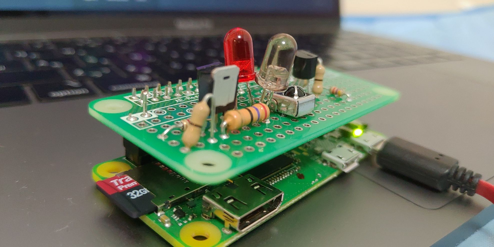
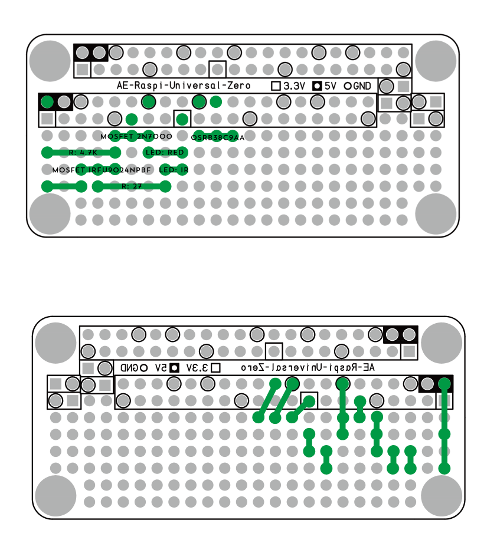

家で~~転がっていた~~使われないでいたRaspberry Pi zero Wを使って、家庭内のリモコン機器を自動化しようと思い立ち、秋葉原くんだりまで行って諸々部品を買ってきました。

ゴミを二つほど生成したのち、最終的に動くモノができましたので備忘録的に残しておきます。

<blockquote class="twitter-tweet"><p lang="und" dir="ltr"><a href="https://t.co/e55qxX5GL6">pic.twitter.com/e55qxX5GL6</a></p>&mdash; nasa9084@某某某某(0x1a) (@nasa9084) <a href="https://twitter.com/nasa9084/status/1155835409131196419?ref_src=twsrc%5Etfw">July 29, 2019</a></blockquote>
<script async src="https://platform.twitter.com/widgets.js" charset="utf-8"></script>

主に「[格安スマートリモコンの作り方](https://qiita.com/takjg/items/e6b8af53421be54b62c9)」を参考にしました。部品を購入した店は秋月電子で、商品ページの下の方にある「店舗情報」のリンクをクリックすると店内のどの棚に商品があるのかわかり便利です。どの部品も特に珍しい部品ではないため、商品自体がなくなっているようなことは(Pi zero用ユニバーサル基板をのぞき)まず無いように思えます。また、手持ちで0Ω抵抗が(なぜか)在庫してあったため、ジャンパ線代わりに使用しています。
一番見つけづらかったのがPi zero用ユニバーサル基板ですが、これは店の中ではなく、外のRaspberry Pi関連部品が置いてあるところにありました。

上記のQiita記事はさほど古いモノではないため、価格も変わってなかったように思えますが、動くモノができるまでにゴミを二つほど生成した都合上、三倍程度のコストがかかりました。回路周りや半田付けがあまり得意ではない人は覚悟(というほどの額ではないですが)しておいた方が(材料を余分に買っておいた方が)良いでしょう。

余談ですが部品を購入した際、近くのあきばおーでTranscendのmicro SDが安くなっていたため、大して使い道も考えずに32GBのモノを5枚ほど購入しました。



ほとんどの情報は参考にしたQiita記事にまとまっているため詳細は端折りますが、変更点として赤LEDを足してあります。ピカッと可視光が光るので、実行されたということを確認するのに便利です。

参考記事には実際の配線図だけはなかったので、紹介します。




上図が部品面、下図が半田面です。MOSFET 2N7000は平らな面が図の上側、MOSFET IRFU9024NPBFは放熱板(?)が図の下側、赤外線LEDは欠けている側(カソード？)が図の右側、赤LEDは欠けている側が図の左側、赤外線受光モジュールOSRB38C9AAは受光部が図の上側を向くように配置します。私は受光モジュールは図の下方向に向けて折り、受光部が天を向くような形にしました。
ブレッドボード上で配線してそのまま基板に移植したような形になっているため、複雑な配線もなく比較的簡単かと思います。
IRFU9024NPBFの左下はジャンパなので、半田面で配線してもかまいません(私は0Ω抵抗を使用した関係で部品面を通しています)。




赤外線コードの学習・実行も参考記事通りpigpioを使用しましたが、毎度SSHしてコマンドを実行するのは面倒なため、GoでAPIサーバを実装しました。Goで赤外線をGPIOでいい感じにアレするようなパッケージが見当たらなかったので、GoからPythonのスクリプトを叩くという残念なコードになっております。いいパッケージがあれば誰か教えてください。

<script src="https://gist.github.com/nasa9084/c482f43cc9ee0644782f8c75013fc778.js"></script>

systemdかなんかでデーモン化したりなんかして起動しておくと、例えば、

``` shell
$ curl http://raspberrypi.local/playback?key=light:off
```

とかすると部屋の電気が消せます。素晴らしい。

今のところ外部に公開してはいないのですが、外部に公開すると他のサービスとの連携(例えばIFTTT)ができないので、公開したい気持ちがあります。とはいえ、外からむやみに部屋の電気をあれこれされても困るし(だれもやらないとは思いますが)、そのまま公開するのも難しいな、と思っているところです。

とりあえずは扇風機とか、そのあたりをなんかいい感じにアレしたいですね。


