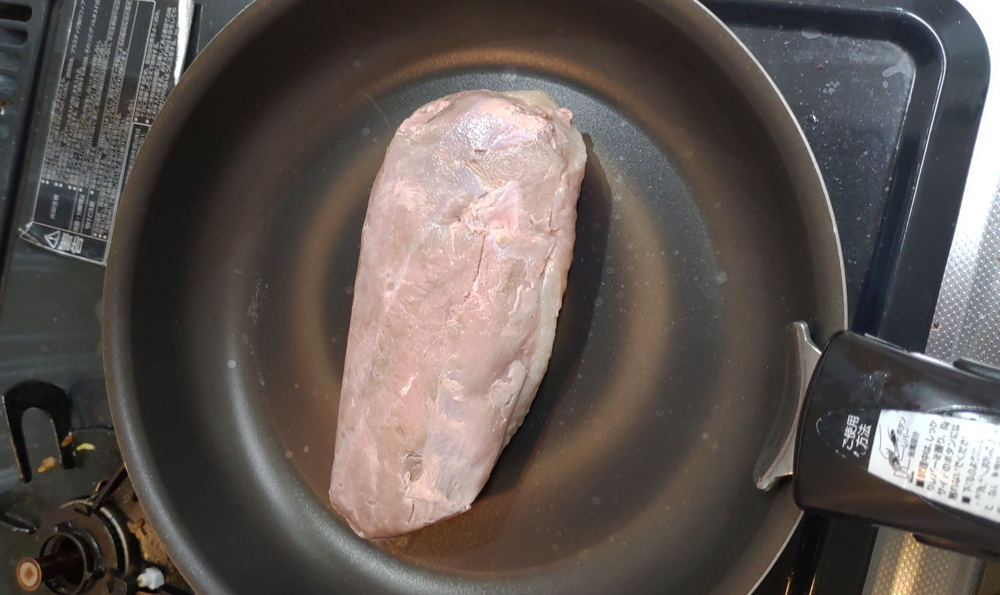
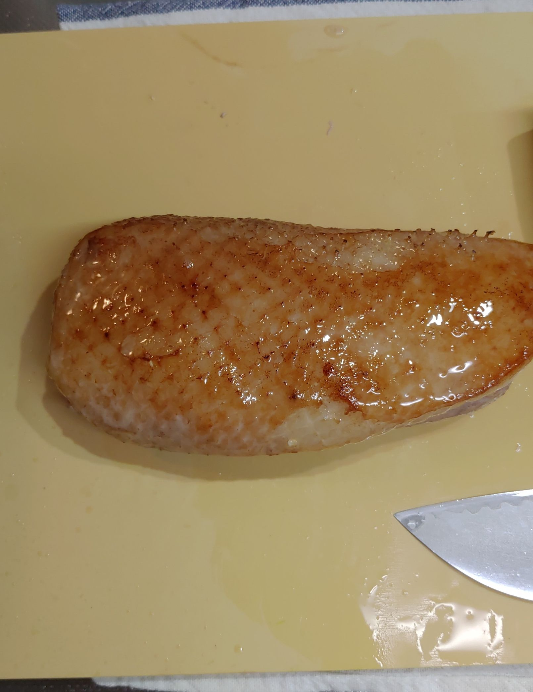
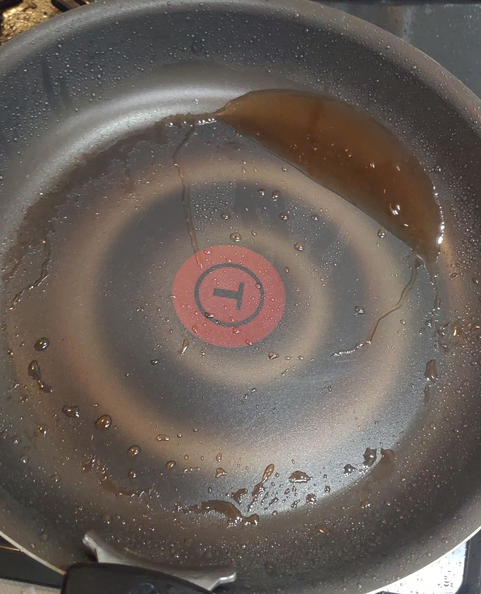
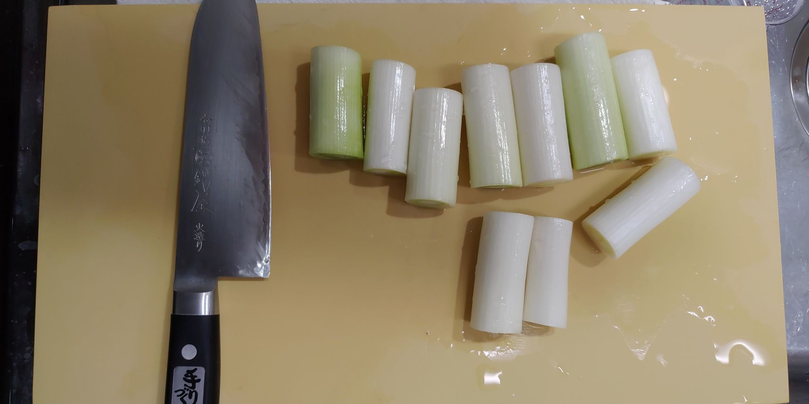
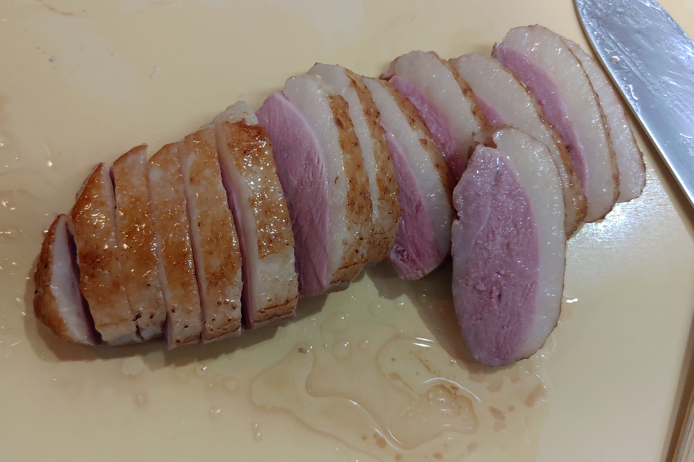
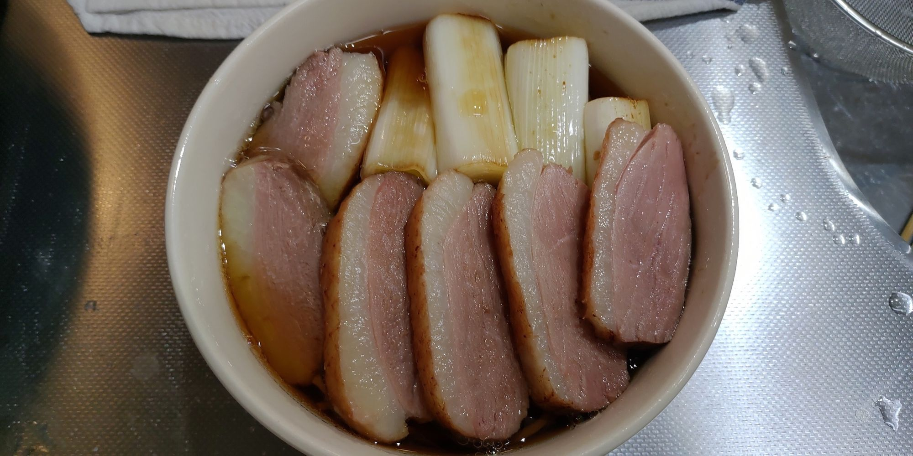

もう1月も半ばを過ぎ、まもなく2月が来る、というところで今更感を拭うことができない話題なのですが、2018年末(実は時間的には年が明けていたが)に年越しそばとして鴨南蛮を作りました。

さて、鴨南蛮なので鴨肉が必要です。今回は[builderscon](https://builderscon.io)の肉会などでお世話になっている[ミートガイ](https://www.themeatguy.jp/ja/)さんから[鴨の胸肉](https://www.themeatguy.jp/ja/d002.html)を購入しました。

こちらが回答した鴨肉をAnovaでやったやつです。温度は忘れたんですが、大体1~2時間くらいやったやつです。

軽く塩をした後、熱したフライパンで焼き目をつけていきます。皮を下にして、高めの温度でさっとやります。

焼き目をつけた鴨肉です。いい色ですね。

油がたくさん出ます。

鴨から出た油でネギを焼きましょう

ネギを焼いている間に鴨を切ります。幸せのため少し厚切りにしましたが、鴨はすこし薄めでもいいかもしれないです。

最後にそばの上に盛り付けて完成。うまい。

