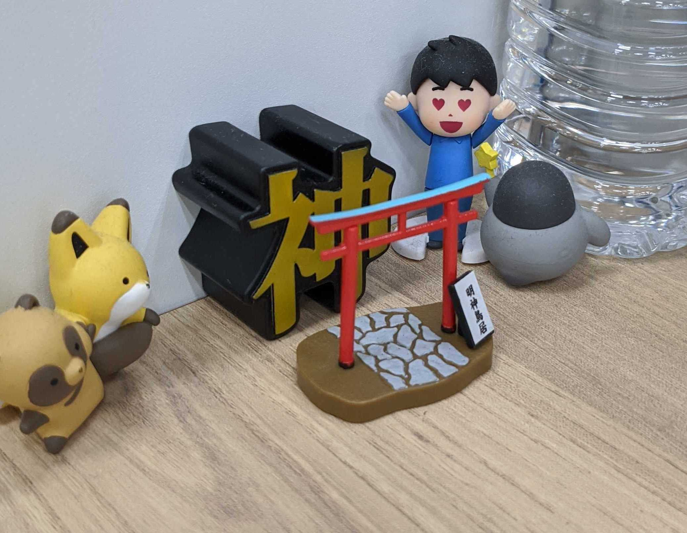

‌

2020年に入って早1週間が経過しましたが、皆様いかがお過ごしでしょうか。 一年の振り返り！みたいのはあんまりやるつもりがなかったのですが、あまりにもみんなやっていて目につくので、これはやった方が良い物なのか・・・と思い直し、遅ればせながら振り返ってみようかと思います。

### 1月

<blockquote class="twitter-tweet">
そういえば2018年振り返りみたいなブログ書いてないんですが、2019年は心おだやかに生きたいと思っております
&mdash; nasa9084@某某某某(0x1a) (@nasa9084) <a href="https://twitter.com/nasa9084/status/1080869672818335744?ref_src=twsrc%5Etfw">January 3, 2019</a></blockquote>

twitterによると、2019年は心おだやかに生きたいというのが目標だった様子。あまり心穏やかには生きられませんでした。合掌。

そういえば昨年は年明け早々インフルエンザにかかったんでした。

一月はLOCALのイベントに行ったり、YAPC::Tokyoに行ったりしていた様子。ここ半年はカンファレンス/勉強会参加数も減ってきてしまっているので、ここらでちょっと頑張りたいところです。

### 2月

ONIconをやったり、自作ケーブルを作り始めたり。

gomaconfやcookpadtechconfもこのあたりだったようです。

### 3月

<blockquote class="twitter-tweet">
ペティナイフが欲しい
&mdash; nasa9084@某某某某(0x1a) (@nasa9084) <a href="https://twitter.com/nasa9084/status/1101339768116281344?ref_src=twsrc%5Etfw">March 1, 2019</a></blockquote>

ペティナイフ、ネット上でもいろんな人が「便利！」って言ってて、しかしまぁ三徳で不自由してなかったんですけど、買ってみたら実際メチャクチャ便利で、正直三徳よりペティを使うことの方が圧倒的に多い。

LINE.goというイベントを開催したのも3月でした。

<blockquote class="twitter-tweet">
朝ご飯 <a href="https://t.co/PLRDDJEOCY">pic.twitter.com/PLRDDJEOCY</a>
&mdash; nasa9084@某某某某(0x1a) (@nasa9084) <a href="https://twitter.com/nasa9084/status/1102716831599484928?ref_src=twsrc%5Etfw">March 4, 2019</a></blockquote>

ご神体は今も職場の机にまつられています。なんと今は鳥居もついています

### 4月

<blockquote class="twitter-tweet">
皆さん技術書典の進捗どうですか
&mdash; nasa9084@某某某某(0x1a) (@nasa9084) <a href="https://twitter.com/nasa9084/status/1112944814541070337?ref_src=twsrc%5Etfw">April 2, 2019</a></blockquote>

今もまた、技術書典の進捗に追われています。

<blockquote class="twitter-tweet">
たいした意味もなく近所のコインランドリーで枕を洗濯した結果、ドラム式洗濯乾燥機がほしくなってる
&mdash; nasa9084@某某某某(0x1a) (@nasa9084) <a href="https://twitter.com/nasa9084/status/1116727517849608193?ref_src=twsrc%5Etfw">April 12, 2019</a></blockquote>

この後勢いよくドラム式洗濯機を買いました。最高。

### 5月

PyCon mini sapporoが5月だったらしいです。GoConでしゃべったのもこのあたりだったらしい。

<blockquote class="twitter-tweet">
改めて。でかい。 <a href="https://t.co/zO9TLfdhy8">pic.twitter.com/zO9TLfdhy8</a>
&mdash; nasa9084@某某某某(0x1a) (@nasa9084) <a href="https://twitter.com/nasa9084/status/1133758838824288258?ref_src=twsrc%5Etfw">May 29, 2019</a></blockquote>

OSC19doも5末〜6始でしたね

### 6月

<blockquote class="twitter-tweet">
鰹節食べ放題 <a href="https://t.co/c6ouIwcHis">pic.twitter.com/c6ouIwcHis</a>
&mdash; nasa9084@某某某某(0x1a) (@nasa9084) <a href="https://twitter.com/nasa9084/status/1138395750902054915?ref_src=twsrc%5Etfw">June 11, 2019</a></blockquote>

ところで、まとめを書くのも疲れてきました。

### 7月

Golang 101を開催したのが7月だったようす。またやりたいんですが、会場が難しいですね。

<blockquote class="twitter-tweet">
進捗です <a href="https://t.co/cbZGgdeHiA">pic.twitter.com/cbZGgdeHiA</a>
&mdash; nasa9084@某某某某(0x1a) (@nasa9084) <a href="https://twitter.com/nasa9084/status/1155029202300628992?ref_src=twsrc%5Etfw">July 27, 2019</a></blockquote>

次の技術書典に向けて、これの第二巻を書いています。

### 8月

buildersconでした。2020に向けて頑張ってます。

### 9月

技術書典でした。毎度つらいのに、なぜ毎度応募してしまうのか・・・

### 10月

Pixel 4を買いました。もう二ヶ月経ってるのか・・・

### 11月

builderscon tokyo 2020の主催をやることに。自分でやる！って言ったんだけど、胃が痛い

### 12月

病んでました

