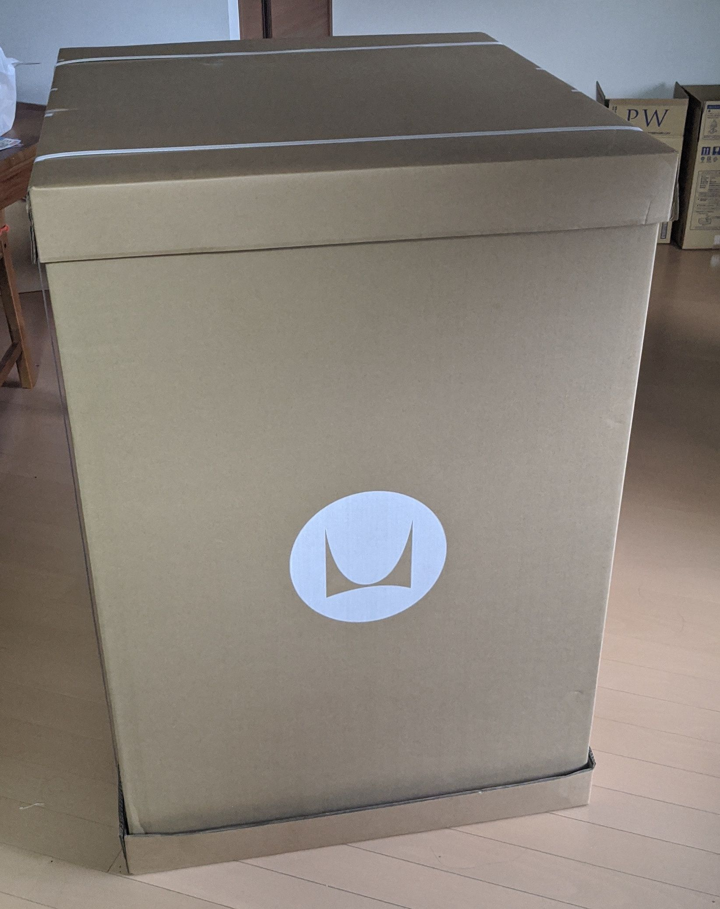
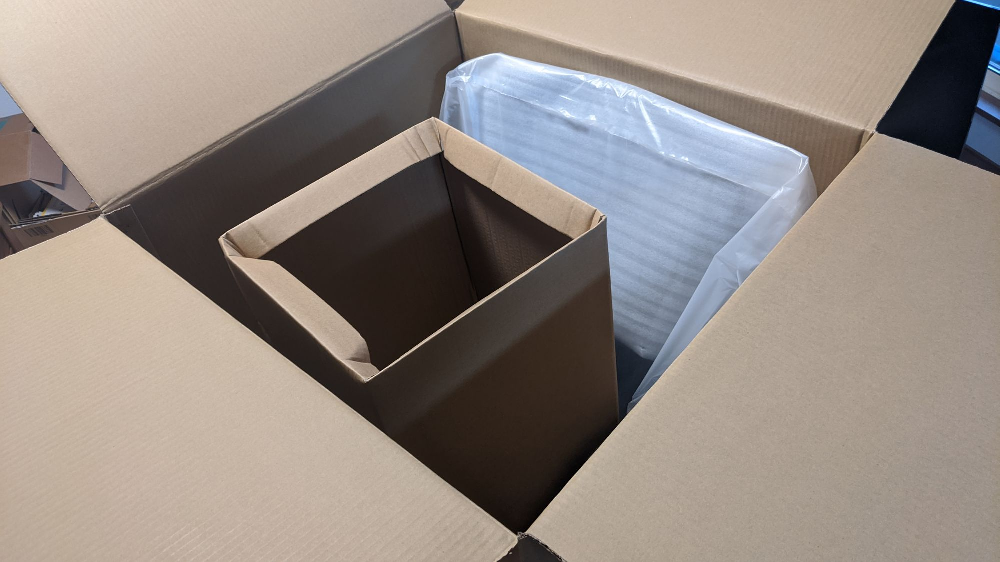
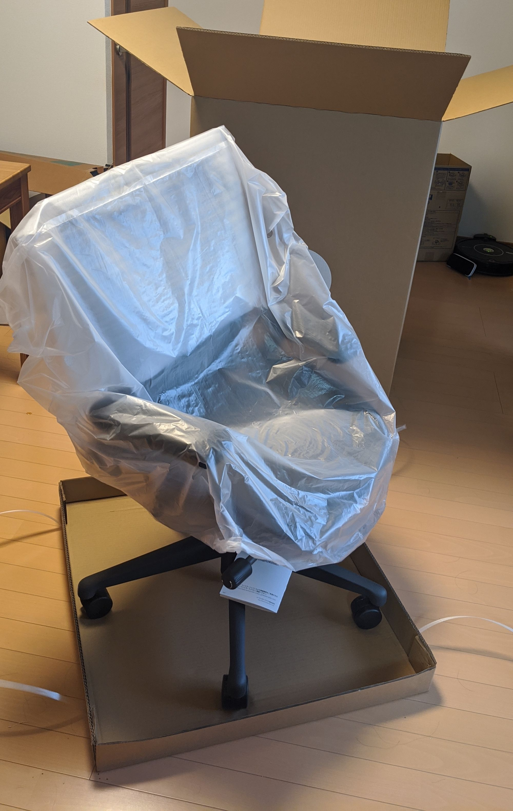
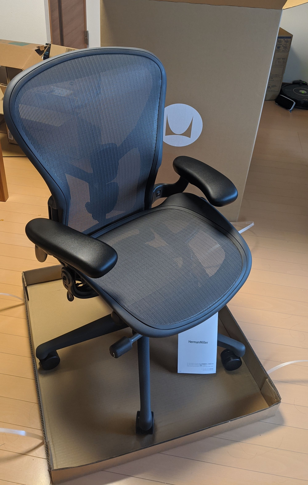
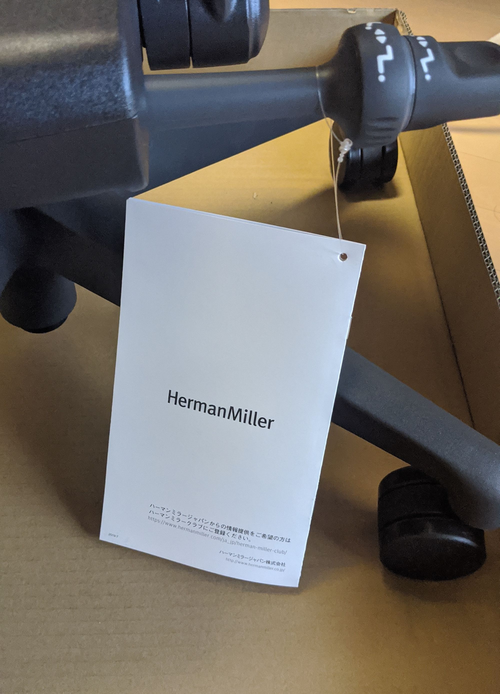
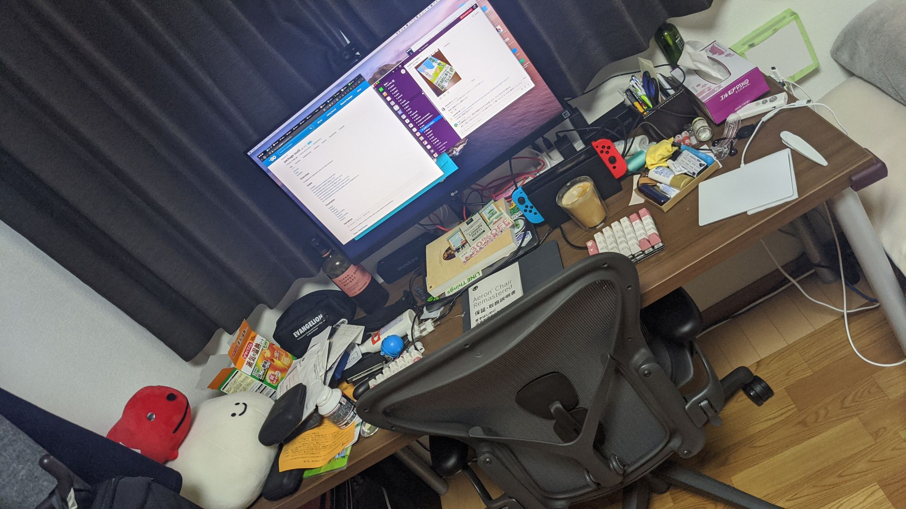

諸般あり、オフィスでも使用している、最高の椅子と名高い[アーロンチェア](https://storesystem.hermanmiller.co.jp/fs/hmjapan/AER1B23DWALPG1G1G1BBBK23103)をかなりお安く購入できるという機会を頂戴したので、COVID-19の影響を受けて完全にリモートワークをしていることもあって購入を決意しました。

おそらくオフィスで使用している物は旧型のアーロンチェアなのですけれども、今回購入したのは(新品なので当然ですが)現行の「アーロン リマスタード」、型番で言うと`AER1B23DW ALP G1 G1 G1 BB BK 23103`というものです。

注文をして支払いをしてからちょうど一週間で届きました。販売元は[Gregory Lyon社](http://www.gregorylyon.com/ja/)で、アーロンチェアをはじめとするハーマンミラーのオフィシャルディーラーです。

箱には取り扱いや持ち上げる際は二人でやりなさい、との注意書き。重いからとのことではありますが、重さよりも大きさがやばくて、我が家の階段(我が家は一階に玄関があり、内階段を上って二階が居住スペースという構成)は幅がぴったりで、手すりの上を通さないとだめでした。購入を検討している方は要注意。

箱を空けると中から箱が。これは多分スペーサーですね。

外箱は下部が空いていて、上からスポッと取り外すことができます。

ご対面！！！そうそう、これですこれ。うひょー。

説明書が座席下のノブにかかってました。特に結ばれているとかいう訳ではなく、棒状の物に引っかかっているだけなので、はさみとかも必要無く取り外すことができます。むしろ配送途中に取れなかったのがすごい。

デスクに合わせるとこんな感じに。机の上があまりきれいではないのはご愛敬と言うことで・・・

ちなみにこれまで使っていた椅子は[ニトリのリカルドPUブレスレザーBK](https://www.nitori-net.jp/ec/product/6620573s/)でした。これはこれでなかなか良い椅子だったので、ちょっと手放すのが惜しい、という気持ちがしています。スペースはあるし、とりあえず置いておいても良いかな・・・
ゲームするときとか、本読むときはふかふかしてる方が嬉しいですね。

アーロンチェアは基本的に保証が12年なので、長いお付き合いになる見込みです。よろしく。

