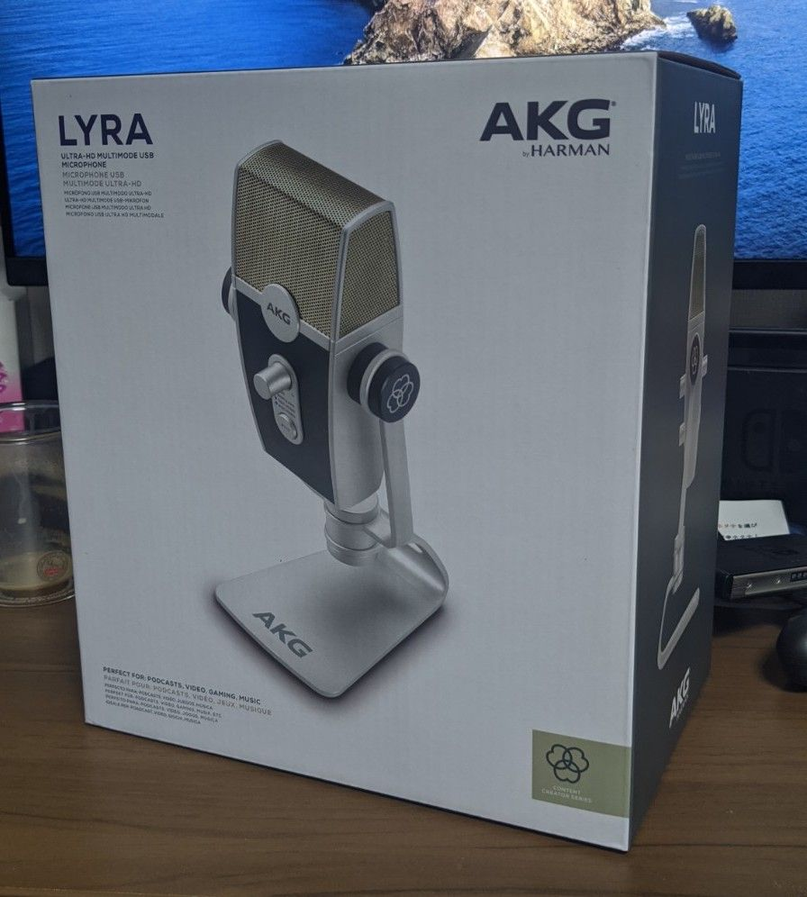
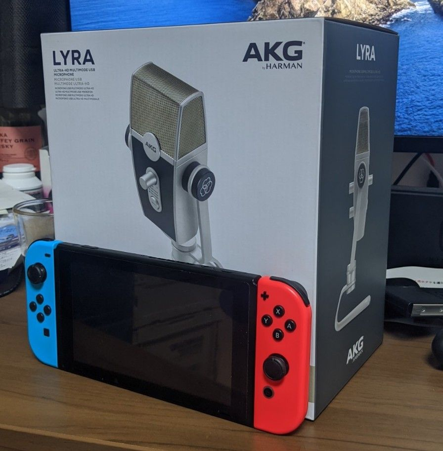
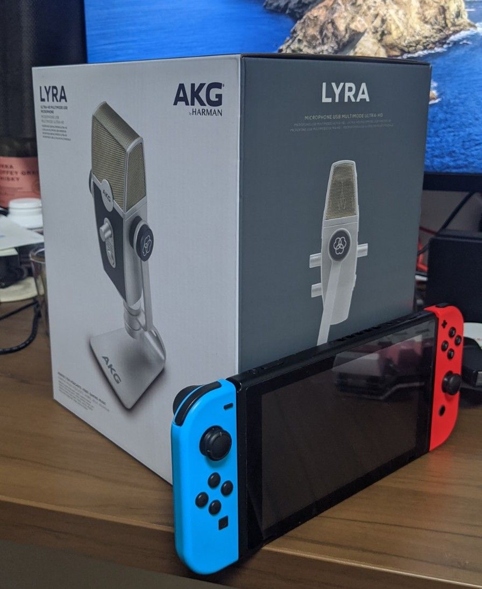
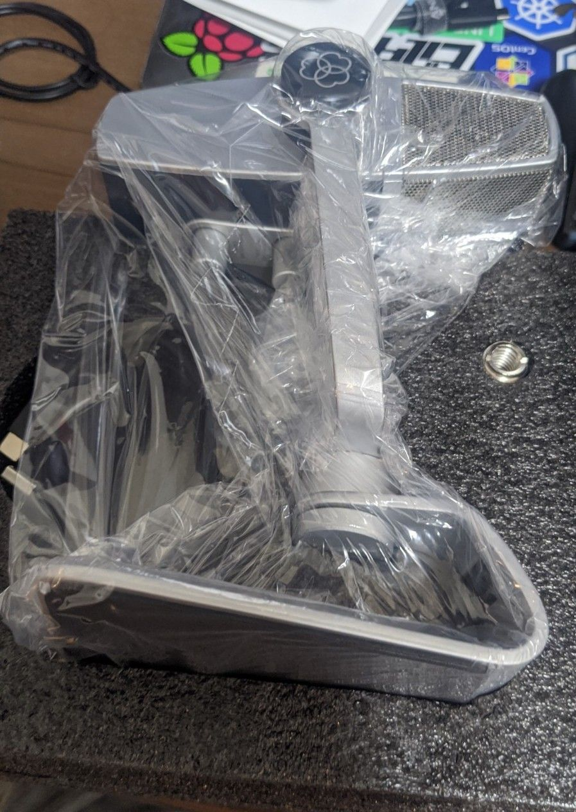
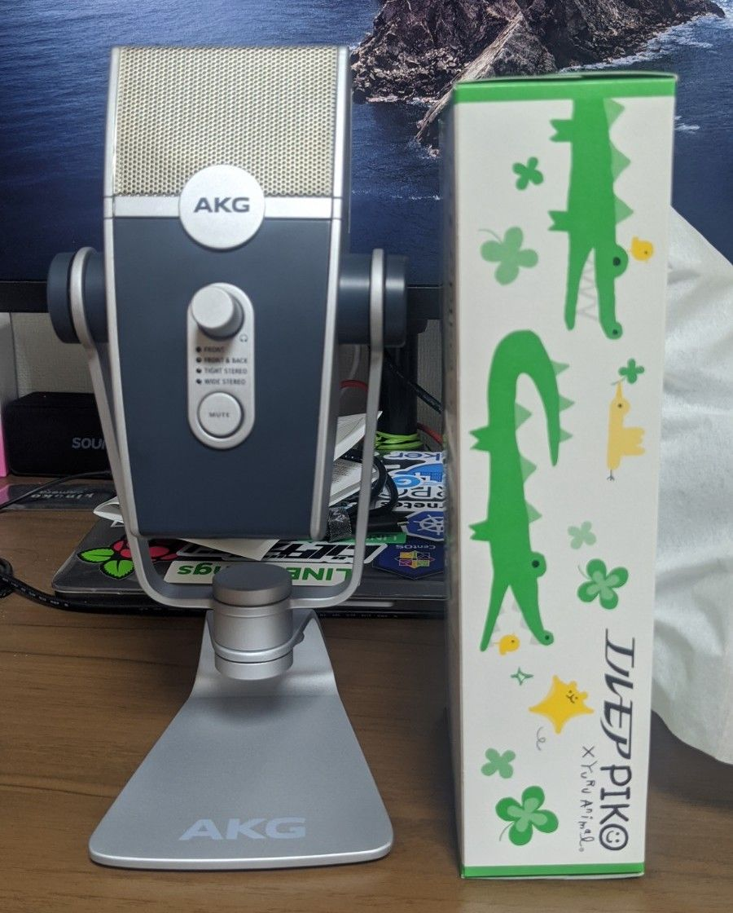

ようやく緊急事態宣言が解除され、むやみにガジェットを買う理由がなくなってしまった皆様、いかがお過ごしでしょうか。

新型コロナウイルス感染症拡大防止の観点から、ﾍｲｼｬでも数ヶ月ほどリモートワーク(余談ですがWFH、という字面をついついWTFと空目してしまうのは私だけでしょうか)をしてきたわけですが、弊宅にはまともなマイクというものがありませんでした。しばらくはかなり前に購入したWebカメラ、[BuffaloのBSW20KM15](https://www.buffalo.jp/product/detail/bsw20km15bk.html)の音声入力を使っていたのですが、何度か聞き取りにくい、と言われたので(大半は問題ないと言ってくれたのですが、まぁ理由付けのようなものです)、ある程度のUSBマイクを購入することを決意しました。

とはいえ、社内外でおすすめされた[オーディオテクニカ AT2020USB+](https://www.buffalo.jp/product/detail/bsw20km15bk.html)はそれこそみんなリモートワークをしているのが理由、と言わんばかりにどこを見ても在庫がない、という状態です。在庫復活はいつになることやら、、、と思いながら[SOUNDHOUSE](https://www.soundhouse.co.jp/)を眺めていたところ、[AKG LYRA](https://www.soundhouse.co.jp/products/detail/item/269265/)という何やらよさげな見た目をしたマイクが一押しっぽい感じでしたので、つい勢いで購入しました。今となってはAKG LYRAもお取り寄せ、となってしまっていますが、購入時点では1週間ほどで入荷予定ということでしたので、まぁそれくらいなら待とうか、ということで即注文、5月22日に届きました。

This is my new gear、な訳です。Youtubeではすでにそこそこ国内外のレビュー動画が投稿されており、それをぼーっと眺めたりもしていたので、そこそこサイズが大きい、というのはわかっていたのですが、届いてみたら予想以上に外箱が大きく驚きました。

適当に何かサイズ感のわかる物はなかろうか、と思って手元を探したのですが、どうにもしっくりくる物がなく、唯一しっくりきたのがNINTENDO SWITCHでしたので、比較のために置いてみたのが次の写真です。

なかなかのサイズ感ですね。この手の物はスタンドと本体がバラバラになっていて、到着してから自分で組み立てる、ということになるのが良くあるパターンだと思うのですが、本製品はすでにガッチャンコされた状態で梱包されているので、外箱が大きくなったようでした。

なんて入り方をしているのでしょう。。。

取り出した本体がこちら。比較用にティッシュの箱を置いています。外箱の比較もティッシュでよかった説。結構良いサイズですね。まぁけっして小さくはありませんが、そこそこ重量があり安定していますし、高さもそこそこあるので普通の姿勢で安心してしゃべることができます。

音質ですが、他のマイクは使ったことがないので、はっきり言って良くわかりません。しかし、ちゃんと聞こえてはいるようです。良かった良かった。PCとの接続は[ANKERのC2Cケーブル](https://www.ankerjapan.com/category/USBCCABLE/A8485.html)を使っていますが、特に問題ないようです。

個人的にはマイク側のMUTEボタンと、ZOOMなどのミュートが連動できたらなお良いと思うのですが、どなたか方法をご存じだったら教えて下さい。

