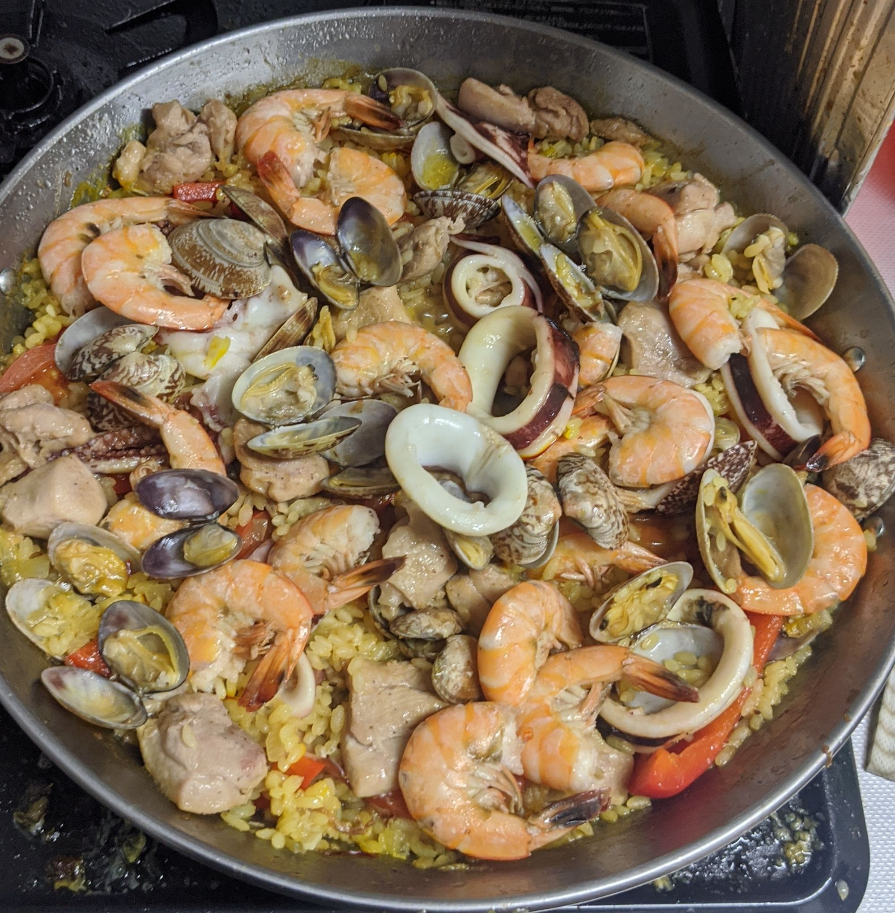

先日、無事誕生日なるものを今年も迎えることができたのですが、twitterやらfacebookやらに[欲しいものリスト](https://www.amazon.jp/hz/wishlist/ls/901D5E6QYC2X?ref_=wl_share)を貼った結果、皆様いろいろと贈ってくださり、本当にありがとうございます。

ところで、欲しいものリストにパエリアパンなど入れていなかったのですが、なぜか届きました。

<blockquote class="twitter-tweet">
家広そうだし入って無くても送ってみっかと思ってポチってみた?
&mdash; TᗩKᑌᗰI KOᗷᗩYᗩᔕᕼI (@chamaharun) <a href="https://twitter.com/chamaharun/status/1247704520060063745?ref_src=twsrc%5Etfw">April 8, 2020</a></blockquote>

全く以て意味がわからないですね。しかし贈ってくれたのに使わない、というのもなんなので、パエリアを作ることにしました。

なお誕生日パエリアというタイトルですが、今日誕生日、というわけではありません。

材料はこちら。アサリ小パック、パプリカ一つ、鶏肉一枚、エビ、イカ、トマト、米、サフラン、玉ねぎ、ニンニク。
鶏肉は一口大に切って軽く塩こしょうしてあります。
玉ねぎとニンニクはみじん切りしておきましょう。
また、アサリは砂抜きをしました(が、食べたらガリッといった。なんでや。)
トマト、パプリカは適当に切りましょう。
イカはカット済みのものを買いました。

ちなみにこの中で一番高かったのは(多分)サフランです。サフラン高い。

こちらが件のパエリアパンです。四人前作れるらしい。大きくて端の方に火が入りにくいのではないかと心配です。

さび止めの油が塗ってあるらしいのでそれを飛ばした後、オリーブオイルを適当に熱して、肉やら魚介やらを炒めます。

火が通ったものから一旦どけておきます。特にアサリは火を通しすぎると縮んでしまうので、開いた時点でどけておいた方がいいでしょう。多分。
なんかすでにパエリアの匂いがする気がしてきます。

追いオリーブオイルをして、玉ねぎとニンニクを炒めます。ちょっと焦げ付いている？ようなところはこそいでおいた方が良いでしょう。多分これがうま味ってやつです。多分。

玉ねぎがしなっとしてきたら、生米を突っ込んで炒めます。大きいのでフライパンの様に振ることはできません。

どんな状態になったら米に火が通ってきた、といえるのかはよくわかんないんですけど、それっぽい感じになったら水とコンソメ、サフランを加えて一煮立ちさせます。
コンソメは多分予めお湯か何かで溶いておくか、顆粒のものを使った方が良かった気がする。

煮立ったらパプリカを入れます。インゲンを入れたい人はここで入れましょう。

トマトさんを入れるタイミングがわからなかったので、「パプリカと同じ赤だしいけるっしょー」とここで投入。まぁ大丈夫。赤いし。

少しぐつぐつさせた後、よけておいた肉やら魚介やらを再投入します。これもタイミングが不明だったので気分で入れました。だいたいなんとかなる。

この状態で十分ほど強火で煮込みます。

十分経ったら弱火にして、水がなくなるというか、どろっとした感じになるまで煮ます。これもなんとなく雰囲気で。多分やり過ぎると焦げる。

良い感じになったら火を止めて、適当なアルミホイルとかで蓋をして(できてない)五分ほど蒸らします。結構これで雰囲気変わるんで大事。

五分経つとこんな感じで汁っ気が飛びます。マジで。

最後によしなにパセリングして完成。うまいです。あと簡単。
魚介とかサフランとかそこそこするので、結構自炊ものとしてはお高めだけど、まぁ一回くらいやってみても良いんじゃないでしょうか。
なお二人で四人前は多いです。注意。

