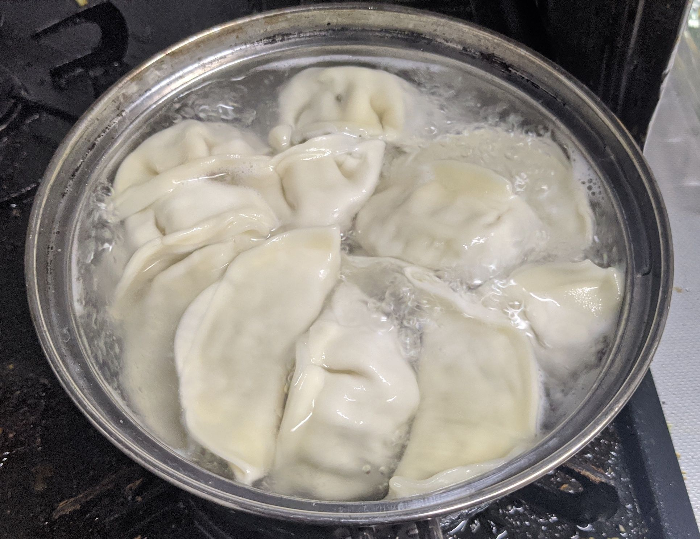
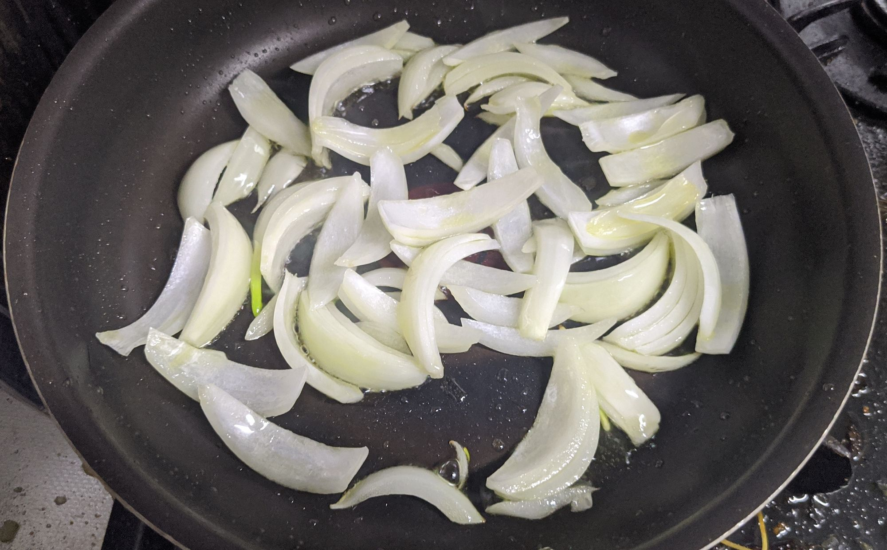
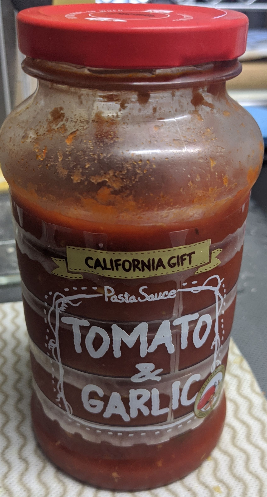
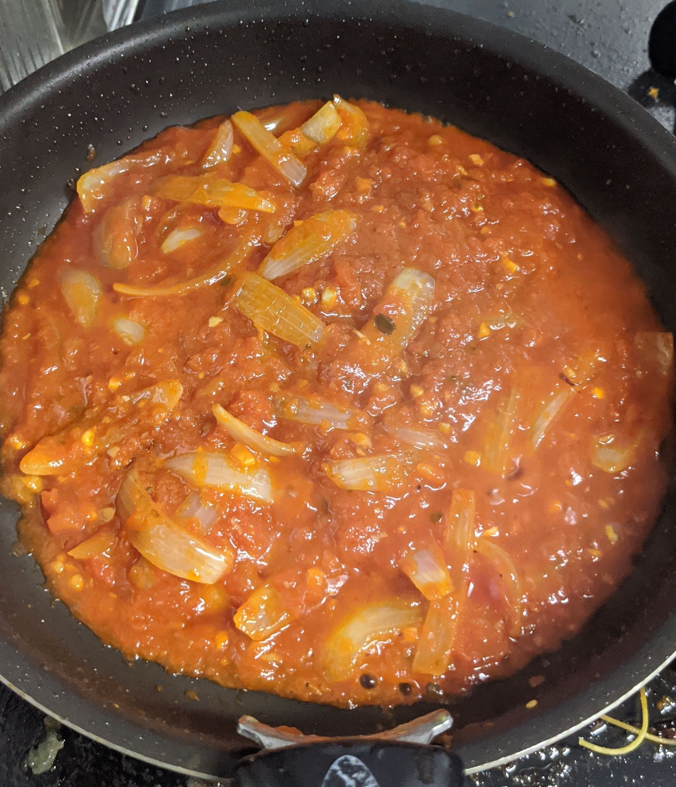
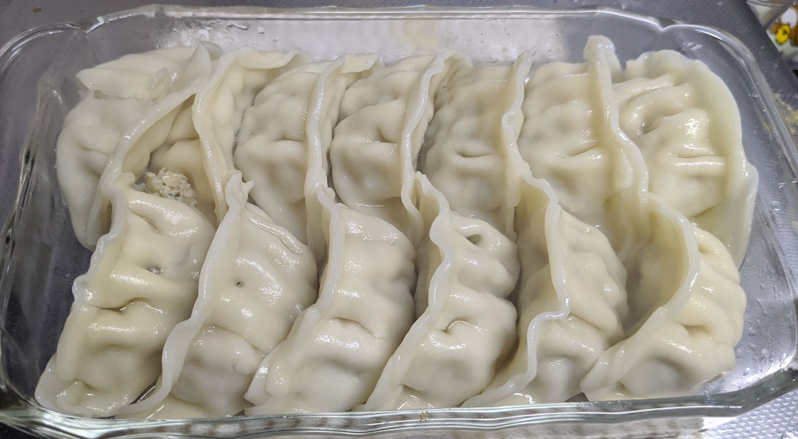
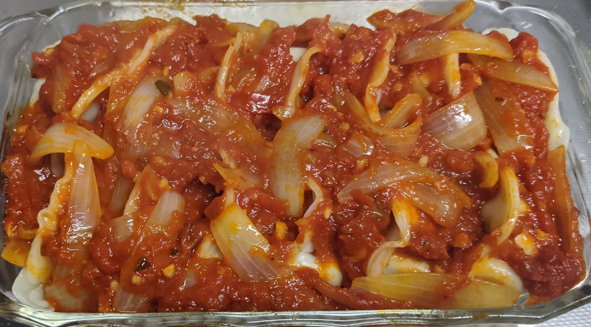
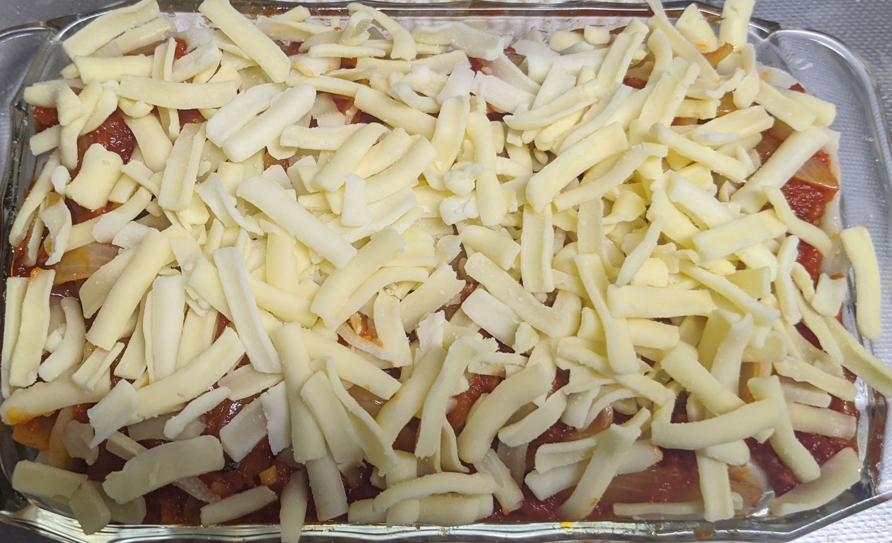
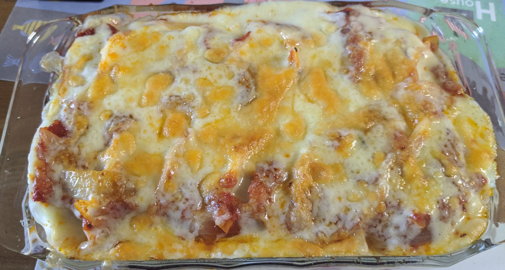
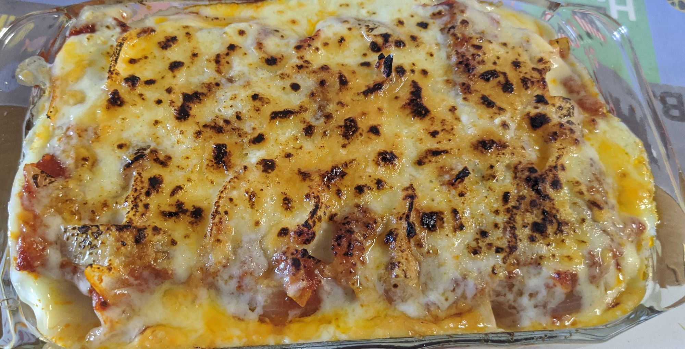

> ラザニア（単数形: lasagna）あるいはラザニエ（複数形: lasagne）は、イタリアのカンパニア州ナポリの名物である、平たい板状のパスタの一種、またはそれを用いたパスタ料理。 イタリア語の発音ではラザーニャやラザーニェに近い。
>
> 料理の場合は、イタリア語で「オーブンで焼き上げたラザニア」を意味するラザーニャ・アル・フォルノ (lasagna al forno) と呼ぶこともある。深さのある耐熱容器に、ベシャメルソース、ミートソース、ラザニア、チーズを何層か重ね、最上段のベシャメルソースに焼き色がつくようにバターを乗せて、オーブンで焼いたもの。

餃子、すなわち薄いパスタ(小麦粉なので大体一緒です)と挽肉の集合体にトマトソースとチーズを載せて焼いたら大体ラザニアになりそう、ということで作りました。ベシャメルは面倒なので省略します。適当にホワイトソースを買ってくるとか、フレークタイプのホワイトソースとかを買ってくれば良い感じになる可能性がありますが、家になかったので諦めます。

我が家には[三割うまい!!](http://www.mansyu.co.jp/)の冷凍餃子が常備されておりますので、これをゆでていきます。お好みによっては焼いても良いかもしれませんが。

玉ねぎが余って(？)いたのでいれようと思い立ち適当に炒めていきます。このあと適当に刻みニンニクを加えて香りを足してみたりしました。

トマトソースはこちらを使います。カルディで買えるもので、結構便利です。

だばぁ。軽く水分を飛ばしましょう。お好みでなんかハーブとか入れても良いかもしれない。

耐熱皿にゆでた餃子を並べます。

ソースをかけます。

チーズ。

オーブン/オーブントースターで良い感じになるまで焼きます。餃子もソースも予め火を通してるので、チーズが良い感じになればOK。

お好みでバーナリングしましょう。香りが立ってより旨そう感が増します。

いざ実食。これはまぁラザニア的な物体として十分戦えます。ベシャメルを入れたらもっとラザニアになりそうではありますが、そこまでやるともうそれは普通にラザニアを作った方が良いかもしれません。

