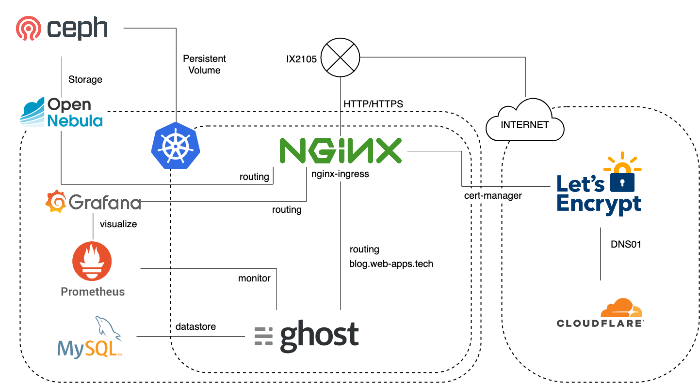

明けましておめでとうございます。
本年もどうぞよろしくお願いいたします。

扨、もう一昨年になりますが、[趣味サーバーのインフラをKubernetesで整えた件](/my-infra-with-k8s/)という記事を投稿しました。
その後紆余曲折ございまして、これらを再構成しましたので、改めて記録に残しておこうと思います。

## 紆余曲折

まずは紆余曲折とは？という話から始めましょう。

当時、Kubernetes用のPersistent VolumeはGlusterFSを使用していました。最初はこれで問題なかったのですが、一部のアプリケーション(具体的にはRedmine)を動かしていく上で、非常に速度が遅い、ということが問題となりました。
調査の上、どうやら遅い原因がGlusterFSであり、Cephに置き換えることである程度速度を改善することができそうだ、という見込みが立ったため、前述の記事を投稿してから約二ヶ月後にGlusterFSを[Ceph RBDへと置き換えました](/ceph-rbd-storageclass/)。

その後、[NTT-X Store](https://nttxstore.jp/)でSSDが安かったため、12台ほどSSDを購入、すべての物理ボリュームをHDDからSSDに置き換え、RAID1+0で再構成しました。
同時に、以前はローカルボリュームを直接使用していたOpenNebulaのストレージ部も分散構成にするべく、物理マシン上に直接Cephを構成、これをOpenNebulaとKubernetesでシェアする形にしました。

これでうまくいったか？と思ったのですが、どっこい、どうやらDL360G6のRAIDカードとSSDの相性(しかもファームウェア単位)が悪いらしく、一週間〜一ヶ月程度で、故障もないのにRAIDから抜けてしまう、という問題が発生しました。

on Kubernetes on OpenNebulaで稼働していた本ブログの運用にも影響が出たため、一旦本ブログを(今は亡き)[CloudGarage](https://cloudgarage.jp/)へと退避、SSDの交換をNTT-X Storeへと申請しました。

その後無事SSDは新品交換され、その間に[某社](https://virtualtech.jp/)から廃棄するということでいただいてきたDL360G7が三台ほど導入されたため、これを基盤として再度プライベートクラウド基盤を構築することと相成りました。

## 現在の構成

再構成した、とはいえ、構成は大きくは変わっていません。
IaaS基盤としてOpenNebula/KVMを使用しているのも変わりませんし、コンテナ基盤としてKubernetesを使用しているのも変わりません。

強いて言えば、本ブログのストレージは最近までSQLiteを使用していましたが、外部MySQLへと移行したくらいでしょうか。

### 物理層

物理サーバとしては前述の通り、DL360G7を使用しています。適当にメモリを増設しており、それぞれ次の様になっています。

* 8コア16スレッド、36GB
* 8コア16スレッド、47GB
* 8コア16スレッド、49GB

メモリの量はできるだけそろえたかったんですが、~~計算が面倒~~うまくそろえることができませんでした。

OSはCentOS 7を使用しています。最初はCentOS 8でやろうとしたんですが、もろもろパッケージがうまくインストールできず、7に落ち着きました。なんとかなってくれ。

これらに、OpenNebulaおよびCeph MIMICをインストールしてあります。Ceph Nautilusにアップデートしたいんですが、安定しているのだろうか・・・

### VM層

OpenNebula/KVMを使用したIaaSの上にVMをポチポチと立てられるようになっています。OpenNebulaのストレージはCephを使用しています。VMも基本的にはCentOS 7を使用しています。

また、DBやPrometheusなど一部のアプリケーションをVMとして構築してあります。
以前はK8s上でPrometheusなども管理していたのですが、(主にストレージの)管理が面倒だったので、今回はVMにDockerをインストールして個別に起動しています。

### コンテナ層

コンテナ基盤はKubernetesで、相も変わらず[Kubespray](https://github.com/kubernetes-sigs/kubespray)を使用して構築しています。便利便利。現在はKubernetes 1.16.3です。

PersistentVolume用のStorageClassはPM上のCephをOpenNebulaと共用で使用しています。手前味噌ですが、[Ceph RBDをKubernetesのStorageClassとして登録する](/ceph-rbd-storageclass/)を見ながら設定しました。

Service type LoadBalancerの実装として[MetalLB](https://metallb.universe.tf/)を、Ingress実装として[NGINX Ingress Controller](https://kubernetes.github.io/ingress-nginx/)を導入してあります。また、HTTPSの証明書を自動設定するため、[cert-manager](https://github.com/jetstack/cert-manager)を導入しています。以前はうまくインストールできないことがあり困ったりもしたのですが、今回は特にトラブルもなくスムーズに導入できました。だいぶCRDの構造が変わっていたので、以前導入していて、再度構成する必要がある人は注意が必要かもしれません。

証明書を取得する方法はDNS01で、CloudFlareを使用しているのも変わりません。

