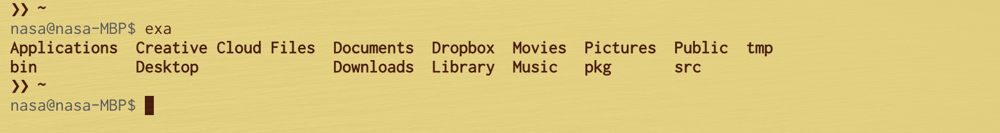
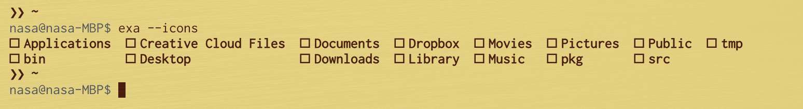
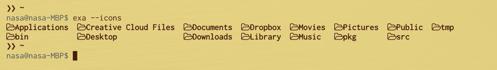
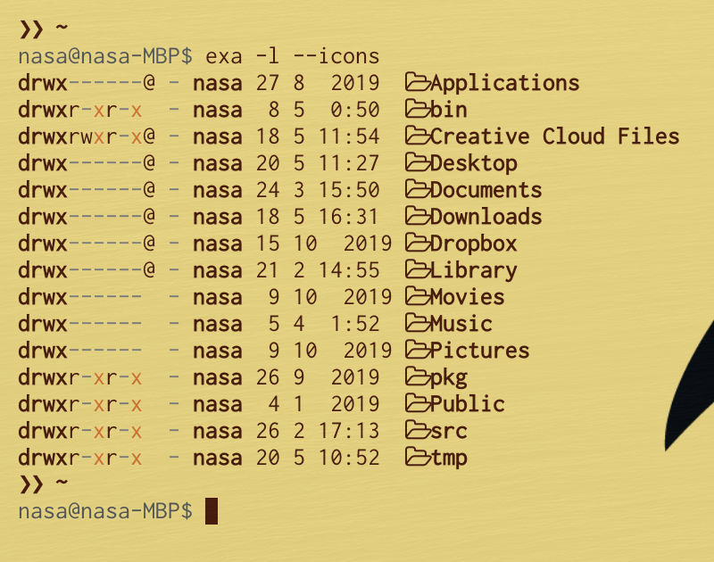

twitterでおのかちお氏(鍵垢なのでここでは紹介できないが)が[`exa`](https://github.com/ogham/exa)というlsの代替コマンドを試してみている、ということでスクショをアップしており、これがなかなか良さそうであったので、探してインストールしてみました。

[website](https://the.exa.website/)の説明によると、

> A modern replacement for ls.

トのことで、色をつけれたり、早かったり、tree viewができたり、Gitのステータスを表示できたりするらしい。

macの場合、[homebrew](https://brew.sh/index_ja)でインストールできるようなので早速インストールしてみます。

``` bash
$ brew install exa
```

very easyですね。使ってみましょう。



なるほど、デフォルトの表示は`ls`と同じくgrid viewなんですね。ホームにディレクトリしかないのでわかりにくいですけど、字が太いですね。あと[klaussinani/hyper-pokemon](https://github.com/klaussinani/hyper-pokemon)を使っている都合で、色は表示されません・・・

アイコン付きで表示してみましょう。アイコンを表示したい場合は`--icons`オプションをつければ良い、とのこと。



おや、表示されないですね。これは困った。まぁこの手の問題は(見た目から言っても)フォントがインストールされてないために発生しているのだろう、とあたりをつけつつ、issueを検索します。

すると[どうやら](https://github.com/ogham/exa/pull/368)[nerd fonts](https://www.nerdfonts.com/)というフォントがアイコン表示用に使用されているようです。これをインストールしてみます。

``` bash
$ brew tap homebrew/cask-fonts
==> Tapping homebrew/cask-fonts
Cloning into '/usr/local/Homebrew/Library/Taps/homebrew/homebrew-cask-fonts'...
remote: Enumerating objects: 19, done.
remote: Counting objects: 100% (19/19), done.
remote: Compressing objects: 100% (14/14), done.
remote: Total 35658 (delta 8), reused 9 (delta 5), pack-reused 35639
Receiving objects: 100% (35658/35658), 6.07 MiB | 3.34 MiB/s, done.
Resolving deltas: 100% (25786/25786), done.
Tapped 924 casks (973 files, 7.8MB).
$ brew cask install font-hack-nerd-font
Updating Homebrew...
Error: Cask font-hack-nerd-font exists in multiple taps:
  homebrew/cask-fonts/font-hack-nerd-font
  caskroom/fonts/font-hack-nerd-font
```

おや、エラーが出ましたね。今回追加した`homebrew/cask-fonts`というtapと元々あった`caskroom/fonts`というtapの両方に同名のパッケージがあったようです。詳細を見てみましょう。

``` bash
❯❯ ~
$ brew cask info homebrew/cask-fonts/font-hack-nerd-font
font-hack-nerd-font: 2.1.0
https://github.com/ryanoasis/nerd-fonts
Not installed
From: https://github.com/Homebrew/homebrew-cask-fonts/blob/master/Casks/font-hack-nerd-font.rb
==> Name
Hack Nerd Font (Hack)
==> Artifacts
Hack Italic Nerd Font Complete.ttf (Font)
Hack Bold Nerd Font Complete.ttf (Font)
Hack Bold Italic Nerd Font Complete Mono.ttf (Font)
Hack Bold Italic Nerd Font Complete.ttf (Font)
Hack Regular Nerd Font Complete.ttf (Font)
Hack Regular Nerd Font Complete Mono.ttf (Font)
Hack Italic Nerd Font Complete Mono.ttf (Font)
Hack Bold Nerd Font Complete Mono.ttf (Font)

$ brew cask info caskroom/fonts/font-hack-nerd-font
font-hack-nerd-font: 2.1.0
https://github.com/ryanoasis/nerd-fonts
Not installed
From: https://github.com/caskroom/homebrew-fonts/blob/master/Casks/font-hack-nerd-font.rb
==> Name
Hack Nerd Font (Hack)
==> Artifacts
Hack Italic Nerd Font Complete.ttf (Font)
Hack Bold Nerd Font Complete.ttf (Font)
Hack Bold Italic Nerd Font Complete Mono.ttf (Font)
Hack Bold Italic Nerd Font Complete.ttf (Font)
Hack Regular Nerd Font Complete.ttf (Font)
Hack Regular Nerd Font Complete Mono.ttf (Font)
Hack Italic Nerd Font Complete Mono.ttf (Font)
Hack Bold Nerd Font Complete Mono.ttf (Font)
```

ふむ、どうやらどちらもリポジトリ・バージョンともに同じようです。単純にダブっているだけの用なので、今回はドキュメントに従い`homebrew/cask-fonts`からインストールすることにします。

``` bash
$ brew install homebrew/cask-fonts/font-hack-nerd-font
```

無事インストールできたので、改めて`--icons`を試してみます。。。。まだ表示されないですね。hyperの設定で、nerd fontsを追加します。Font Bookを見ると、`Hack Nerd Font`として登録されているようなので、これを`~/.hyper.js`の適切な項目に追加します。


``` yaml
fontFamily: 'Ricty, "Hack Nerd Font", Menlo, "DejaVu Sans Mono", Consolas, "Lucida Console", monospace',
```



表示されました！やったぜ！

`-l`と合わせて使ってみましょう。



なぜかこのタイミングでディレクトリへのアクセス権を求められました(もっと前に要求されているべきでは？)が、無事表示できました。ちょっとアイコンと文字の間が詰まっている気がしますが、こまかい調整をするのが面倒なのでこのままにしておきます。特に不便ないし。

割と良い感じなので、`-l`を付けたときについてはアイコンあり、付けてないときはアイコンなしで`ls`のaliasにしてしまいましょう。[すでに`ls`はエイリアスを設定しています](https://github.com/nasa9084/dotfiles/blob/ef9e41196416a4ce89864fe2fb8b0dc90798d8c9/.zshrc#L83-L86)ので、これをちょっと置き換える形で設定します。

* `-p`オプションは`exa`には実装されていないようなので、これは取り除きます
* `exa`の`-a`オプションは`ls`の`-A`相当のようなので、`-a`を使用します
* `exa -l`は標準で`ls -lh`的な表示をしてくれるのでこれも取り除きます
* `-l`を付けた場合の表示順が`ls`と`exa`では異なるので、`-h`でヘッダを表示することにします

[これで設定したalias](https://github.com/nasa9084/dotfiles/blob/cf5ce0f505e1eab3ee4b8f8e82847cea40c160f7/.zshrc#L83-L86)は次の様になりました。

``` bash
alias ls="exa -h"
alias la="ls -aF"
alias ll="ls -lF"
alias lla="ls -laF"
```

これでしばらく使ってみることにします。


