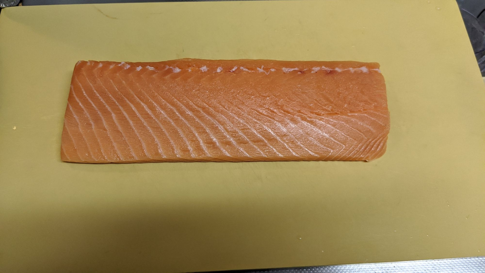
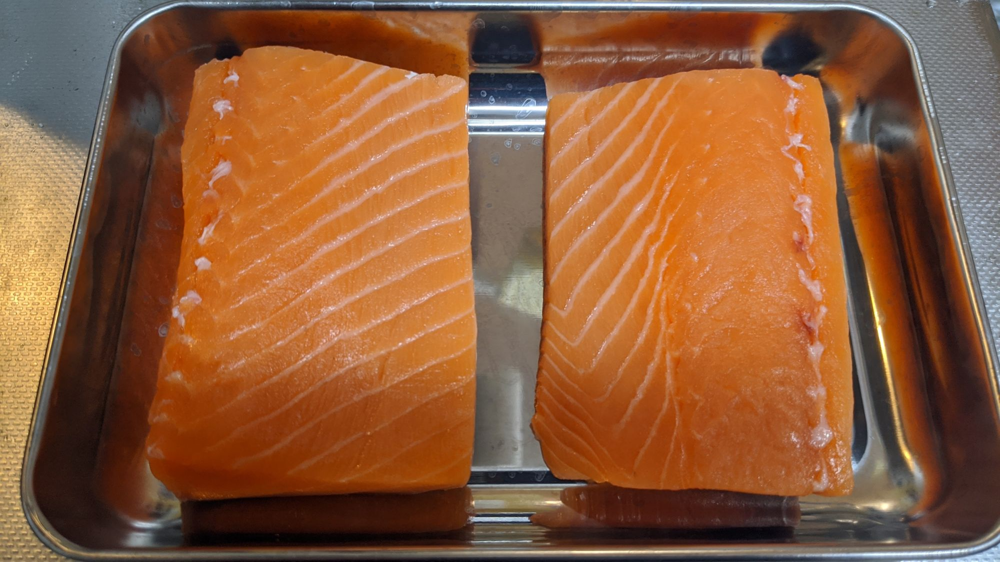
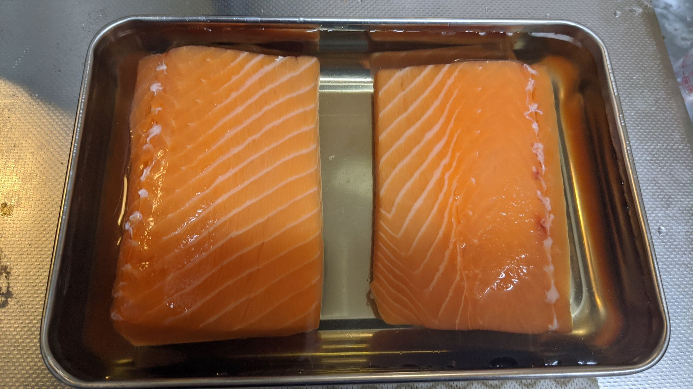
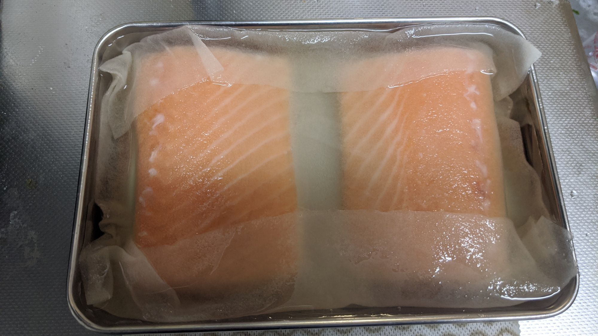
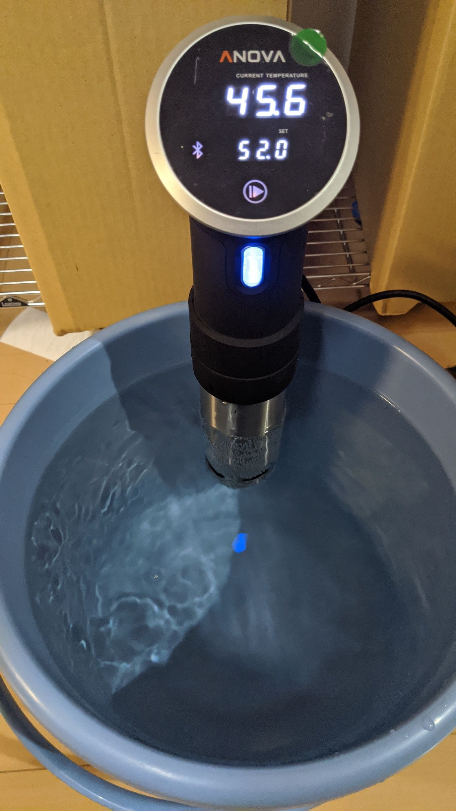
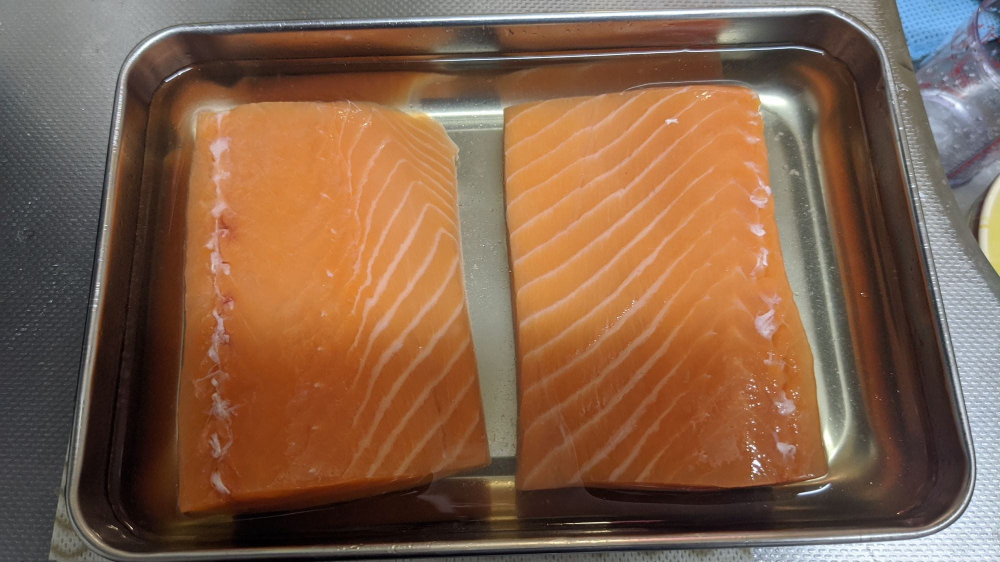
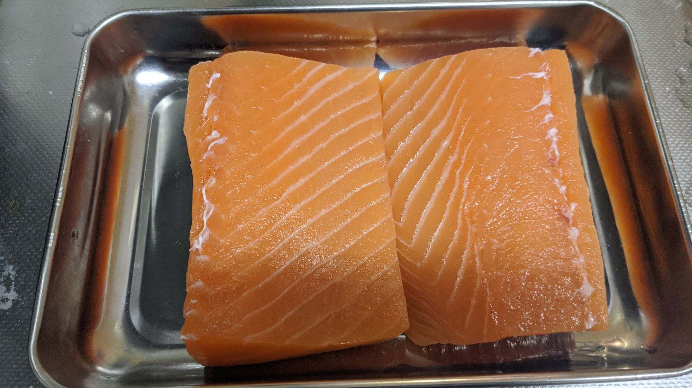
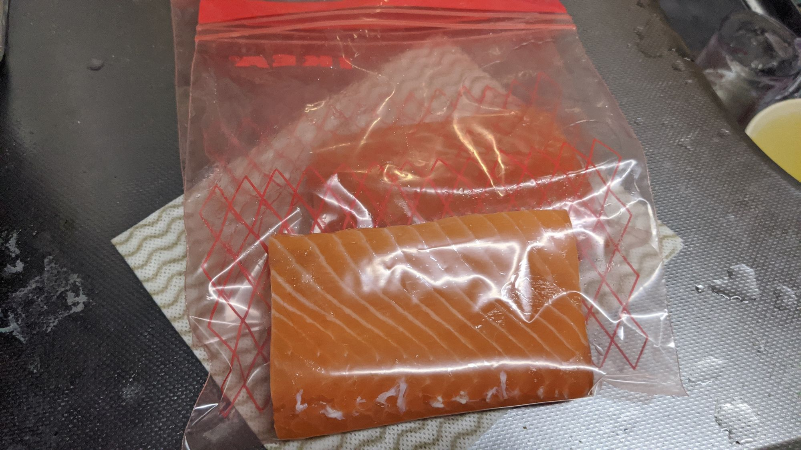
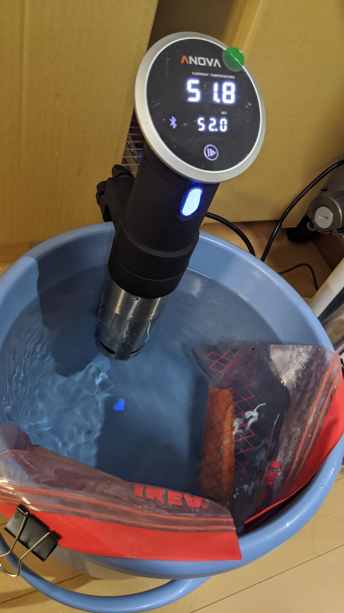
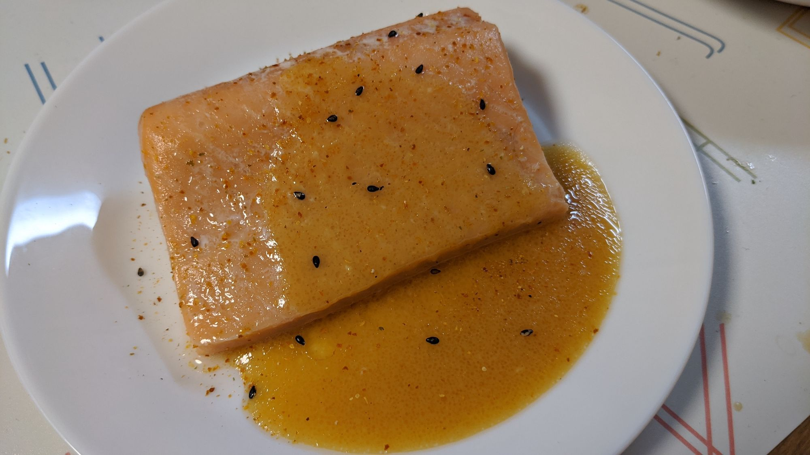

昨晩の晩ご飯として、サーモンを低温調理でやりましたので、記録に残しておきます。
なお、使用したサーモンは刺身用のサーモンを使用しています。多分刺身用じゃなくても良いとは思うんですが、ちょっと怖かったので。

使用するサーモンはこちら。近所の西友で割引になっていたもので、300g前後で600円弱だった気がします。二人分です。

水気を適当に拭いた後、半分にざっくりと切ってステンレスのトレー？バット？に置きます。実家にはバットというものは存在しなかったんですが、使ってみると非常に便利です。100均でも売っているので、適当に数枚そろえておくとなんだかんだ重宝します。

塩と水と砂糖を何やら混ぜ合わせたものに浸します。細かい分量はオライリーさんの「[家庭の低温調理](https://amzn.to/2TBYdTw)」を参照してください。なお、私は紙の本を買いましたが、電子書籍で買ってiPadかなんかに表示しながら調理するのがおすすめです。結構厚い本なので、とにかく取り回しがしにくいので。

我が家のバットでは若干サーモンが液体から出てしまうので、キッチンペーパー的なものに液体をしみこませて上からかぶせておきました。この状態で20分ほど放置します。

<iframe style="width:120px;height:240px;" marginwidth="0" marginheight="0" scrolling="no" frameborder="0" src="//rcm-fe.amazon-adsystem.com/e/cm?lt1=_blank&bc1=000000&IS2=1&bg1=FFFFFF&fc1=000000&lc1=0000FF&t=nasa9084-22&language=ja_JP&o=9&p=8&l=as4&m=amazon&f=ifr&ref=as_ss_li_til&asins=487311862X&linkId=3e70bc4098a26c187997b670ad6c567e"></iframe>

その間に水槽(というかバケツですけど)を暖めておきます。今回は52度でやります。水道から普通にお湯(できれば少し温度設定をあげたもの)をためるとあたため時間が短縮できます。多分。

20分経過したものがこちら。あんまり見た目は変わってない気がします。

流水でさっと洗って余分な塩気を落とし、ペーパーで水分をとります。なんか筋がピロピロしててキモい。

キャノーラ油をまんべんなくまぶし、ジッパーつきの袋に投入します。写真のものはIKEAの袋です。まだ袋の口は閉じていません。

いわゆる水圧法で空気を抜き、袋の口を閉じて52度で20分やります。あたためている間にソースを作ったりするのですが、昨日はパスタを作ったりもしたので、結局40分くらい放置してしまいました。「家庭の低温調理」には30分までと書いてあったのですが、まぁ40分でも大丈夫です。

ソース単体の写真は取り忘れてしまったんですけど、味噌とディジョンマスタード、蜂蜜、レモン汁、すりおろした生姜、ごま油とキャノーラ油をよしなに混ぜたモノです。適当にスプーンで混ぜても案外ちゃんと乳化するもんですね。

ソースをかけた後七味をかけていますが、買ってから大分たった七味なので、辛みも香りも何もない物体になってしまっていました。

おいしかったです。まる。

