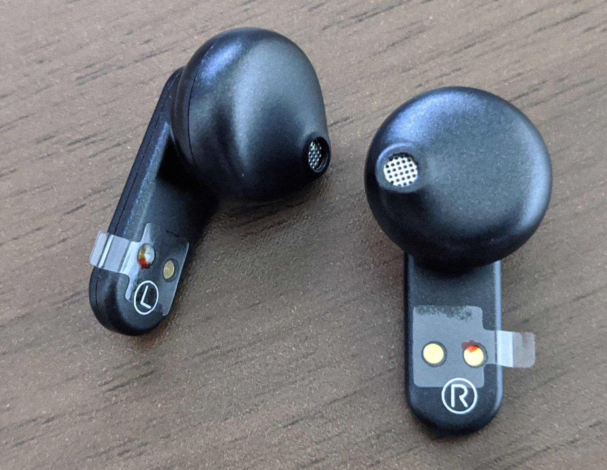

<ins datetime="2020-05-19T14:32:37+09:00">
2020-05-19追記: 
外出時にPixel 4との組み合わせで使用したら、音の途切れが激しく、正直使い物にならなかったので、「不良品では？」と問い合わせをしたら返品・返金対応となりました。見た目、サイズ感、装着感などは良かっただけに残念です。
</ins>

先だってMakuakeで応援購入した[CARD20](https://www.makuake.com/project/card20/)が届いたので、開封レビューします。

CARD20は非常に薄い左右完全独立型のワイヤレスイヤホンで、クラウドファンディングプラットフォームMakuakeで出資を募っていました。私も1月末頃に支援をし、紆余曲折あり(コロナのせいであれこれあったらしい)本日手元に届きました。

なお、多くの「提供」記事がウェブで展開されていますが、本記事は提供を受けたわけでもなく、自分で買っての感想です。

特筆すべきはその薄さで、この手のTWSイヤホンでも比較的標準と思われるサイズ感の[AVIOT TE-BD21f](https://aviot.jp/product/te-bd21f)のケースの厚さが3cm弱程度なのに対し、CARD20はなんと1.3cmと、TE-BD21fの約半分の厚さです。Pixel 4 (ファブリックケース付き)より若干厚いかな、という程度です。

> CARD20の13.4mm世界最薄クラスのボディは、お財布やジーンズのコインポケットにしまうことができ、コードや収納の煩わしさから解放されます。

との説明がプロジェクトページに書かれていたものの、さすがに1.3cmのものを財布に入れたら邪魔そうではあります。とはいえコインポケットに入るのはなかなか良さそうです。

また、近年は店頭で販売されるイヤホンの大半がカナル型ですがCARD20はインナーイヤー型です。これは個人によってプラス評価になるかマイナス評価になるかというのはかなり分かれるところですが、左右完全独立型のワイヤレスイヤホンの選択肢はほとんど存在しない(AirPodsとその類似品+αくらい)現状で、カナル型があまり得意ではない私としてはかなり心が惹かれる製品となっています。ウェブ上でさっと調べても、「カナル型ではない点が惜しい」との記述を見ますが、個人的にはカナル型じゃないからこそ、「買い」でした。

外箱は至ってシンプルで、製品を上面から見た写真が白い箱に印刷されています。蓋と内箱がぴったり吸い付くようなサイズ感で構成された箱、しろい外観、余計な物が書かれていないデザイン、最近流行のデザインともいえますが、Appleっぽさがありますね。

箱底面にはケースからだしたイヤホンの写真と、モデル番号をはじめとした一通りのスペックが記載されています。Bluetoothのバージョンは5.0、MakuakeのプロジェクトページによるとQualcomm QCC3020を使用しているようです。TWS Plus対応ということなのですが、ざんねんながらPixel 4はTWS Plusに対応しておらず、あまり恩恵を受けることはなさそうです。

連続再生時間は約4時間、ケースのバッテリーが約16時間分充電できるようなので、合計で約20時間使用可能とのこと。AVIOT TE-BD21fが約7時間+約18時間の合計約25時間、SONY Xperia Ear Duoが約4時間+約16時間の合計約20時間なので、サイズの割には標準的な使用時間となっているように思えます。

箱には記載がありませんが、防水性能はIPX4ということなので、少なくとも雨が降る、汗をかく、くらいでは問題がないようです。

開封すると直ぐに本体が入っています。注文時にロゴなしバージョンを選択したため、イヤホン本体にはロゴが入っていません。プロジェクトページや箱に描かれていたものよりは深い黒で、光沢感もあまりきつくなく、高級感もありなかなか良い色だとおもいます。

表面は天窓設計によりイヤホン本体の一部が見えています。これにより、気づかないうちになくなっていた、ということがなくなるとのことですが、実際はどうなんでしょうか。タッチコントロール対応と言うことで、おそらく銀色の部分をタッチして操作することができるのでしょう。AVIOT TE-BD21fはボタン式で、うまく押さえて操作しないと耳にさらに押し込む形になってしまうという感じだったので、タッチで操作できるのはプラスポイントです。(感度が悪いor良すぎる、ということがなければ)

裏面には技適をはじめとした各種法令関係のマークとバッテリー容量、電源関連情報、生産国、モデル名などが書かれています。平面に対して垂直に充電ケーブルを挿すのはどうなのか、とおもわなくもないのですが、この薄さなら仕方が無かったのでしょう。充電ケーブルはUSB Type-Cです。

付属品として説明書と充電ケーブル。ケーブルはUSB Type A to Type Cのそれほど長くない物です。説明書は英語と日本語で記載がありますが、日本語の一部が中国語？になったりしていて微妙に怪しさがあります。

本体ケースを空けるとこんな感じ。空けるときに若干イヤホンに干渉するようで、すこしイヤホンがぐらっとします。取り落としてしまうほどではないのでとくに問題はありませんが、繰り返し開け閉めしていたらすこしイヤホンが傷つくかもしれません。

YOBYBOロゴとL/Rの文字はエンボス加工というか、すこし周りから浮き出たような処理になっていて、高級感があります。

閉じると真ん中が光ります。充電残量の表示でしょうね。多分。

イヤホンの内側はこんな感じ。ケースから取り出す際、少し取り出しにくいかも、という印象をうけましたが慣れれば多分大きな問題ではないでしょう。

充電端子部分に絶縁フィルムがついているので、これを剥がして充電を開始します。

まだ音楽を再生していないので音や接続の安定度などについてはなにもコメントできないのですが、開封してみての見た目だけでいうならかなり満足度が高い商品となっていると思います。AVIOT TE-BD21fやXperia Ear Duoのケースや本体がプラプラしいのに対して、CARD20はそういった安っぽさはあまり感じられません。

新型コロナウイルス感染症の影響を受けてリモートワークをしていますから、ワイヤレスのイヤホンを使用する機会が激減してはいるのですが、機を見て使ってレビュー記事でも書けたらな、とはおもっています。

