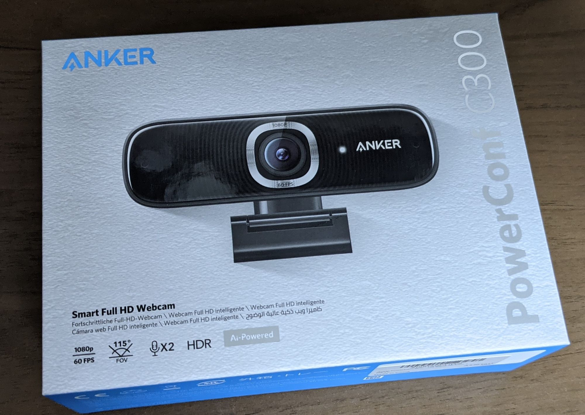
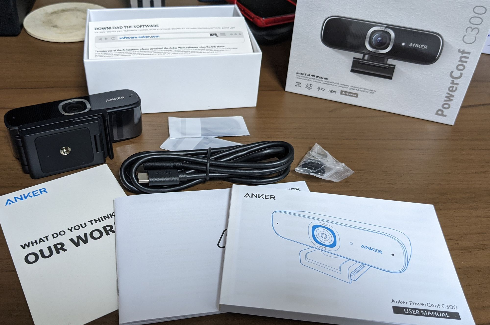
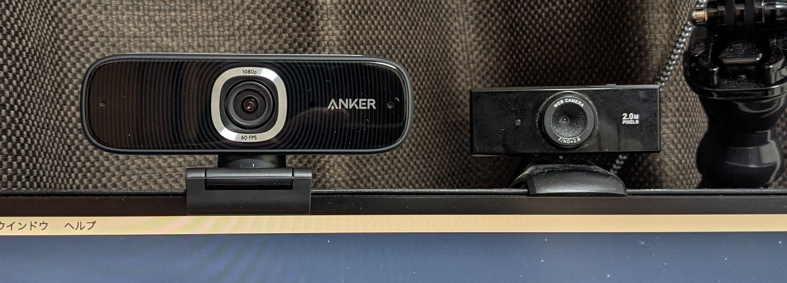

どうもAnker大好き人間です。ケーブル類は大体Ankerだし、[Thunderbolt 3 Dock](/anker-powerexpand-elite-13-in-1/)もAnkerだし、充電器も[ヘッドホン](/soundcore-life-q30/)もAnkerです。

そんなAnkerから、新しくWebカメラが発売されたということで、購入したらすごかったのです。

購入したのは[Anker PowerConf C300](https://amzn.to/3tRAfUy)。Amazonで7,990円で購入できます。[LogicoolのStreamCam](https://amzn.to/33PFZ6x)を買いたいな、と思っていたところのAnkerからの新商品、値段も半額以下、という事で即購入に至りました。

箱は最近よくあるぴったりでしっかりしたタイプの箱です。ぴったりすぎて開けるのにちょっと時間がかかる奴ですね。高級感はあります。写真ではざらざらしたかんじのテクスチャっぽく見えますが、これは印刷で、手触りはすべすべです。

これまでのAnker製品によく入っていたHappy/Not Happyカードではあんく、"WHAT DO YOU THINK OUR WORK?"というカードが入っていました。PowerConfシリーズではこの紙なんでしょうかね。
ケーブルはType-C to Type-Cケーブルが付属しています。この手のWebカメラは本体からケーブルが伸びている事が多いので、ケーブル交換ができるのはとても嬉しい点ですね。

外部ディスプレイを使っていると、Webカメラは大体ディスプレイのUSBポートを使うと思うんですが、Type-CからUSB-Aに変換するためのコネクタも入っているので安心(?)です(Type-Cの仕様的には全然安心じゃないんですが)

プライバシー保護用の蓋みたいなものもついているのはなんだか時代を感じさせますね。

これまで使っていたWebカメラと並べた様子はこんな感じ。サイズは結構大きくなりましたね。

古い方のカメラで、ライトをつけないとこんな感じでした。一般的なご家庭は大体そうだと思うんですが、壁に机をくっつける配置にしていると夕方以降逆光になる、という問題があり、顔がとても暗くなります。

結果として、[ライト](https://amzn.to/3uRrKKv)を購入して明るさを確保したりなんかしている人も多いと思います。私もその一人でした。ライトをつければまぁもちろん明るくはなります。

新しいカメラではこの通り。ライトなしでも頭が適当にボサボサなのがバレて恥ずかしいくらいには明るく映ります。これは本当に感動。

比較用にライトをつけてみました。むしろちょっと明るすぎる位ですね。これはライトはもうお役御免かもしれません。

加えて、専用のアプリで細かい設定をする事ができます。解像度の調整、fps、画角、明るさやコントラストなどが設定できるほか、人の顔を追跡するような設定もできます。
このアプリの良いところは、他のメーカーで良くあるような、常駐させておかなければ設定が反映されないような類いのモノではなく、設定したらアプリを閉じても設定が反映され続ける、というところですね。

総じて、非常に満足度が高く、コストパフォーマンスに優れた商品だと思いました。流石Anker。

