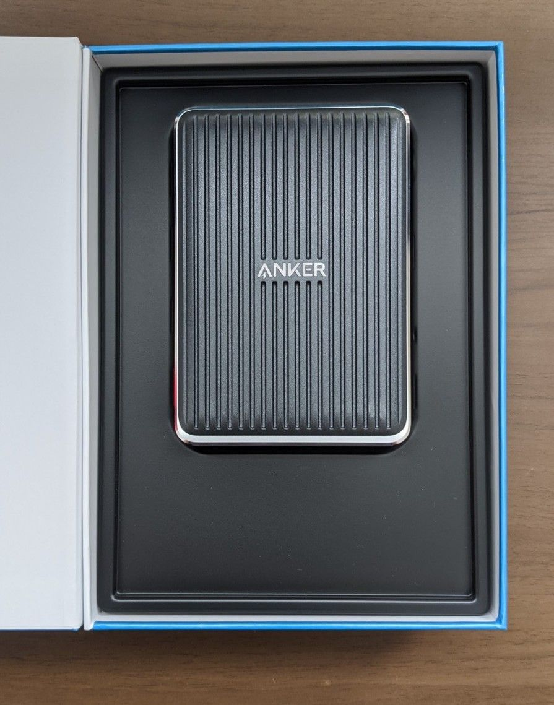

Ankerが最近(といっても国内の販売開始は12月中旬頃だったはずなので、かれこれ一ヶ月は経過している)発売した、PowerExpand Elite 13-in-one Thunderbolt 3 Dockを購入したので、unboxing & review noteを書いておきます。

実はこの商品自体は海外では大分前に発売されており、個人的には国内の発売を今か今かと待ち望んでいた形でした。発売即購入・・・といきたかったのですが、そこはAnker。良さそうな新商品はすぐに完売と相成ってしまったのでありました。

個人的にこの商品を選んだのは、以下のような理由があります:

* USB Type-Cポートが複数ある
    * USB Type-Cポートが4つあり、うち二つはThunderbolt 3ポートです。一つはPCとつなぐことになるため、都合2つUSB Type-Cのポートが増える計算になります。弊宅ではケーブルをできるだけUSB Type-C to USB Type-Cに統一しようとしているため、USB Type-Cポートを増やすことができるというのが最優先事項でした。
* 余計なポートが少ない
    * USB Type-Cポートを増やすというのが主目的なため、多くのドックにありがちな「いろんなポートがついてるよ！」は無駄でしかないという気持ちでした。光デジタルオーディオやSDカード、USB Type-AやEthernetも正直不要です。が、世の中の人はたくさんポートがついているものをほしがっているのか、Type-Cのポートを増やすだけ、という物はほぼ存在しておらず・・・
* 比較的小さい
    * 世の中のドックは大きいんです。USB Type-Cポートを増やしたいだけなのに(以下略
* 比較的安い
    * 大体このスペック(Thunderbolt 3 dock)だと約3万というのは最も安い方の値段で、高い物だと4万〜5万程度します。同時に発売されたThunderbolt 3ではないほうのドックは2万円程度ですが、Type-Cポートが少ないのです。

現在の配線はこんな感じです。最初、PowerExpand - ディスプレイ間もtype-C to type-Cケーブルでつないでみたのですが、何か遅延があるのか、カクついているのか、マウスカーソルの動きに違和感がすごかったので、試しにHDMIでつないでみたところ、違和感がなくなったためHDMIでの接続としました。ウェブカメラはディスプレイのtype-Aポートにつないでおり、これをPowerExpandまで引き延ばすと取り回しが良くなさそうだったので、ディスプレイとPowerExpandの間にもう一本type-A to type-Cのケーブルを配線し、ウェブカメラは引き続きディスプレイのダウンストリームポートに接続するという形にしました。

現状マイク(AKG Lyra)とキーボード(Ergodash)がPCに直接接続されているので、これをPowerExpandに接続する形にまとめられれば、PCのポートは一つで済むという事になり、取り回しが非常に楽になりそうです。マイクはtype-C接続なのでそのまま特に問題なく接続できそうですが、キーボードはmicro-Bなので、今更micro-Bのケーブルを増やしたくもないですし、どうするかはちょっと検討することになりそうです。

以下unboxing。

