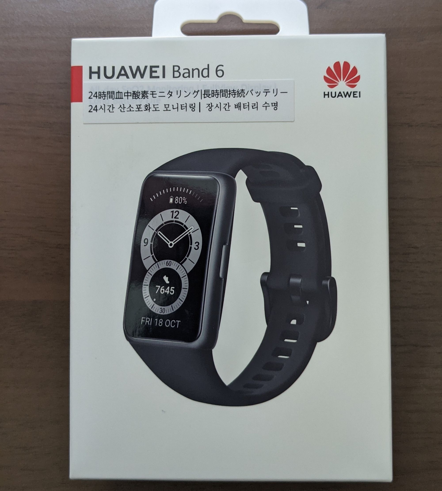
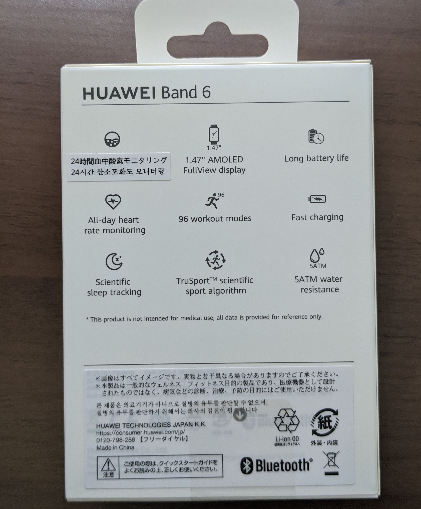
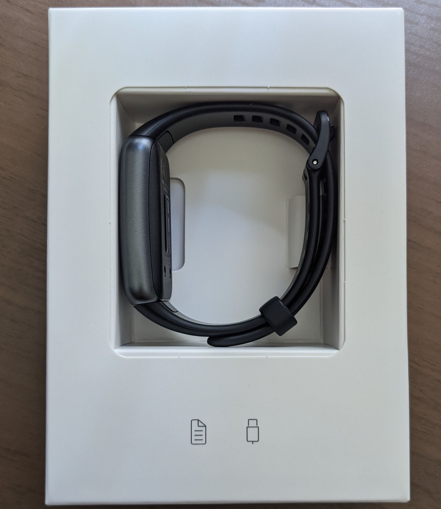
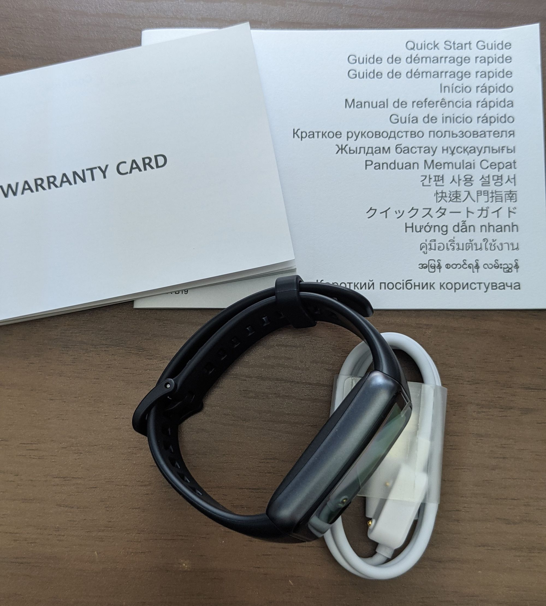

TL;DR: 割と良い。

スマートウォッチは長いこと[fitbit versa](/fitbit-versa/)を使用していたのですが、最近プールに行くようになり、プール内で使用できるレギュレーションに対応したスマートウォッチ/スマートバンドが欲しいと思っていました。

私が行っているプールのスマートウォッチ/スマートバンドのレギュレーションは次の様になっています:
* ベルト幅が30mm以下でディスプレイがベルト幅および厚みから出ないものは使用可能
* 柔らかい素材のカバー等で覆えば使用可能
* シリコン製カバーまたはウォッチスーツで覆えば使用可能

fitbit versaは一つ目のレギュレーションにマッチしていないため、柔らかい素材のカバー・シリコン製カバー・ウォッチスーツで覆えば使用可能、ということです。
とはいえ、fitbit versaはもう2世代型落ちのモデルです。ディスプレイを覆うカバーを見つけるのがそもそも難しい(あるにはあるけど)ですし、[シリコン製カバーは何故か6個単位でしか売っていない](https://amzn.to/3mInH1P)ため、私の結論としてはレギュレーションにマッチするスマートバンドを買うのが早い、となりました。

じゃぁなにを買おうか、と考えたときに、私はPixelユーザですしfitbitのユーザでもありますから、Googleによるfitbitの買収を受けて、fitbitから良い感じの新製品が出るのを待ちたいという気持ちもありますから、あまりコストを掛けるわけにもいかないな、と考え、選択肢は自然とHuaweiかXiaomiの二択となりました。

いろいろ検討しましたが、最終的には[mi band 6](https://amzn.to/3zv2r34)の丸っこいデザインより、[Huawei Band 6](https://amzn.to/3gIl9gv)の四角いデザインの方が通知などが見やすそうですし、画面もほどよく大きい、という事でHuawei Band 6を選択しました。

以下開封写真です。

外箱はこんな感じ。一応amazon.co.jp販売の日本正規代理店品と書かれたモノを購入したのですが、日本語はシールで修正しているような外箱でちょっと不安な感じがあります。まぁ気にしても仕方ないでしょう。安いし。

箱を開けると本体がこんな感じで入っています。まぁわかりやすいはわかりやすいですね。

箱に入っていたものはこれで全部です。本体、充電ケーブル、WARRANTY CARD、クイックスタートガイドですね。クイックスタートガイドは本当に必要最小限の情報だけが書いてあるという感じで、詳細はWebから説明書をダウンロードしてね！という事でQRコードが書いてありました。

今のところ購入から二週間弱使用しましたが不満点は次の二つです:

<blockquote class="twitter-tweet">
HUAWEI BAND 6、お値段も含めて割と満足してるけど、保護フィルムにまともなのがなさそう（これはこのクラスのものに気を使いすぎかも）なのと、ツイートをしたときに通知が来ちゃうのが微妙ポイント
&mdash; nasa9084@某某某某(0x1b) (@nasa9084) <a href="https://twitter.com/nasa9084/status/1431285906405658627?ref_src=twsrc%5Etfw">August 27, 2021</a></blockquote>

まぁ保護フィルムはこのクラスの製品に保護フィルムをつけようというのが間違っているのかも知れませんが。
ツイートをしたときに通知が来ちゃうのは、「tweetをしました」という通知が一瞬通知欄に出るためそれを認識してしまっている、という事でHuawei Band側の問題と言うよりはtwitterアプリ側の問題の様な気もしますね。

あとはまぁ、ウォッチフェイスを作ってみた、みたいなブログを書こうと思ってはいたんですが、環境のセットアップがまぁまぁめんどくさそうというか、バンドとスマホの情報同期にはHuawei Healthというアプリをスマホにインストールするんですが、ウォッチフェイスを作ってテストするにはこれのベータ版？開発版？をインストールしなければならないということなのでやめました。諦めて既製のウォッチフェイスを使うことにします。

以上です。

