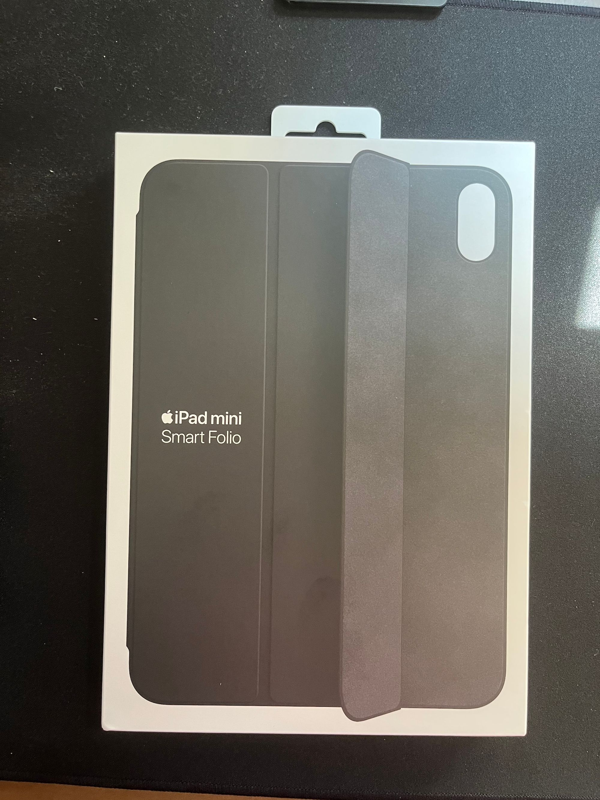
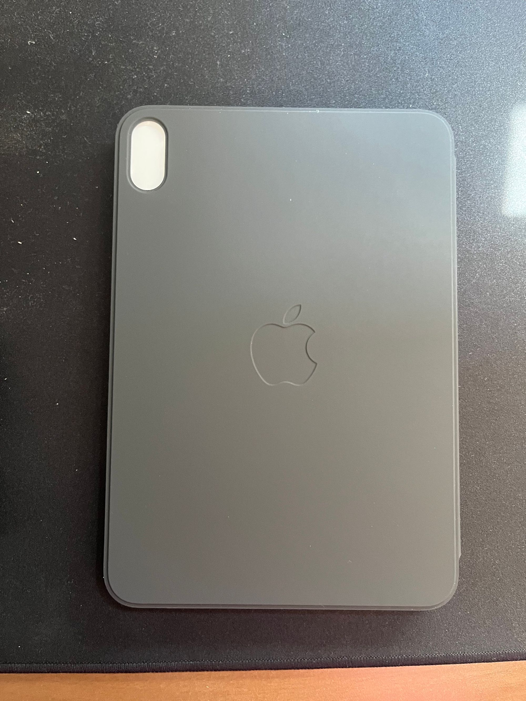
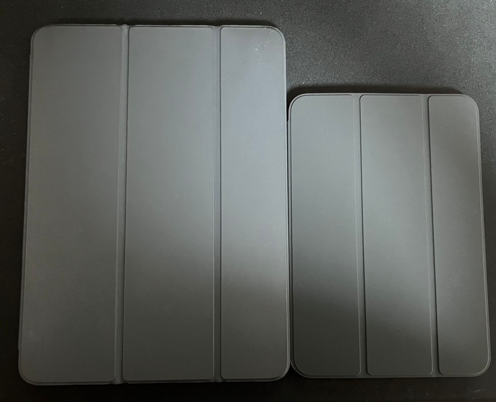
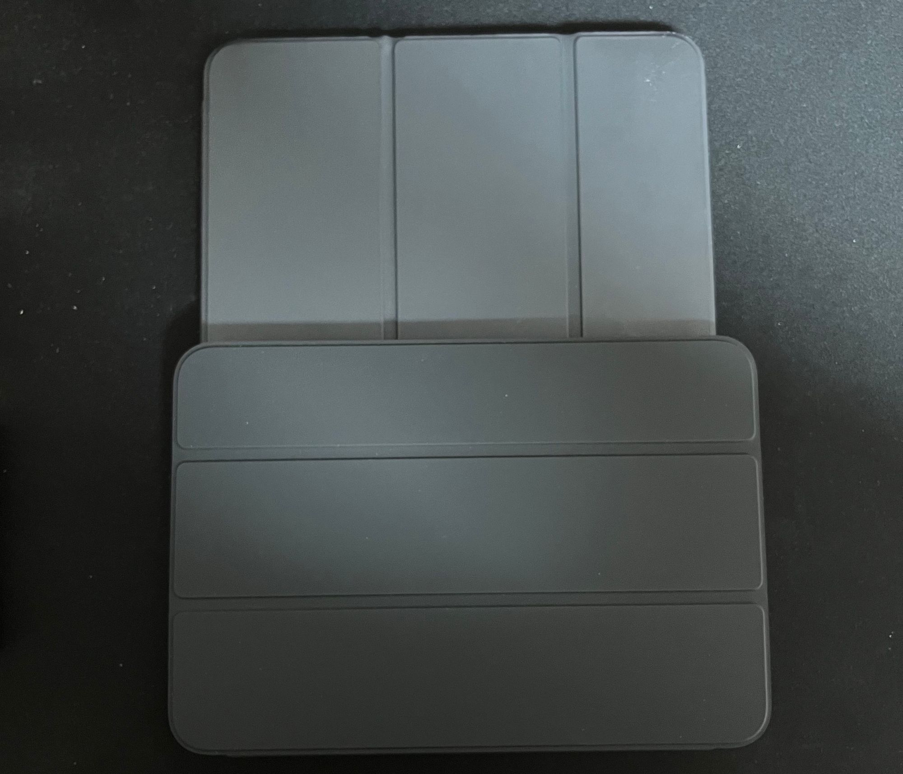
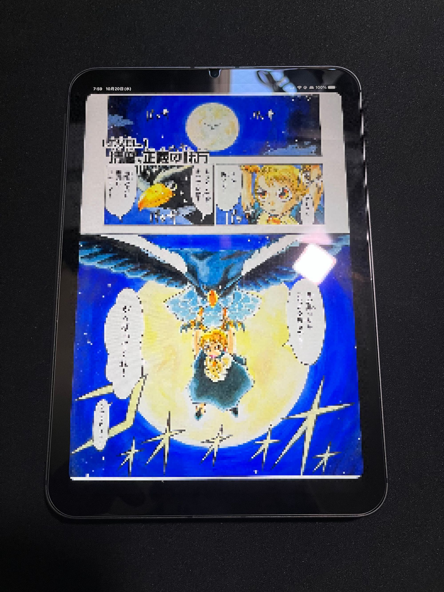

みんなが待ってたiPad。そうiPad miniです。私は過去に会社のお下がりでもらったiPad mini第2世代を使っていたことがありますが、その後iPad Pro 第一世代(2018)に買い換え、今に至ります。Youtubeや読書に使用するにはちょっと大きいな、と思いつつ、なんだかんだ便利に使ったり使わなかったりしていました。iPad miniは良いサイズだったな、なんて思いながら。
とはいえ、iPad Proのベゼルレスデザインを体感すると、(ちょっとダサい)従来のiPad miniに戻る気にはなれず、ベゼルレスデザインのiPad miniがでたら買おうと思っていました。

そして今年、第六世代iPad miniとしてベゼルレスデザインのモノが発売されたので購入しました。なんだかんだ安くはないので、一晩悩んだ結果発売日に入手することはできず、10月9日到着でした。

今回購入したのはスペースグレイのiPad mini 第六世代 Wi-Fi + Cellularモデル、ストレージは256GBです。iPad Proも256GBのモノを使用していて、ストレージが大きく余っているので正直256GBは多すぎると思ったのですが、64GBか256GBという二つの選択肢を考えたとき、64GBは流石に小さすぎるだろう、と考え256GBを選択しました。MacBook Proですら256でストレージが余っている(最近ゲーム実況動画編集をするようになって、動画の為に外付けSSDを買ったけど)ため、iPad miniのストレージも枯渇することはおそらく無いと思います。

ケースは安定の公式Smart Folioを購入。iPad Pro用のモノとは異なり、アップルのロゴがエンボス加工されています。これはこれで良いですね。

iPad Proとサイズを比較するとこんな感じ。ざっくり半分くらいの大きさです。身長176センチ(最近1センチほど伸びました)の私だと片手でホールドできるくらいのサイズ感です。

著作権的なアレをアレするためモザイクをかけていますが、マンガを読むのに非常にちょうど良いサイズです。おそらく小説やビジネス書など、他の書籍にも良いでしょう(技術書は大判の事も多いしiPad Proの方が読みやすいかも知れない)

本機はiPad Airと同じくtouch IDですが、個人的にはiPadはface IDの方が良いかな、という気がしました。家の中で使うことが多い端末ですから、マスクをしている事も無いため、face IDの方がボタンに指を持っていくという動作が不要なため便利です。
また、これは慣れの問題もあるとは思いますが、ボリュームボタンが画面左上部(ランドスケープでは左下)というのは少し操作しづらいように感じました。これはiPad Proとボタンの位置が違うから戸惑っているだけかも知れません。画面の向きによってボタンの方向が変わる(右側、上側が+になる)のは直感的で良いので、iPad Proにもバックポート(?)してほしいものです。

