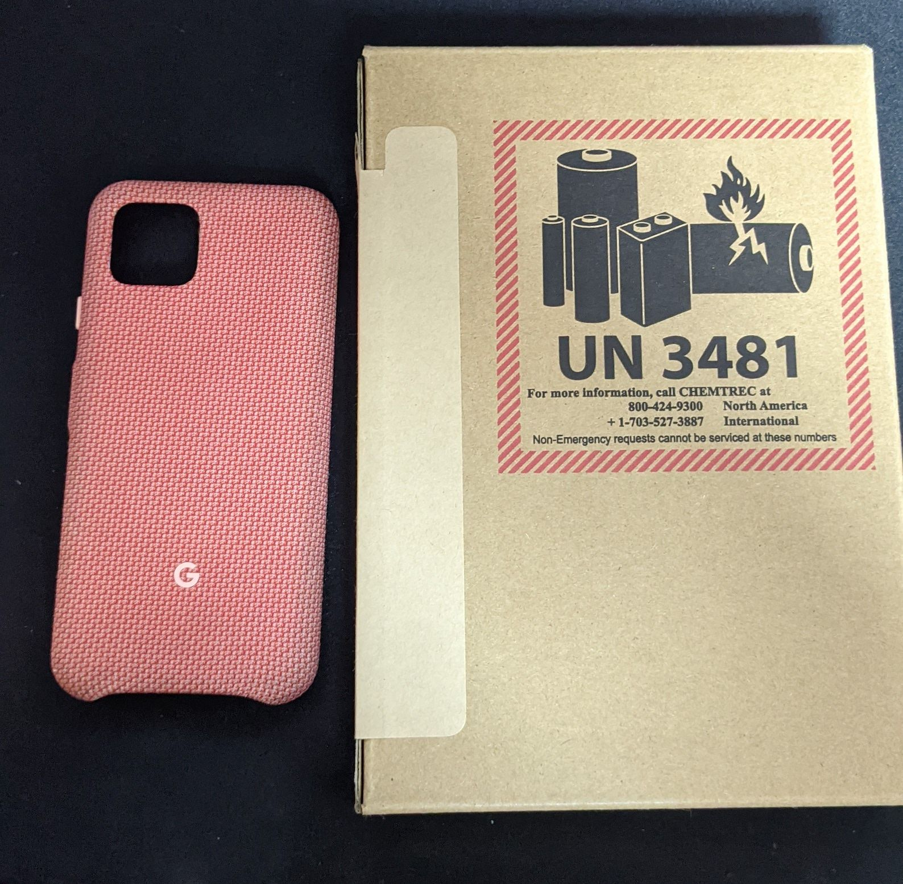
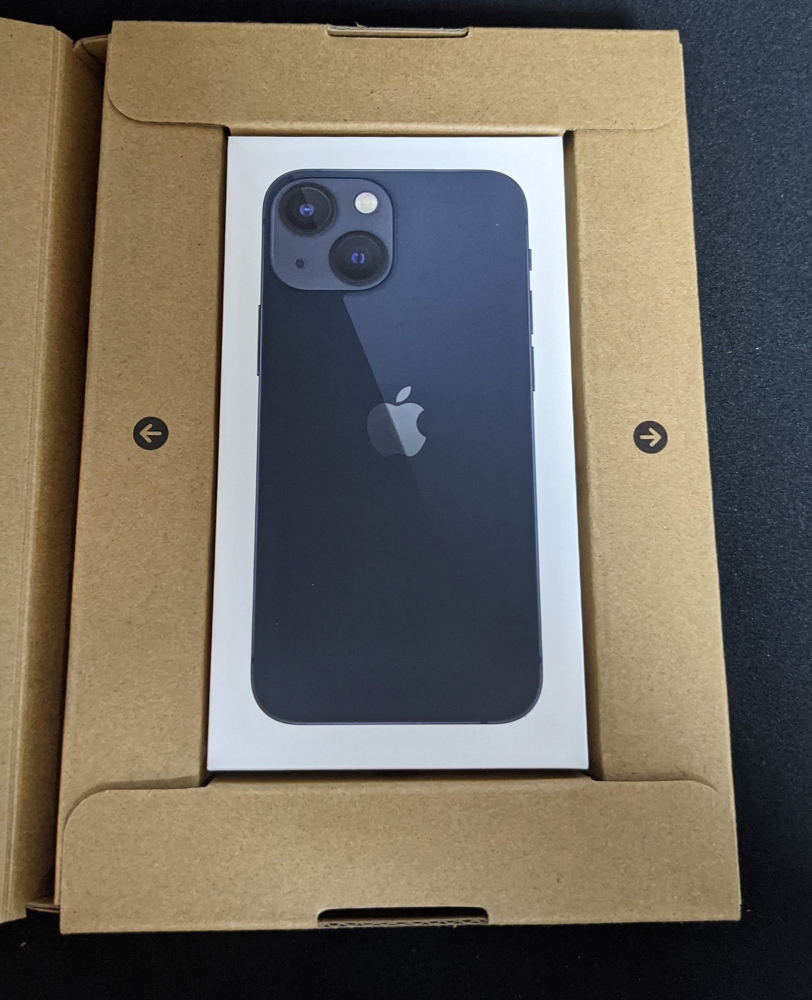
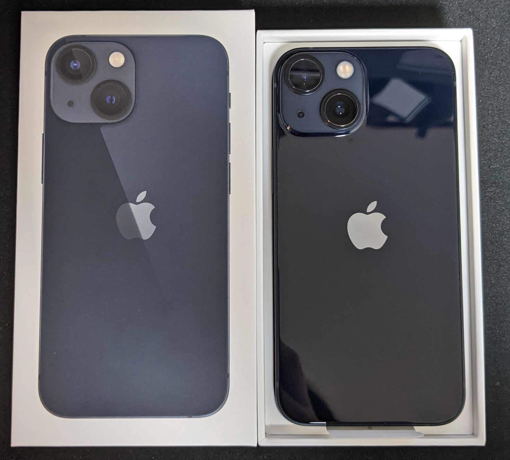
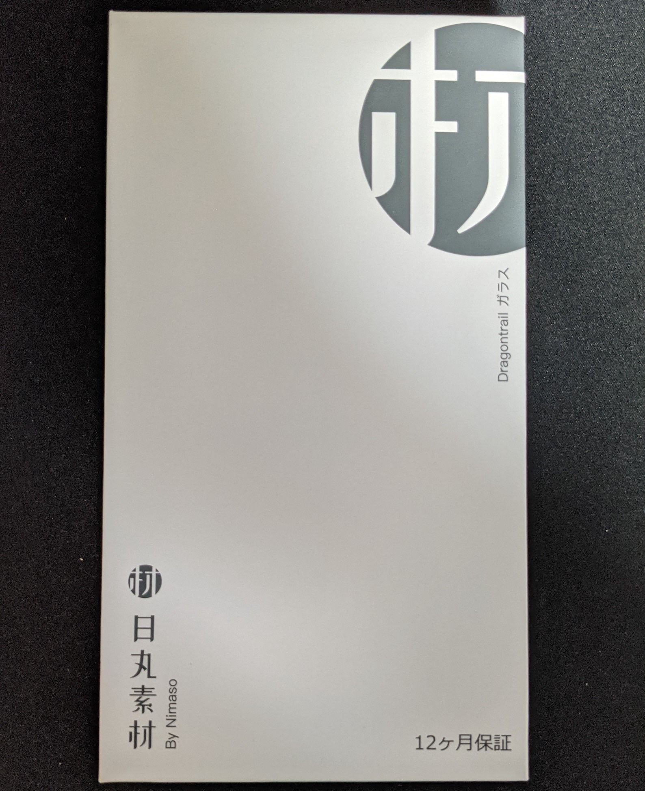
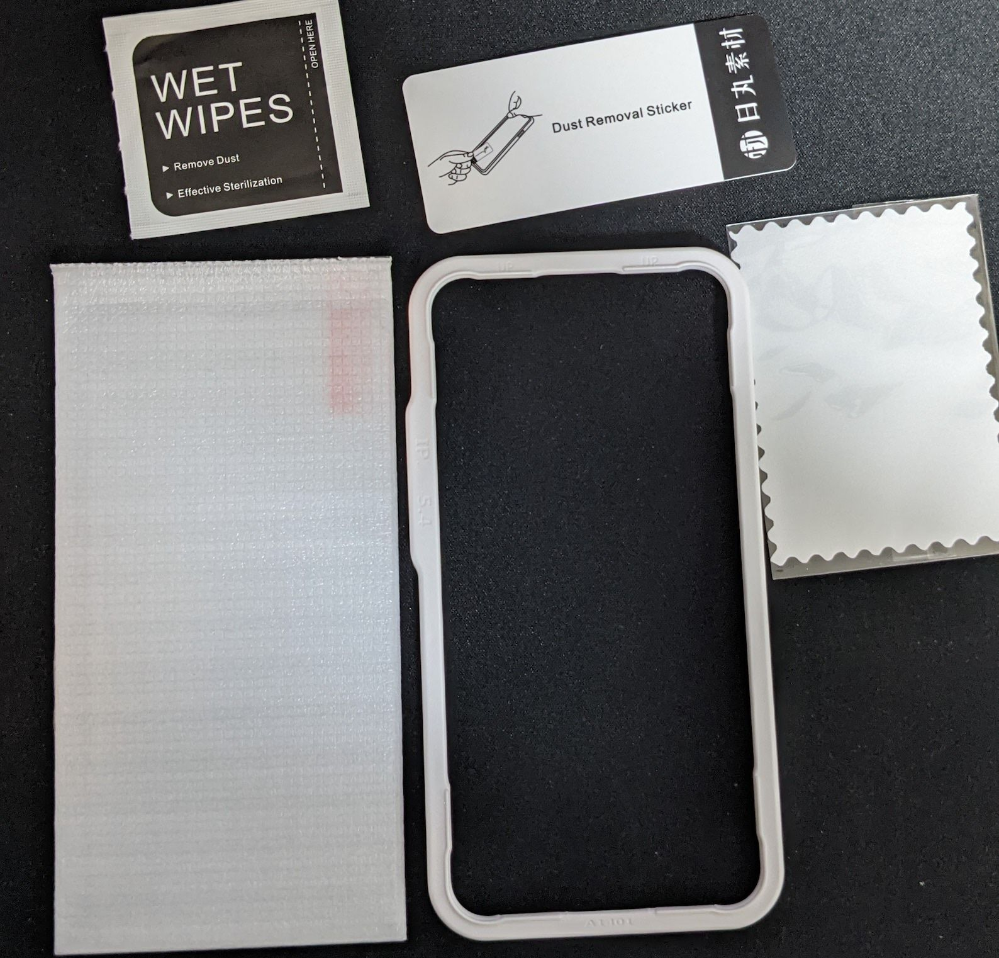
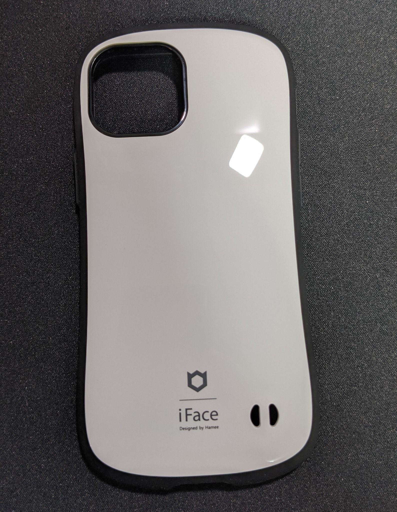
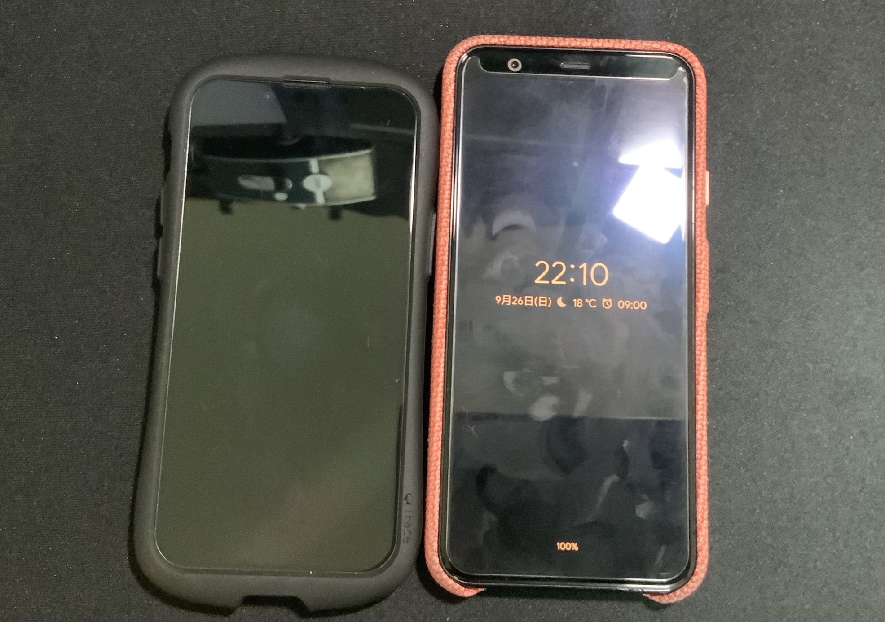

新型コロナウイルス感染症ワクチンの副反応(ということにした)で、iPhone 13 miniを購入しました。色はミッドナイトで、128GBのモデルです。
日々のご飯の写真くらいしか写真は撮らないし、大きいスマホは好きになれないのでminiを選択しました。これまで使用していたPixel 4が64GBのモデルだったので、ストレージは倍になったことになります。AppleCare+ 盗難・紛失プラン for iPhone 13 miniもつけて、107,600円でした。
最後にiPhoneを使っていたのはiPhone 5なので、実に8年ぶりくらいのiPhoneです。

iPad miniも買いましたが、買うかどうか一晩悩んだ結果発売日に届きませんでした。

以下開封写真です:

