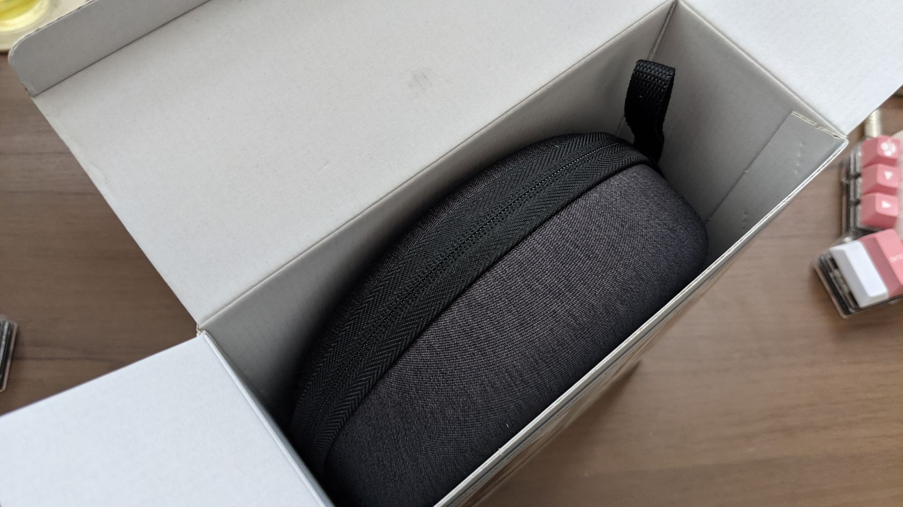
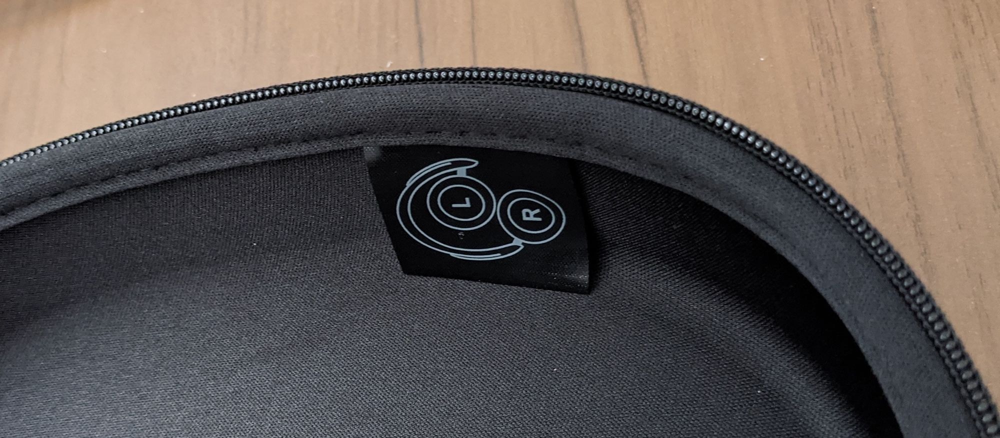

最近、[Among Us]()というゲームにはまっておりまして、友人とのプレイ動画を[Youtubeで配信]()なぞしているのですが、その際、リモートワークで自宅勤務になってからあまり使用されていなかったヘッドホンを使用しています。

これまで使用していたヘッドホンは某社の社長からお下がりで頂いた[beats studio wireless]()なんですが、多少年数が経っているというのもあり、充電ポートがmicroUSB type-Bです。オフィスで使っている分には、専用のケーブルを一本用意しておいて、退勤時に充電するという運用でうまくいっていたものの、ここしばらくは自宅のケーブル類をなんとかtype-Cに統一しようとしていたことも相まってmicroUSBのケーブルを自宅で出しっぱなしにするというのは避けたいという気持ちが強くなりました。

そんなわけでtype-C充電のヘッドホンがほしいな〜と思っていたのですが、beatsの新しめのモデルは相変わらずmicroUSB充電で、かといってSONYとかBOSEとかの上位モデルを買うかというと、[Anker PowerExpand Elite](/anker-powerexpand-elite-13-in-1/)とか買っちゃったのでちょっと散財しすぎかな、と思っておりました。

そんな折に目に入ったのが[Soundcore Life Q30]()でした。

ヘッドホンを購入しよう、と思ったときに個人的にはいくつか条件があり、まず一つは上述のtype-Cで充電できること。加えてオーバーイヤー型であること、[ANC]()がついていること、というあたりを条件としました。Soundcore Life Q30は多少形が好みではない感じがあるものの、どうせ基本は自宅で使うだけだし、価格も安いという事で購入に踏み切りました。

Soundcoreはみんな大好きAnkerのサブブランド(?)で、これまでには[スピーカー](/anker-soundcore-motionb/)を購入したことがありました。Web上のレビューも悪くなく、比較的安心して購入することができました。

箱はAnker製品にありがちなシンプル・・・という路線ではなく、Soundcore製品にありがちな写真+文字という感じのおしゃれな箱。最近(といってももう数年単位とかだと思いますが)こういう箱のオーディオ製品多いですよね。

しかし梱包レベルはAnkerという感じ。ケースに入ったヘッドホンがそのまま箱に入っています。ウケる。

ケーブル類は小さい巾着袋に入って同梱されていました。この巾着が結構触り心地が良いです。

付属していたケーブルはUSB type-A to USB type-Cケーブルと、AUXケーブルです。このAUXケーブルでつないで有線で音楽を聴けばハイレゾにも対応しているとか。そんなに音質のいい音楽を最近は聴かないので、あまり意味は無いですが。

飛行機とかで無線NGな時に音楽を聴きたい人にはいいかも。

中の仕切りは固定されているわけではなく、ただの梱包材だった模様。

梱包材を外してしまうと収納方法が分からなくなりそうですが、そういった可能性も考慮してか収納方法のタグがついてました。安心。

装着感としては側圧が結構やさしめな様に感じます。眼鏡をかけて数時間装着しても痛くありませんでした。

まだ使い始めなので音質等はレビューできませんが、以上、開封レビューでした。

