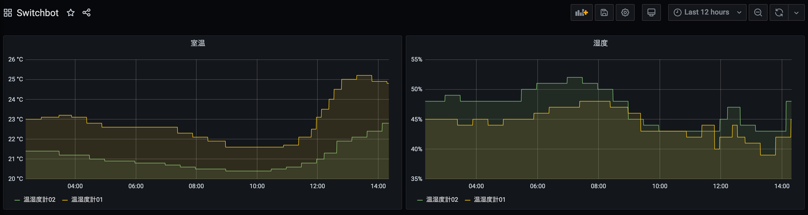

先だって、SwitchBot APIのGo言語用クライアント実装である[github.com/nasa9084/go-switchbot](https://github.com/nasa9084/go-switchbot)を書いた、という[記事](/go-switchbot/)を書きましたが、これを使用してPrometheusで[SwitchBot温湿度計](https://www.switchbot.jp/meter)の情報を収集できる[switchbot-exporter](https://github.com/nasa9084/switchbot-exporter)を書いてみたので紹介します。

switchbot-exporterは[blackbox exporter](https://github.com/prometheus/blackbox_exporter)のように、起動時にはターゲットを指定せず、Prometheusがメトリクスを収集する際にrelabel_configでターゲットを与えるタイプのexporterです。
起動時に必要な情報はSwitchBotアプリから取得できるOpenTokenのみです。OpenTokenはコマンドラインオプションか、環境変数`SWITCHBOT_OPENTOKEN`経由で渡すことができます。

``` shell
$ switchbot-exporter -switchbot.opentoken=blahblahblah
# or
$ SWITCHBOT_OPENTOKEN=blahblahblah switchbot-exporter
```

[docker image](https://hub.docker.com/r/nasa9084/switchbot-exporter)も用意してありますので、例えばKubernetes上で動かすこともできます:

``` yaml
---
apiVersion: apps/v1
kind: Deployment
metadata:
  name: switchbot-exporter
spec:
  revisionHistoryLimit: 3
  selector:
    matchLabels:
      app: switchbot-exporter
  template:
    metadata:
      labels:
        app: switchbot-exporter
    spec:
      containers:
        - name: switchbot-exporter
          image: nasa9084/switchbot-exporter:0.1.0
          ports:
            - protocol: TCP
              containerPort: 8080
          env:
            - name: SWITCHBOT_OPENTOKEN
              valueFrom:
                secretKeyRef:
                  name: switchbot
                  key: opentoken
---
apiVersion: v1
kind: Service
metadata:
  name: switchbot-exporter
spec:
  ports:
    - protocol: TCP
      port: 8080
      targetPort: 8080
  selector:
    app: switchbot-exporter
```

このようにして起動した後、[README](https://github.com/nasa9084/switchbot-exporter/blob/master/README.md)に記載のあるようにprometheusの設定をします

``` yaml
scrape_configs:
  - job_name: switchbot
    scrape_interval: 5m
    metrics_path: /metrics
    static_configs:
      - targets:
          - DFA0029F2622 # meter 01
    relabel_configs:
      - source_labels: [__address__]
        target_label: __param_target
      - source_labels: [__param_target]
        target_label: instance
      - target_label: __address__
        replacement: switchbot-exporter:8080
```

`static_configs`の`targets`には温湿度計のIDを記入します。IDは例えば[get_switchbot_devices.go](https://gist.github.com/nasa9084/2be5e22485ff2ad91fdb3e5a0f2a01b4)の様な簡単なスクリプトで取得することができます。
`relabel_configs`で、`__address_`のreplacementにはprometheusがswitchbot-exporterにアクセスする際のURLやアドレスを記入します。

SwitchBot APIのrate limitが1000 requests/dayなので、一日すべての値を取得したい場合は途中でrate limitに引っかからないよう、`scrape_interval`をうまく調整して下さい。

設定ができたら、温度は`switchbot_meter_temperature`で、湿度は`switchbot_meter_humidity`で取得することができます。デバイスの名前は`switchbot_devices`に格納されていますので、`group_left`などでjoinすると良いでしょう:

```
switchbot_meter_temperature + ignoring (device_name) group_left(device_name) switchbot_device
```

後はGrafanaなどを使用すると良い感じにグラフを書くことができます。



できるだけAPI rate limitに影響を与えないよう、`device_list`はキャッシュして、起動時以降は`device_list`の取得をしないようにしてありますので、デバイスの増減があった場合はSIGHUPを送るか、`/-/reload`にアクセスして`device_list`を更新して下さい。

SwitchBot加湿器などは持っていないので現在のところ温湿度計のみの対応ですが、加湿器を持っていてメトリクスを収集したい、という場合はPull Requestを送ってください。お待ちしております。


