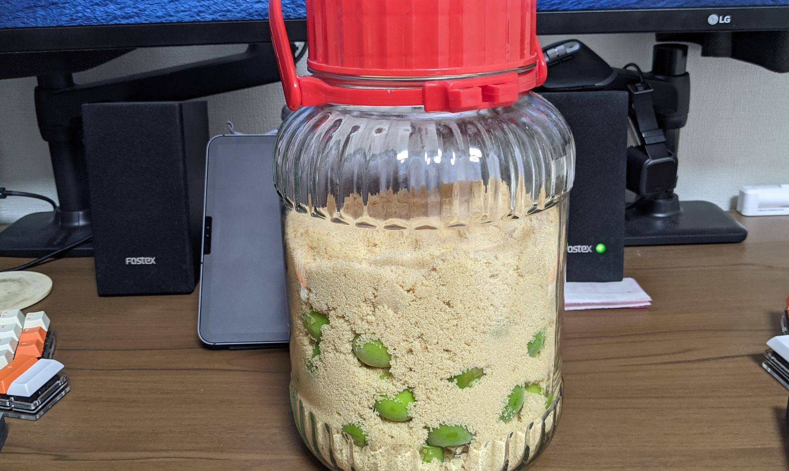

向暑の候皆様いかがお過ごしでしょうか。近所の西友で梅酒関連の商品が店頭に並びはじめているのを見て季節を感じる今日この頃です。

例年梅酒と梅シロップを漬けるわけですが、漬けっぱなしで放置している梅酒はさておき梅シロップはできればシーズン中に二回は仕込みたい、という気持ちがあり、店頭で梅の実を発見してとりあえず購入してきました。

まだ出始めですから、まだかなり青い実ではありますが、急ぎ一発目の梅シロップを仕込みました。

手順自体は例年とそう変わるモノではなく、昨年梅シロップをつけていた空き瓶をアルコールで消毒した後、洗って水気を切りへたを取った梅の実と砂糖を交互に積んでおいておきます。[昨年](/ume-2020/)は中ザラ糖を使用した、との記録がありましたが今年は気分で三温糖をセレクトしました。特に深い理由はありません。三温糖はしっとりとしており、積み上げるのも容易ですし、粉末状なので隙間にも入っていきやすく取り扱いがしやすい様に感じました。氷砂糖はうまく積んでいくことを考えると意外と難しいです。

うまいこと梅を砂糖の中に埋める事ができ、上から見ると梅が出てしまっているということもありませんから、今年は酢を入れない方針で行ってみようと思います。

大粒の実が店頭に並びはじめたら梅酒も漬けたい所存です。

