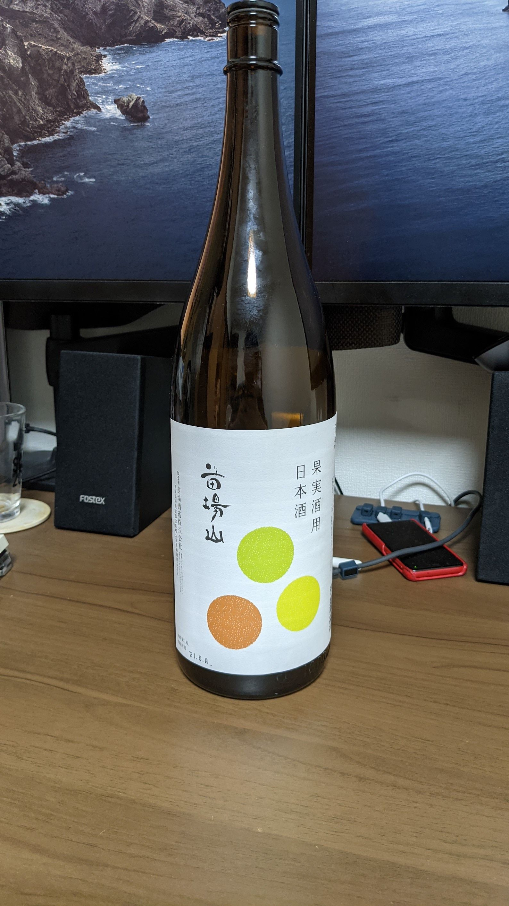
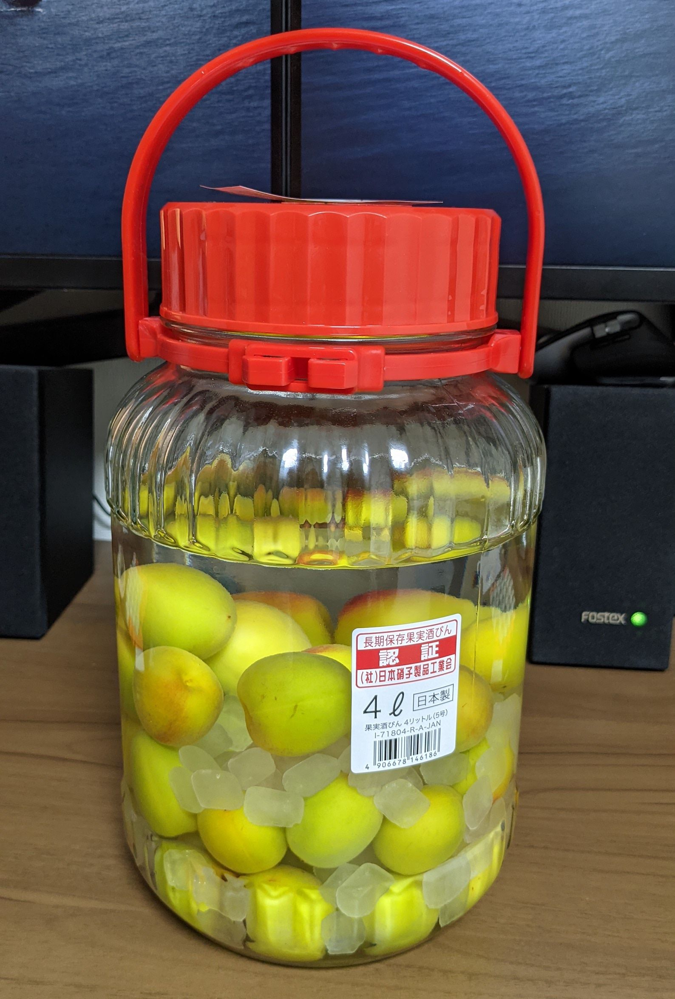
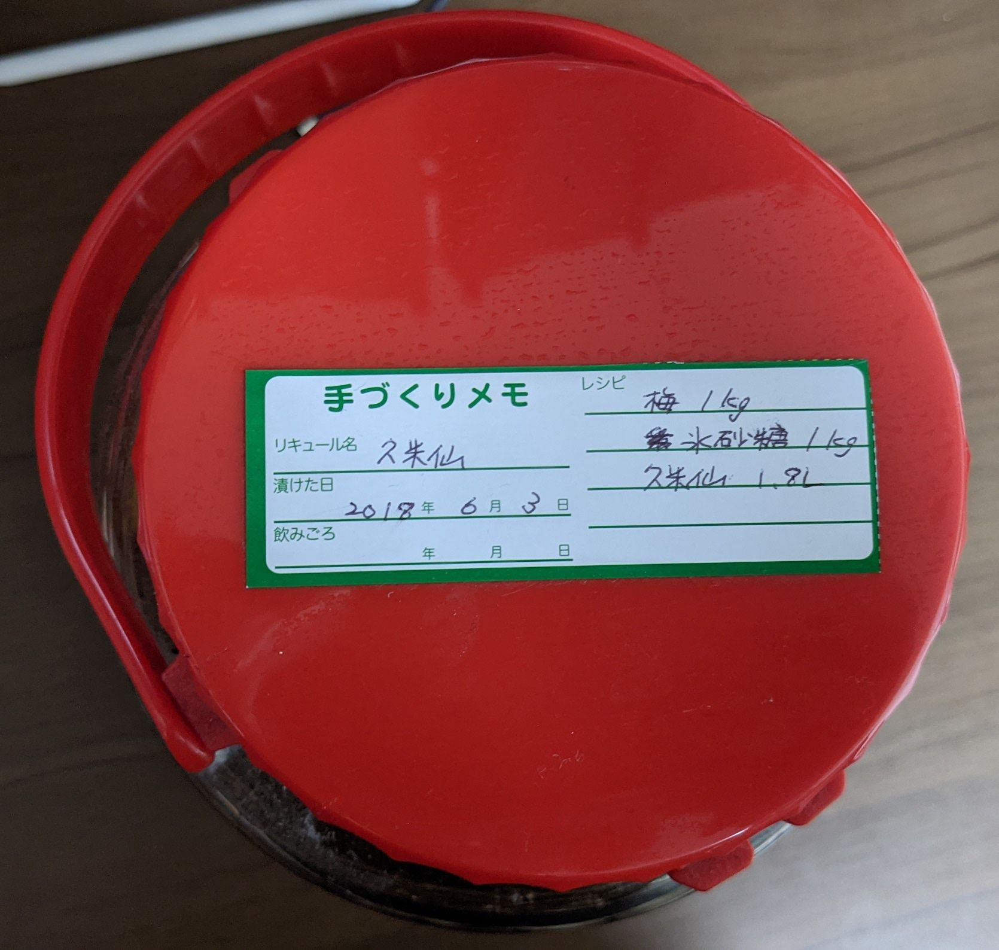
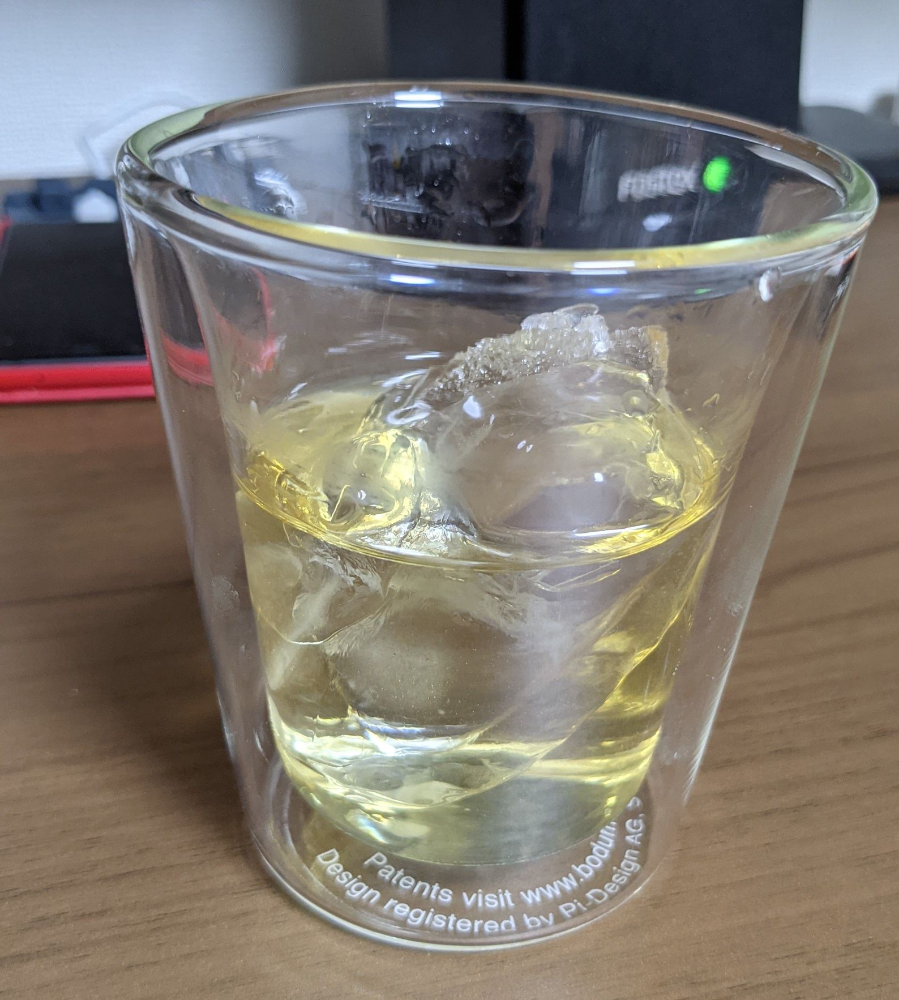

先だって梅シロップを漬け、既に半分以上梅シロップを消化してしまった今日この頃、大分遅くなってしまったものの今年も梅酒を仕込みました。
就職で関東に出てきてから今年で4L瓶が5本目と相成りました。
本年は面倒くさがっている間にあれよあれよと日が経ってしまい、近所の西友では4L瓶が買えなくなる始末でありましたがなんとか4L瓶を調達する事に成功し、無事仕込みを済ませることができました。

今年はあまり時間が無かったこともあり、梅は近所の西友で調達した南高梅(大玉)です。割と傷も少なく良い香りのする梅で、西友侮りがたし、といったところですね。おそらく1kgと思われる袋が980円(税抜)でした。

酒は今年は初めて日本酒を使用。実は以前から日本酒で梅酒を仕込むというのはやってみたいと思ってはいたのですが、通常店頭で販売されている日本酒は梅酒を仕込むには度数が足りないため、梅酒(乃至果実酒)用のものを調達する必要がある、という面倒さがあり、店頭でそういった梅酒用の日本酒が販売されているのを発見したことがなかったため、これまでは挑戦してきませんでした。
今年はむやみやたらにAmazonのポイントが貯まっていたという事もあり、Amazonでいろいろと探したところ、果実酒用の日本酒が販売されていたためこちらを購入しました。

苗場酒造という酒蔵の苗場山「果実酒用日本酒」、度数が20%のものです。[Amazon](https://amzn.to/35Ar3tW)で本体価格が1,800円、送料が500円です。

日本酒を使うのは初めてのため、砂糖は特に奇をてらわず一般的な氷砂糖を使用しました。

作り方は特に例年と変わらず、洗ってへたを取った梅と砂糖を瓶に入れ、上から酒を注ぎ入れるだけです。日本酒の場合米の甘みがあるため砂糖は控えめで良い、という事でしたので、酒に付属してきたレシピにあわせて氷砂糖の量は500gとしました。例年は1kgで使用しているため、例年の半分です。

このあとは砂糖が溶けるまでは時々振ってあげて、砂糖が溶けたら放置です。自家製梅酒大体3ヶ月程度からが飲み頃と言われていますから、9月くらいになったら味見をして、そのあとはまた数年放置されることとなります。

最後に、[昨年は2017年に漬けた梅酒を飲んで締めたようなので](/ume-2020/)今年は2018年に漬けた梅酒を飲んで締めようと思います。

ラベルによると2018年は久米仙と氷砂糖を使用したようです。泡盛ですね。意外と癖もなく、飲みやすく仕上がっています。

今年の梅酒も美味しく漬かることを祈って。

