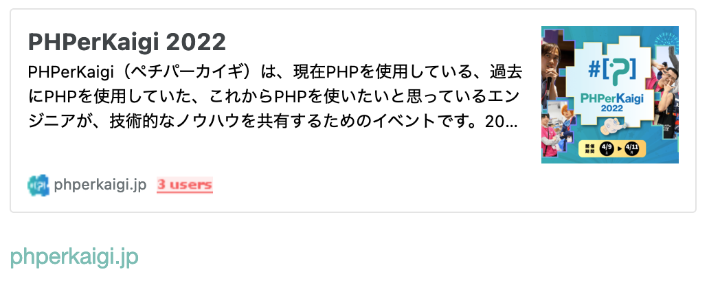
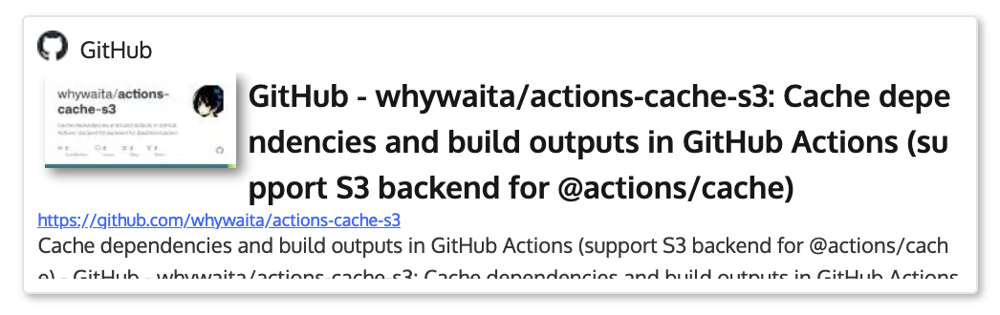
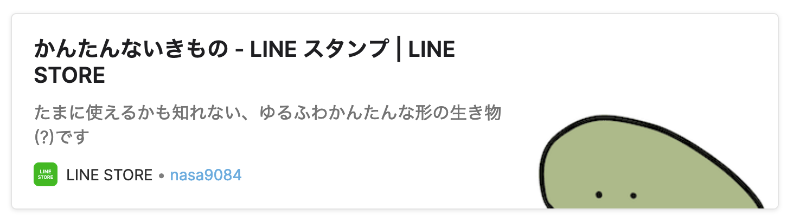

例えば、はてなブログだとブログカードと呼ばれるこういうの:



が有ったり、wordpressだとプラグインでこういうの:



が有り、リンクをなんだか良い感じに表示してくれます。このブログでつい先日まで使っていたGhostでも、こういうの:



が有りました。

一方、現在使っているHugoには標準機能でこういったものを表示する機能はありません(twitterとかYoutubeはあるんですけど・・・)。しかし、無ければ作れば良いじゃない、ができるのがHugoの良いところです。

Hugoには[shortcode](https://gohugo.io/content-management/shortcodes/)という機能があり、例えば標準のtwitter shortcodeだと、

```

```

と書くと



の様に展開されます。なので今回は

```

```

というshortcodeを作ってみようと思います。調べてみると同様の実装をしている人もいましたので、それを参考にしつつ実装していきます。

まず、URLからデータを取得してくるにはHugoの[getJSON](https://gohugo.io/templates/data-templates/#get-remote-data)を使うと良さそうです。残念ながらOGP情報などを取得する方法は用意されていないようなので、指定したURLからOGP情報をとってきてJSONとして返す様なプロキシ的なサーバが必要そうです。[cloud functions for firebase + javascript](https://seita.icu/post/hugo-shortcode-web-embed/)で実装している人もいれば、[Netlify Functions + javascript](https://wada.page/post/0003-hugo-blogcard/)でやっている人もいるという感じでしたが、やはり個人的にはGoがシュッと読み書きできて早いし、Cloud Functionsなどで常時稼働させておくには認証とかのことも考える必要がありありそう(まぁ無くてもいいっちゃいいけど、よくわからん踏み台にされても面白くない)で面倒だな、ということでちょっと困ったんですが、OGPプロキシサーバは特に状態を持っておらず、`hugo build`する間だけ存在してくれればいいので、GitHub Actionsのサービスコンテナとしてプロキシを動かすことにしました。ローカルでテストビルドするときも`docker run`すれば良いだけなので簡単です。

ハンドラの実装は次の通りです:

``` go
url := r.URL.Query().Get("url")
if url == "" {
	http.Error(w, `{"message": "url parameter is required"}`, http.StatusBadRequest)
	return
}
log.Printf("request URL: %s", url)

ogp, err := opengraph.Fetch(url)
if err != nil {
	http.Error(w, fmt.Sprintf(`{"message": "error fetching OGP", "error": "%s"}`, err.Error()), http.StatusInternalServerError)
	return
}

if err := ogp.ToAbs(); err != nil {
	http.Error(w, fmt.Sprintf(`{"message": "error converting relative URLs to absolute URLs", "error": "%s"}`, err.Error()), http.StatusInternalServerError)
	return
}

var body bytes.Buffer
if err := json.NewEncoder(&body).Encode(ogp); err != nil {
	http.Error(w, fmt.Sprintf(`{"message": "error encoding OGP info to JSON", "error": "%s"}`, err.Error()), http.StatusInternalServerError)
	return
}

w.WriteHeader(http.StatusOK)
body.WriteTo(w)
```

コード全体は[ここ](https://github.com/nasa9084/blog.web-apps.tech/blob/0eea2254f7650b5a682e568fdc55fbbb9679d913/getogp/main.go)にあります。リポジトリを作ったときにhugo用のディレクトリをルートディレクトリではなく一段掘ったサブディレクトリにしておいたおかげで気軽にディレクトリを追加できたので良かったですね。

あとはshortcodeを次の様に実装して:

``` html
{{ $url := .Get "url" }}

{{/* LINE Store specific config */}}
{{ $localePathSuffix := "" }}
{{ if (hasPrefix $url "https://store.line.me") }}{{ $localePathSuffix = "/ja" }}{{ end }}

{{ $data := getJSON "http://localhost:8080/ogp?url=" $url $localePathSuffix }}
{{ $title := $data.title }}
{{ $image := (index $data.image 0).url}}
{{ $description := $data.description }}
{{ $favicon := $data.favicon.url }}
{{ $siteName := $data.site_name }}

<div class="web-embed">
  <a href="{{ $url }}">
    <div class="web-embed-thumbnail">
      
    </div>
    <div class="web-embed-content">
      <div class="web-embed-title">{{ $title }}</div>
      <div class="web-embed-description">{{ $description }}</div>
      <div class="web-embed-site-name">
        
        {{ $siteName }}
      </div>
    </div>
  </a>
</div>
```

[適当にCSSも付けて](https://github.com/nasa9084/blog.web-apps.tech/blob/a147d54390dbe2655f9d0ce216dc956ea6262572/blog.web-apps.tech/assets/css/extended/web-embed.css)、Actionsのジョブでサービスコンテナを起動するように設定すれば:

``` yaml
    services:
      getogp:
        image: ghcr.io/nasa9084/getogp:v0.0.1

```

完成です。ついでにOGP-JSONプロキシのDockerイメージも良い感じにビルドしてGitHub Packagesにpushする様に[workflowを追加しておきました](https://github.com/nasa9084/blog.web-apps.tech/blob/a147d54390dbe2655f9d0ce216dc956ea6262572/.github/workflows/getogp.yaml)。GitHub Actionsは複数プロジェクトをきれいに扱えるので良いですね。

```

```

と書くと



の様に描画されます。良い感じ。
