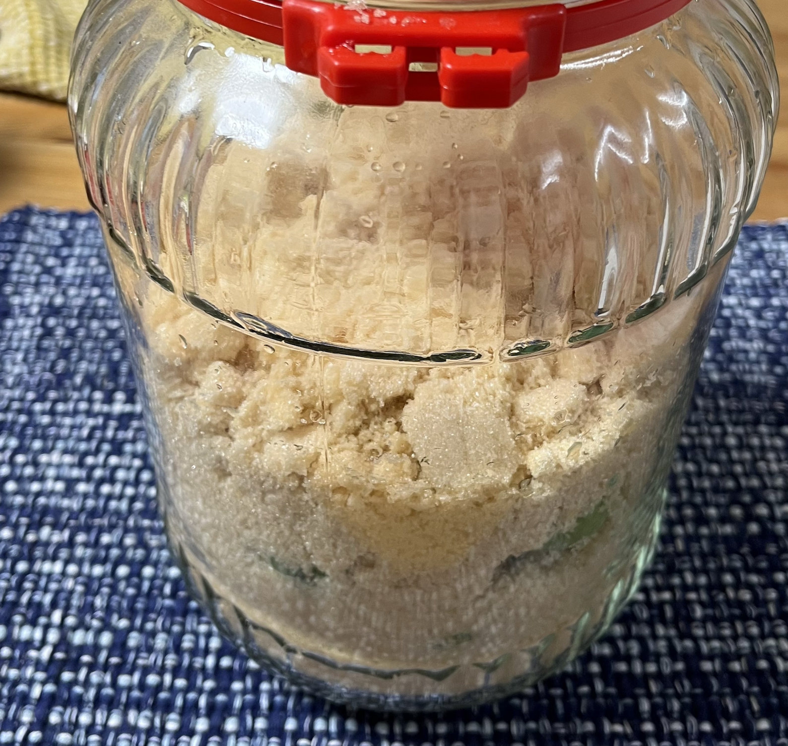

皆さん、6月です。6月と言えば、そう、梅の季節ですね。今年も近所の西友で梅やらでかい瓶やらが店頭に並んでいたので買ってきました。このブログでは2020年からしか記録をつけていないのですが、成人してから毎年梅酒と梅シロップを漬けており、梅酒はほぼ手を付けていないので4L瓶が実家にも現在の家にも並んでいます。そろそろ一升瓶を入手して瓶詰めでもしようか、などと考えています。

扨、もちろん今年も梅酒/梅シロップを漬けましたので記録しておきます。今年のレシピはこちらです:

* 梅: 近所の西友で購入した青梅一袋。多分1kgくらい(で売ってるのが普通のはず？)
* 砂糖: 西表島産黒糖1kg
* 酒: ホワイトタカラ 果実酒の季節 1.8L

昨年はかねてからやってみたかった、梅酒用の日本酒を手に入れて日本酒梅酒を漬ける、ということをやりましたので、今年は砂糖の方で変化を入れてみました。酒はこの季節どこにでも売っている果実酒用ホワイトリカーの定番、果実酒の季節です。度数は35%です。適当な焼酎で漬けても良いんですが、黒糖を使うこともあり度数が高めのモノを使った方が良いだろうと考え果実酒の季節を選びました。

梅を洗って、

水分を拭き取りながらへたを取り、砂糖と交互に積み、

酒を注ぎます

余談ですがこの黒糖、カレールゥにしか見えないのは私だけでしょうか

巷にあふれるレシピを見ると、へたのところに水分が残りやすいので注意とか、傷があったらそこから腐るので除けた方が良いとか書いてありますが、多少へたのところに水分が残ってたり傷があっても多分大丈夫です。大きな傷があるモノとか、傷のところが柔らかくなっているモノは除けておきましょう。今回は一袋の内1つだけ傷のところがすこし柔らかかったため除けました。

梅は金気を嫌う、という話が有るので私はへた取りは爪楊枝でやっています。ボウルもプラかなんかの奴で、金属製じゃない奴です。まぁ金属のボウルに入れたところでどれだけ影響があるのか分からないですが。

黒糖特有だと思うんですが、アクのようなモノが浮いてきました。

最後に、瓶に付属していたラベルに年月日とレシピを記録して貼り付けておきます

あとはしばらく数日ごとに瓶を揺すって、砂糖が溶けたら放置して3ヶ月くらい経ったら飲むことができます。1年くらい置くとなお良いでしょう。私は永遠に放置します。

続いて梅シロップを漬けます。レシピはこちら:

* 梅: 近所の西友で購入した青梅一袋。多分1kgだろうという想定。
* 砂糖: カップ印の三温糖1kg

こちらも氷砂糖のレシピが一般的だと思いますが、今年は三温糖にしてみました。店頭で今年は三温糖にしようかな、と思って買ってきたのですが、[昨年も三温糖を使ったよう](/ume-2021-1/)です。まぁ良いでしょう。

酢を入れるレシピもありますが、今年は酢を入れないでやってみることにしました。

以上です。
