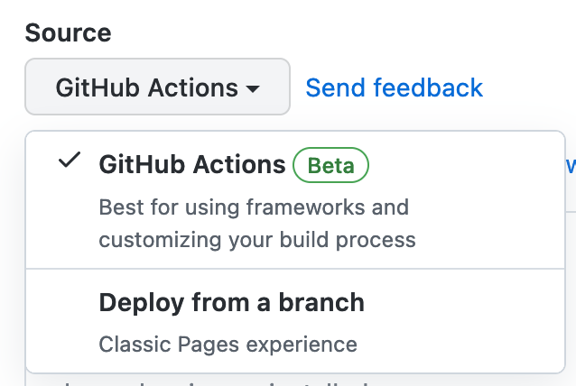

2022年9月1日現在、このブログはmarkdownファイルからHugoを使って静的サイトを生成し、GitHub Pagesで公開しています。元々GitHub Pagesにページをデプロイするには、生成済みページを入れた専用のブランチ(一般に`gh-pages`)を用意するか、生成済みページを入れたディレクトリを用意するか、という二択で、いずれにせよページを生成してから生成されたページをGitHubにpushする必要がありました。前者の場合`gh-pages`ブランチは`main`ないし`master`ブランチとは一切関係の無いコミット履歴となり、ぱっと見よく分からないですし、後者の場合gitのcommit logにサイト生成のコミットが入ってしまいきれいではありませんし、CIでbuild/pushをしている場合ローカルに毎回pullする必要も発生します。当サイトでも`gh-pages`ブランチに生成済みページをpushする運用となっていました。

ところが最近、[GitHub Actionsから直接GitHub Pagesにページをデプロイできる様になった](https://github.blog/changelog/2022-07-27-github-pages-custom-github-actions-workflows-beta/)というではないですか。これは試してみるしかない、ということで設定を変更してみました。

まず、リポジトリのSettings > Pagesから、SourceをGitHub Actionsに変更します。



次に、GitHub Actionsのworkflow設定を[actions/starter-workflows](https://github.com/actions/starter-workflows/tree/main/pages)を参考に書き換えます。重要なのは2点で、`actions/upload-pages-artifact`を使って生成済みページをartifactとしてアップロードする点と、`actions/deploy-pages`を使ってGitHub Pagesにデプロイをすることです。

``` yaml
steps:
  - name: Upload artifact
    uses: actions/upload-pages-artifact@v1
    with:
      path: ./public
```

``` yaml
# Grant GITHUB_TOKEN the permissions required to make a Pages deployment
permissions:
  pages: write      # to deploy to Pages
  id-token: write   # to verify the deployment originates from an appropriate source

environment:
  name: github-pages
  url: ${{ steps.deployment.outputs.page_url }}

steps:
  - name: Deploy to GitHub Pages
    id: deployment
    uses: actions/deploy-pages@v1
```

多分artifactのアップロードとページのデプロイは同じJob内で実施しても問題無く動くとは思いますが、[actions/deploy-pagesのREADME](https://github.com/actions/deploy-pages)によると専用のJobに分けることが推奨されているようです。

ということで、簡単に設定ができて、このページもシュッとActionsから直接Pagesにデプロイされている・・・はず。
