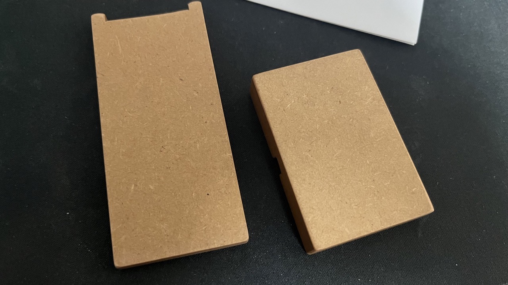

あけましておめでとうございます。11月頃にMakuakeで応援購入したApple watch用のバングルが届いたので開封しました。

購入したのは[Air bangle](https://www.makuake.com/project/air-bangle02/)のべっ甲カラーです。
Air bangleはその名の通り、世にも珍しい(?)バングル型のApple watchバンドです。
鯖江のメガネ作りの技術で作られているそうです。

箱はこんな感じで、思っていたよりも高級感があります。クラウドファンディングで作られたモノはもっとがさつな袋に入ってくるものだと思っていたのですが、そうでもないようです。

中にはアダプタと本体、取扱説明書が入っていました。取説の内容はほとんどQRコードで、Apple watchへの装着方法や着け心地の調整方法などは動画で確認することができます。
保証も一年ついていて安心です。

色はこんな感じ。Makuakeのページ上で見たイメージよりは濃い色に見えます。

購入したのはApple watch 38/40/41mm用のサイズ4(17〜18.5cm)です。これまではソロループのサイズ9や、ブレイデッドソロループのサイズ8がちょうどいい、と思っていた位の腕の太さです。

おまけ(?)として専用のスタンドもついています。簡単な作りではありますが木製で悪くないです。

表から見ると木目が良い感じですが、実際は突板で、裏から見るとMDF材まんまなので表からだけ見ましょう。(makuakeのページを見るとチェリー突板/MDF材、とのことです)

Apple watchに固定するプレート部分もきれいです。安モノだとこういう部分があまりきれいではなかったりするんですよね。

実際にApple watchに装着する際はこのアダプタを使用します。アダプタは購入時に黒かシルバーから選ぶことができますが、私のApple watchはミッドナイトカラーなので黒にしました。
もちろん、きちんとロック部分も実装されています。

平置きタイプのドックなどは使えないと思いますが、[Amazonで売っている安価な横置きタイプの充電スタンド](https://amzn.to/3ILbUdT)であれば問題無く使用できます。

今回購入したべっ甲カラーはまだ正式には発売前なのでクラウドファンディングが終了した現在は購入することができませんが、第一弾で販売された3色は[公式サイト](https://airbangle.com/)から購入できるようなので、気になった人は購入してみてください。
サイズは38/40/41mm Apple watch用と42/44/45mm Apple watch用でそれぞれ5サイズ展開、届いた後にサイズが合わなかった場合も無償で交換してくれるそうです。

なお、予想していたことではありますがキーボード操作をするときは邪魔になりますので、キーボード操作をするときはソロループ、外出時はAir bangleといった使い分けが必要そうです。
