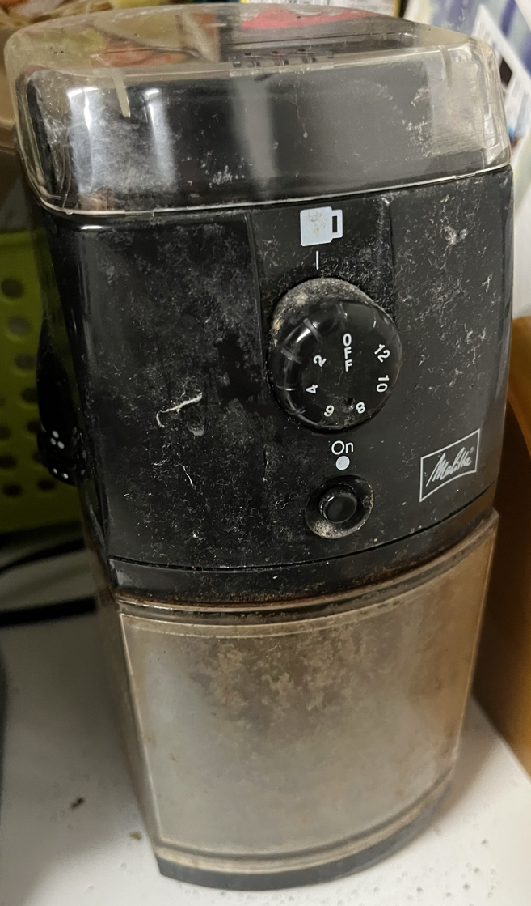
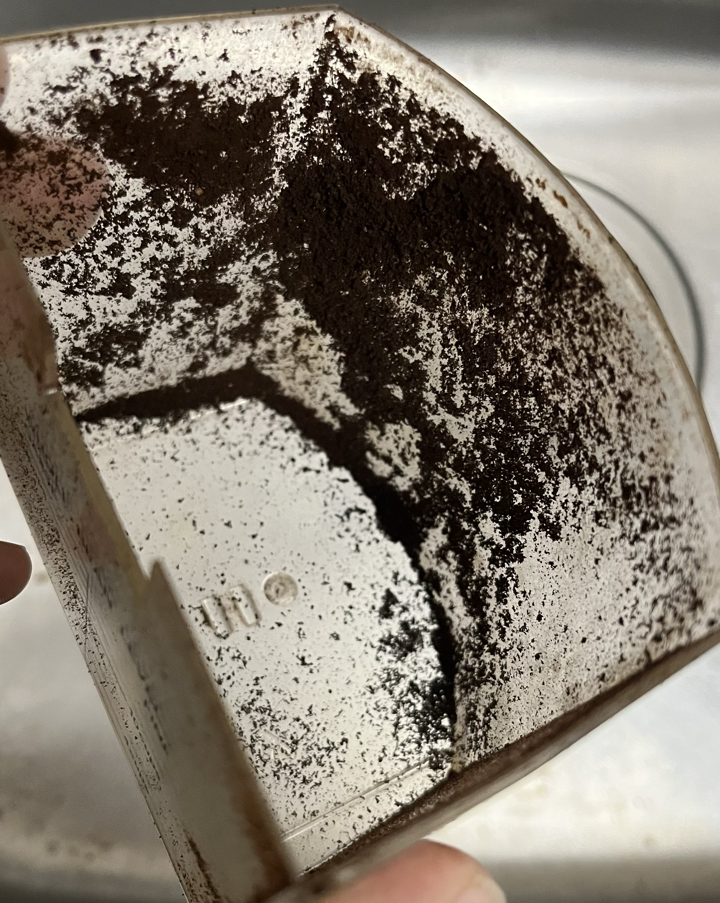
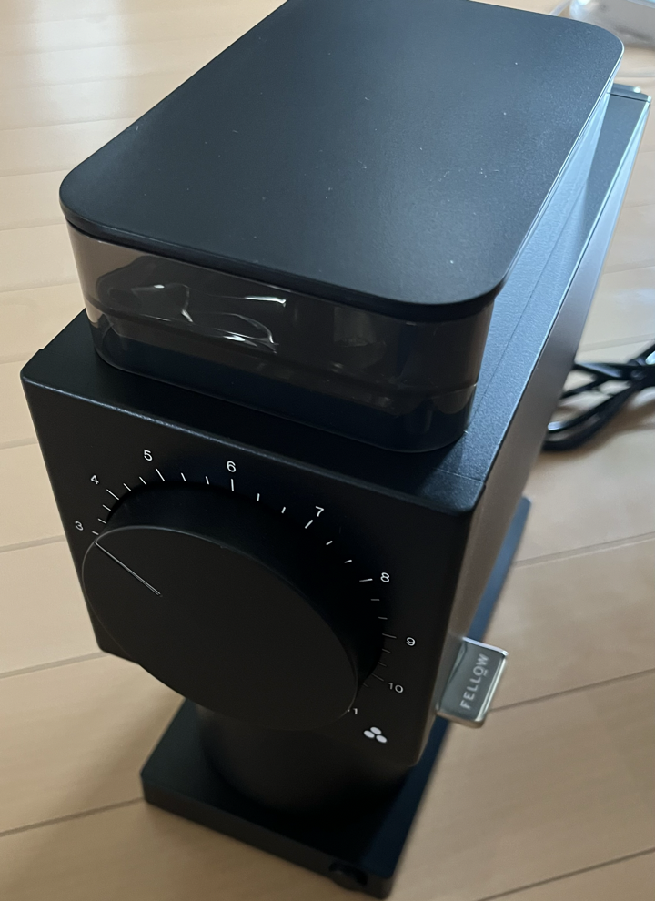
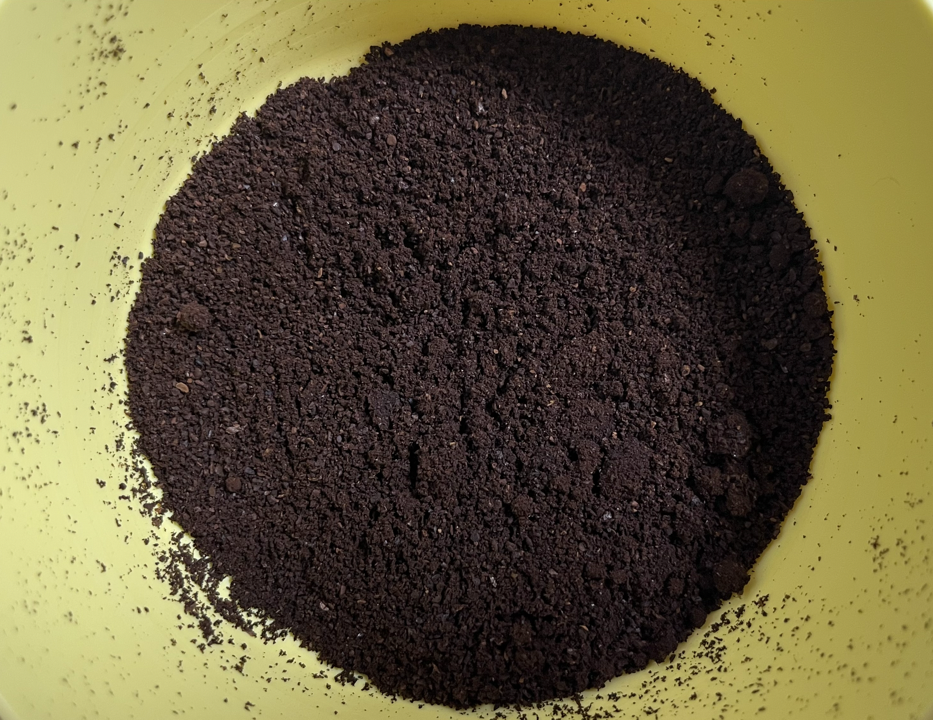
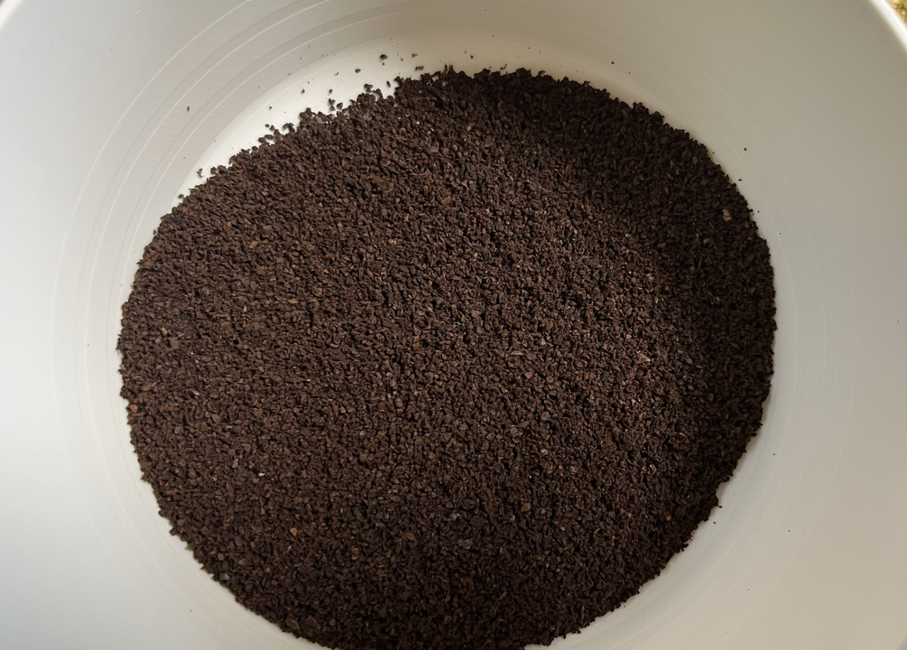
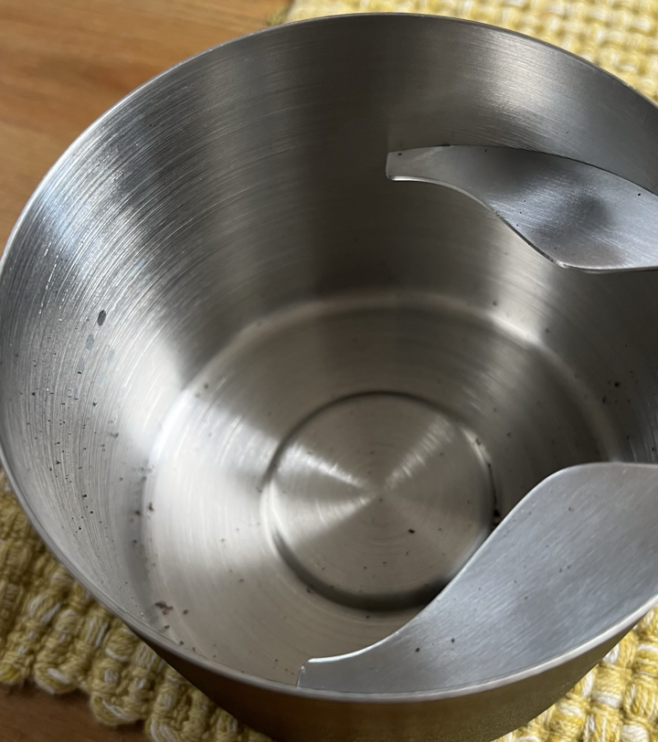

みなさん、コーヒーは好きですか。私は豆でコーヒーを買ってくる位には好きで、ミルで豆を挽いてコーヒーメーカーで雑に淹れる、という感じでやっております。

扨、そんな私ですがこれまでコーヒーミルはメリタのパーフェクトタッチIIという電動ミルを使っていました。

これは大学生の時に買ったやつで、掃除もろくにしないで雑に使っていたため、かなりひどい見た目になっていますね。定価は多分12,000円くらい？で、当時ビックカメラあたりで5,000円くらいで購入しました。電動ミルとしてはかなり手頃な値段で買える割にプロペラ式ではない(プロペラ式のミルは安いけど引いた後の粉の粒度が安定しない)ミルということで、私のコーヒー生活をかなり豊かにしてくれたと思っています。

とはいえ値段なりの問題はいくつかあって、最大の問題は微粉と静電気でした。すごく微粉が出るし(微粉が多いと雑味が多くなる、と言われている)、粉受けがプラスチックなので静電気で粉受けの内側にくっつく、ダマになる、挙げ句粉受けの外も粉だらけになるという感じでした。エントリーモデルとしては最高だと思うんですけどね。

まぁそんなわけで毎回キッチンをコーヒーだらけにするのがストレスだなー、良いミルが欲しいなー、と思っていたところ、Fellowという会社からの最新ミルであるODE Gen2というミルが日本でも発売になるということで予約して購入しました。値段は61,600円。高いですね。私はちょうどボーナスが出たので高いなーと思いながらポチりました。

参考にしたレビュー動画はこちらです:



このミルの何が一番良いかというと、静電気防止機能とノッカーがついているところで、前述の通り静電気が主なストレスの原因だったのと、粉を落としきるためにパーフェクトタッチを叩いていたので、ノッカーがあるのはすごくいいと感じました。

販売ページはこちら: [Fellow ODE Brew Grinder Gen 2](https://kigu.coffee/products/ode-brew-grinder-gen2)

届いたモノがこちら:

まず、デザインが良いですよね。安っぽさを感じさせないですし、大きなダイヤルが使いやすそうです。

挽いた粉を比較してみましょう。

黄色い皿に入っている方がパーフェクトタッチIIで挽いた粉です。微粉が静電気でダマになっているのが見て取れますし、静電気で皿の壁面に細かい粉がついてしまっています。一方ODE Gen2で挽いた粉は粒度が一定で、静電気もひどくありません。まぁ、(定価ベースで)値段が6倍くらい違うので、同じ結果では困るのですが・・・

粉受けも見てみましょう。

粉受けにもほとんど粉が残っていません。良いですね。

スペック的には、フレンチプレスで使えるくらいの粗い挽き目から、マキネッタ用にもなんとか使えるかな、位の範囲で挽けるようです。

以上です。
