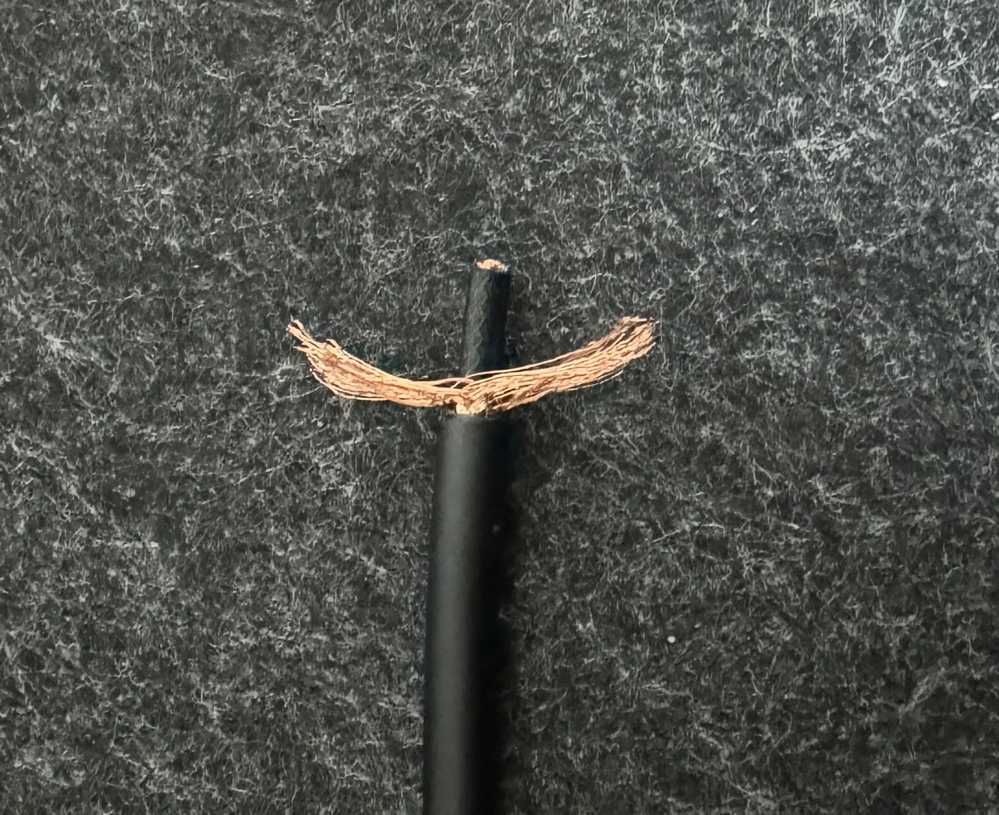
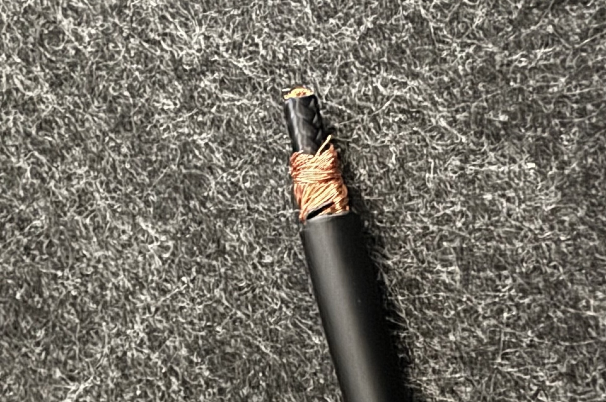
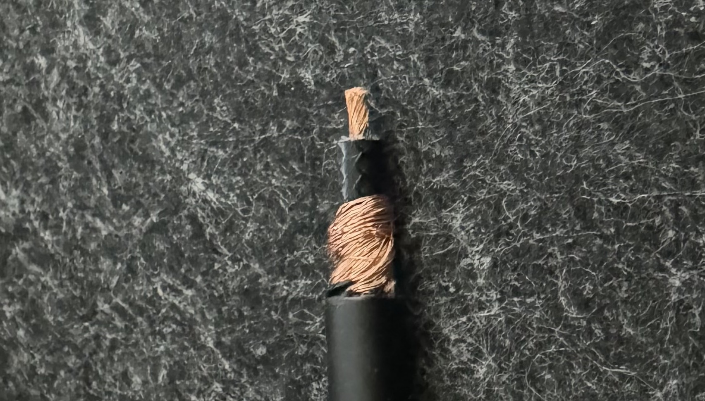

現在、ギターを練習するとき、有線でケーブルをつなぐとイスで踏んでしまったり、あちこちに引っかかってしまったりして不便なので、[LINE6 Relay G10TII](https://line6.jp/products/relay-wireless/g10-g10s.html)というワイヤレス送信機を使っています。

今使用しているギターは[YAMAHA PACIFICA 112V](https://jp.yamaha.com/products/musical_instruments/guitars_basses/el_guitars/pacifica/pac_100.html)なんですが、このギター、サイドにジャックがあるんですよね。そうすると、ワイヤレスの送信機、特にG10TIIや[BOSS WL-20](https://www.boss.info/jp/products/wl-20_wl-20l/)の様な四角いタイプの送信機を挿すとかなり飛び出る格好になってしまい、オフィスチェアに座って練習をしていると(単にオフィスチェアとギター練習の相性が悪い、という点はさておき)ぶつけて折ってしまいそうで不安になります。

一応L字のアダプタは付属していたような気もしますけれど、丸みのあるギターの側面にL字アダプタを挿しても、結局違う方向にはみ出るのはあまり変わらないな、ということでL字プラグに短いケーブルがついている、いわば「延長ケーブル」を作りました。

なお、何故ライブ前に作らなかったのか、という問いには答えられません。

## 材料

* 任意のL字プラグ
  * 今回は[オヤイデの超小型な奴](https://shop.oyaide.com/products/p-63l_6mm.html)。使ってみたかったので。
* 任意のフォンジャック
  * 今回は[TOMOCA JS-504](https://www.soundhouse.co.jp/products/detail/item/132656/)。見た目が良かったので。
  * [千石電商](https://www.sengoku.co.jp/mod/sgk_cart/search.php?cid=3414)とかでもっと安いのも買えるけど、送料がかかるので通販だと実質TOMOCA JS-504一択。秋葉原によく行く人は[千石電商秋葉原本店](https://www.sengoku.co.jp/shop_01.html)の2階か、ラジオ会館の[トモカ電気プロショップ](https://www.tomoca.co.jp/shop/proshop/)に行くとソレっぽいモノが売っています。
* 任意の単芯シールドケーブル
  * 今回は[CANARE GS-6](https://www.soundhouse.co.jp/products/detail/item/22872/)。ど定番だし、たまたま安く売ってたので。
  * PACIFICA 112Vの場合は25cm位用意すればちょうどよさそう
* 何か絶縁する奴
  * 無くても良い。[フッ素テープ](https://shop.oyaide.com/asf-110_5.html)とか熱収縮チューブとか。ホームセンターとかで買ってきても良いし、ご家庭に在庫している適当な熱収縮チューブを使っても良い。
* 任意の半田
  * 材料というか工具というか？

## 工具

* 任意の半田ごて
* 半田吸い取り線
  * 無くても良いけど、ミスした場合を考えると持っていた方が良い。
* 任意のニッパーまたはカッターまたはまたはワイヤーストリッパー
* テスター
  * 無くても良いけど導通チェックはした方が安心
* (オヤイデのSuperSlimシリーズを使う場合)任意のプラスチック/ゴムハンマー
* (熱収縮チューブを使う場合)任意のヒートガン
  * ドライヤーなどでも代用できるけど、あった方が便利
* ツールクリップ
  * 土台に腕とクリップがついていて、はんだ付けする対象を固定できるやつ
  * これもなくても良いけど、ケーブルのはんだ付けは細かいし、ケーブルは意外とのたうち回ってはんだ付けが難しいのであった方が良い。

## 作成手順

1. 目算で外側の被覆を剥く

2. シールド線をほぐす

3. L字プラグをつける (以下オヤイデSuperSlimの場合)
    1. シールド線をざっくり二つに分けて芯線に巻く
    
    2. 芯線を剥く
    
    3. カバー？ハウジング？をはずしたオヤイデSueprSlimに差し込みTIP(+)にはんだ付けする
    
    4. クランプ側面の穴からはんだを流し込む
    
    5. 導通チェックをする
    6. 熱収縮チューブを差し込んで加熱して収縮させる
    
    7. カバーをつける
    8. 樹脂キャップを乗せてプラスチックハンマー/ゴムハンマーで叩いてはめ込む
4. フォンジャックをつける (以下TOMOCA JS-504の場合)
    1. フォンジャックのカバーを差し込む (これを忘れてはんだ付けするとやり直しになるので注意。私はやり直しました)
    2. シールド線を適当にまとめる
    3. 芯線を剥いて二つに分ける
    
    4. シールド線、芯線の順にはんだ付けをする (フッ素テープやビニールテープなど絶縁するモノの用意があれば絶縁しておくと安心)
    
    5. カバーをつける
5. 完成!

## 実際にギターに挿す

実際にギターに挿すとこんな感じ:

ちょうどストラップの、ストラップエンド(?)をちょっと超えたぐらいのところに送信機が来る形。何らかの方法でケーブルをストラップエンドのあたりに固定すれば、送信機の抜き差しもできて良い感じに使えそうです。

オヤイデSuperSlimのおかげで、飛び出しも最小限で済んでいて大変良いですね。
