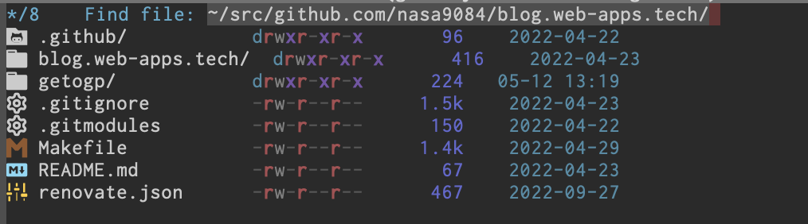

世の流れ的には、Helmといえば[Kubernetes用のパッケージマネージャー](https://helm.sh)を思い浮かべる人が多いと思いますが、私にとってはHelmといえばやはり[emacsのパッケージ](https://github.com/emacs-helm/helm)を思い浮かべます。emacs-helm(以下helm)は所謂fuzzy finder的なモノの一種で、emacsを使っていない人は雑にfzfとかpecoみたいな絞り込みをemacsでできるようにするやつ、と思えば想像しやすいと思います。

helmはなかなか歴史の長いパッケージで、2012年5月15日にanything.elからForkをしたという[コミット](https://github.com/emacs-helm/helm/commit/b016418949e60bc5e9cb4f135a17d129b2b2f28a)が打たれています。私個人としては2015年7月にhelmを導入したっぽい記録([commit](https://github.com/nasa9084/dotfiles/commit/c256d97362af972c724fbc35dc7fd701fe35ead6)/[tweet](https://twitter.com/nasa9084/status/619565563744923648))が残っています。そこから数日前まで、かれこれ8年余りの期間にわたってhelmを使ってきました。使ってきた、とは言っても導入したときに多少使い勝手の調整をして以来、ほとんど設定は変えておらず、機能的にも`helm-M-x`、`helm-find-files`、`helm-show-kill-ring`、`helm-buffers-list`くらいしか使っていませんでした。基本的にはMELPAからインストールされる最新版を使っていたのですが、8年使っていてもアップデートで壊れた記憶は多分1回くらいしかなくて、かなりの頻度でコミットが打たれているのに安定していた、という印象があります。

8年の間にも、[Ivy/Counsel](https://github.com/abo-abo/swiper)が話題になったり、icomplete-vertical-mode/fido-vertical-modeという補完UIが標準に追加されたりと、いろいろと流行が変わっていたのは認識はしていたのですが、まぁなんやかんやあり8年間helmを使い続けてきました。

そうこうしていたところ、最近emacs 29.1がリリースされ、同じく長らく使用してきた[use-package](https://github.com/jwiegley/use-package)(どのタイミングで導入したのかは不明ですが、GitHub上での[first commit](https://github.com/nasa9084/dotfiles/commit/897277d5f5a1b434c9c06d359c3a909227714312)で既に導入済みだったっぽいのでhelmより長く使っていることになります)がemacs標準搭載となりました。use-package以外のパッケージに関する設定はuse-packageを使ってやっていて、他のパッケージがインストールされていないときにインストールするというのもuse-packageでやっていて、という感じなのですが、そうなるとuse-packageは誰が入れてくれるんだ、ということになり結局use-packageだけは`package-install`を[直接呼び出すことでインストールしていた](https://github.com/nasa9084/dotfiles/commit/ee6aa1b313ed896719ed2040f3f88d2f47e8b330)のですが、use-packageがbuilt-inとなったことで、晴れて`package-install`の直接呼び出しも[不要となりました](https://github.com/nasa9084/dotfiles/commit/13e938297a813111e316fc62189a17357c54d63a)。その変更ついでに、いろいろと設定を見直したりとか、ローカルでのみ設定されていた諸諸をGitHubにpushしたりとか、そんなことをやったのですが、その一環として(?)helmから[vertico](https://github.com/minad/vertico)に乗り換えてみました。

helmからverticoに移行して一番の大きな違いは、helmはそれ自体が巨大パッケージで、いろいろなモノがhelmでまかなわれていましたが、verticoはそれ自体はかなり小さく保たれていて、いろいろなパッケージを組み合わせることで同じような機能を実現する、というところです。個人的にはでかいフレームワークより小さいライブラリ類を組み合わせてアプリを書く方が好きなので、そういった意味でもverticoは好きになることができそうです。

今のところ組み合わせているものは[marginalia](https://github.com/minad/marginalia)と[orderless](https://github.com/oantolin/orderless)の二つ。

marginaliaはminibuffer completionに何やら情報を足すやつで`M-x`でコマンドの簡単な説明が見られたり、`find-file`でファイルのパーミッションやら最終更新時間やらが見られるようになります。インストールしただけでも情報が見れるようになって便利なのですが、そのままだとファイルの更新時間が`2023 Sep 10`みたいなかんじで月名を使った表示になっており、分からなくはないんですけど日本人としてはやはり`2023-09-10`と数字を使って表現してくれた方がぱっと見でわかりやすいので、次の様にadviceで`marginalia--time-absolute`を置き換えることで数字表記に修正しました。

``` emacs-lisp
(defun marginalia--time-absolute--month-number (time)
    "Format TIME as an absolute age but use month number instead of month name."
    (let ((system-time-locale "C"))
      (format-time-string
       (if (> (decoded-time-year (decode-time (current-time)))
              (decoded-time-year (decode-time time)))
           " %Y-%m-%d"
         "%m-%d %H:%M")
       time)))
(advice-add 'marginalia--time-absolute :override #'marginalia--time-absolute--month-number)
```

orderlessは候補の絞り込みをするときに、完全一致や前方一致だけでなく、fuzzy matchをしてくれるようになるやつで、たとえば`abc`と入力すると`a.*b.*c.*`にマッチする奴を返してくれるようになります(多分これは触らないと便利さはわかりにくい・・・)。

また、helmの時にどうなっていたかはもう既に記憶にない(いつも手癖で操作しているので・・・)んですけど、magitを使用していて、feature branchを切って`git push -u`するときに候補の順番に違和感があったので次の様に`magit-completing-read-function`を調整しました。

``` emacs-lisp
(defun sort-preferred-remote-first (branches)
  (let ((preferred-push-remote-prefix "origin/"))
    (nconc (seq-filter (lambda (x) (string-prefix-p preferred-push-remote-prefix x)) branches)
           (seq-remove (lambda (x) (string-prefix-p preferred-push-remote-prefix x)) branches))))

(defun magit-completion-table-with-sort (collection)
  (lambda (string pred action)
    (if (eq action 'metadata)
        '(metadata (display-sort-function . sort-preferred-remote-first))
      (complete-with-action action collection string pred))))

(defun builtin-completing-read
    (prompt choices &optional predicate require-match initial-input hist def)
  "Wrapper for standard `completing-read' function to be used by magit."
  (pcase this-command
    ('magit-push-current-to-upstream
     ;; use my sort function to sort candidate branches
     (setq choices (magit-completion-table-with-sort choices))
     ;; I don't want origin/master to be on top when push
     ;; ref. https://github.com/magit/magit/blob/7bef529ce9b07808d5c14692c5ab2d248e7b5bd1/lisp/magit-push.el#L141
     (when (equal def "origin/master") (setq def nil)))
    (_
     ;; otherwise use magit's default completion-table function
     (setq choices (magit--completion-table choices))))
  (completing-read prompt choices predicate require-match initial-input hist def))

(setq magit-completing-read-function #'builtin-completing-read))
```

ざっくりと説明をすると、
* upstream remoteにpushをすることはほぼないのでoriginのブランチが先に来るようにソート
* `origin/master`にpushすることもほぼないので、`completing-read`に与えるdefaultをnilに上書き
という設定です。あんまりemacs lispに詳しくないので、`magit-completion-table-with-sort`で`collection`が`void`だというエラーが出て解消に数日かかりました。。。(`lexical-binding: t`が必要)
ここ数日このへんを深夜にいじっていて、emacs/emacs lispへの理解がグッと深まった感じがします。adviceとかも書けるようになりました。

加えて、[nerd-icons-completion](https://github.com/rainstormstudio/nerd-icons-completion)も導入したので見た目もちょっと可愛い感じになりました。



まだもうちょっといじる予定ではありますが、とりあえずvertico (and friends)は使い続ける見込みです。
