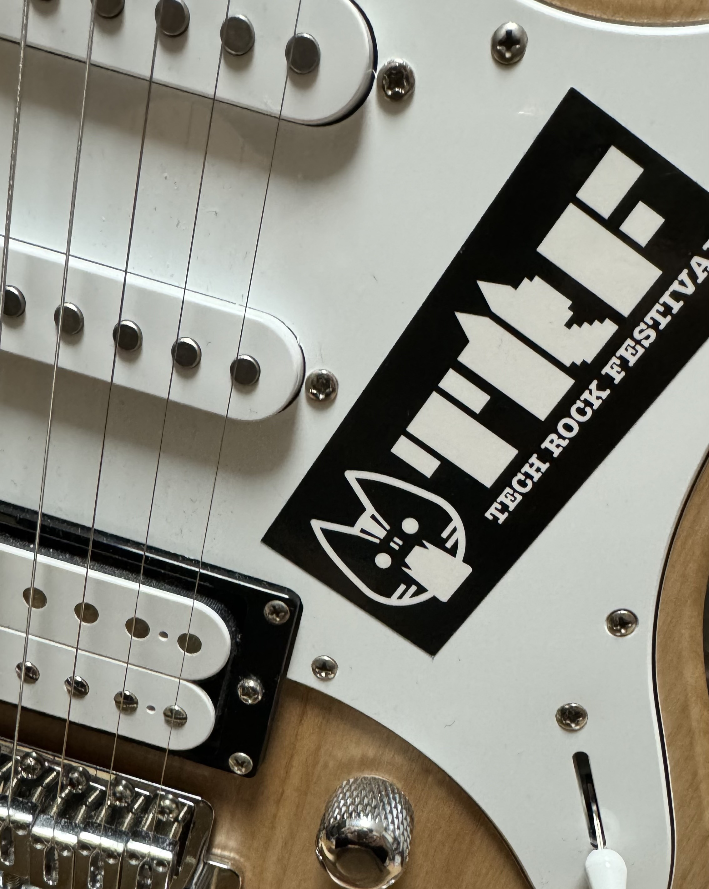
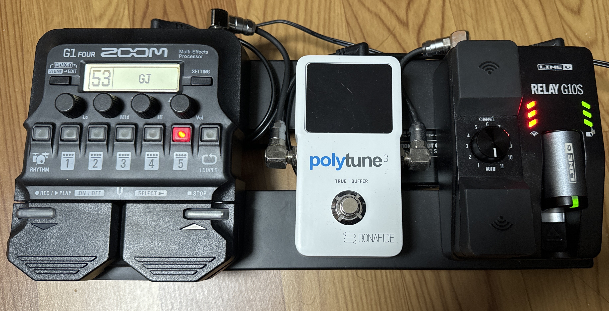
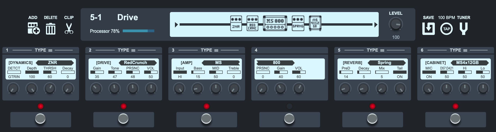
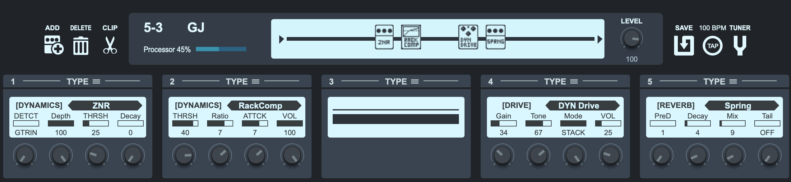
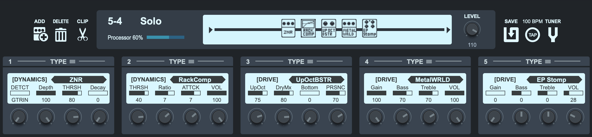

2023年12月23日に新宿SUNFACEで開催されたITエンジニアによるITエンジニアのためのロックイベントTech Rock Festival 2023に参加してきました。

## 経緯

事の発端は某GAFA社長であるところの[@jyoshise](https://twitter.com/jyoshise) sanによる次のツイートでした:


どうやら、エンジニア界隈、結構音楽やっている奴いるぞ、ということで立ち上がったプロジェクトですが、翌日にはGitHub Repositoryが立てられ:



7月の頭には申し込み締切、13日にはバンド振り分けが終わり、会場も決まり、練習を進めて、先週の土曜日ついに開催となりました。
演者がエンジニアという都合上、大きめのテックカンファレンスとかぶらないようにしなければいけないということで調整の結果、12月末は目立ったテックカンファレンスもないだろうということで12月23日の開催となりました。

概ね演者だけで会場は一杯だったのですが、[一般オーディエンスも募集していました](https://trf.connpass.com/event/293949/)。

## バンドと演目

私たちのバンドは3-way handshakeという名前で、当初バンドに振られた連番が3であったことから、3に関連する技術っぽい言葉でバンド名っぽくもある、というところでこの名前になりました。

面子は以下の通り:

* Vo: [tsukaman](https://twitter.com/tsukaman)
* Gt: [じゅんじゅん](https://twitter.com/yoshiyama_hana)
* Gt: [nasa9084](https://twitter.com/nasa9084)
* Ba: [karupanerura](https://twitter.com/karupanerura)
* Key: [harak](https://twitter.com/yb300k)
* Dr: [皮しばき](https://twitter.com/r315dr)

そして曲目は次の通りでした:

1. 深夜高速 / フラワーカンパニーズ
2. ばらの花 / くるり
3. 歩いて帰ろう / 斉藤和義
4. 群青日和 / 東京事変

## 機材

ギターは[YAMAHA PACIFICA 112V](https://jp.yamaha.com/products/musical_instruments/guitars_basses/el_guitars/pacifica/pac_100.html)です。

正直に言うと、当初600シリーズを買おうと思ったけど某アニメの影響で全然買えなくて、妥協で買ったギターではありますが、良いギターだと思います。

弦はElixir Optiweb 09-42です。

エフェクターは[ZOOM G1 FOUR](https://zoomcorp.com/ja/jp/multi-effects/guitar-effects/g1-four-g1x-four/)ですべてを済ませました。練習では[THR10II Wireless](https://jp.yamaha.com/products/musical_instruments/guitars_basses/amps_accessories/thr-ii/index.html)に無線で繋いでいるので、有線でやるのはやだな〜と思って、[LINE6 Relay G10SR](https://line6.jp/products/accessory/#G10SR)を購入してエフェクターボードでも無線で接続できるようにしました。

チューナーはG1 FOURにもついてはいるんですが、手前に専用のモノを用意した方が見やすいし、ミュートもできて便利だな、と思ったので[tc electronic POLYTUNE3](https://www.tcelectronic.com/product.html?modelCode=P0CM0)を入れました。miniだと黒があってよかったんですが、シュッと手に入らなかったので普通のサイズにしました。

ボードは[pedaltrain nano](https://pedaltrain.com/products/pt-nano-sc)で、まとまりよく構成できたと思います。

パッチケーブルはOYAIDEのソルダーレスですが、これはがっちりしていて安心感がある一方頭がでかいので予算があるなら他の良い奴が有ると思います。

パワーサプライはVITAL AUDIOのVA-05 MkIIで、pedaltrain nanoの裏側にちょうど良いサイズです。

エフェクターの貼り付けには[魔法のテープ](https://amzn.to/48xwDM4)という、がっちりつくけど剥がせる謎のテープ(?)を使いました。ホントはEx-proのマジックテープを使おうと思って購入までしたんですが、セットアップ時に魔法のテープの方が便利かも？？って思っちゃったので・・・

エフェクターボードからアンプまでは超ド定番シールドであるところのCANARE LC03を使いました。

アンプはJVM 210Hで、マスターボリュームマックス、bass/trebleは12時、middleマックス、gainはちょっと、という設定でした:

本番で使ったピックは[MASTER 8 JAPAN INFINIX-U JAZZ type with Hard Gripの0.88mm](https://www.soundhouse.co.jp/products/detail/item/277561/)です。直前に焦って予備を買いに行ったんですが、本番では実際にピックを落としたので無理に時間を作って買いに行って良かったです。みんなは余裕を持って買っておきましょうね。予備ピックは[ROMBOのピックホルダー](https://www.soundhouse.co.jp/products/detail/item/281149/)でヘッドにつけておきました。二枚つけるとかなりダサい気がするけど、一枚ならまぁ許容範囲かな、的な。

カポは[G7TH Performance 3 ART Capo](https://www.g7th.com/p3)を使っています。

ストラップはどこかの島村楽器で買った、ナイロンっぽい滑りの良い奴です。

### ZOOM G1 FOURの設定

#### 深夜高速 / ばらの花 / 歩いて帰ろう

基本のノイズリダクションZNRに、RedCrunchでオーバードライブ、後段にSpring reverbをちょっとだけ、という感じです。

練習の時にヘッドホンで練習するのにアンプとキャビネットをいれていましたが、アンプに繋いでも変な感じにはならなかったのでそのまま使いました。

#### 群青日和

群青日和はバンド全体的に音が多くごちゃごちゃしているのと、練習時はチューニングをサボるためにPITCH SHIFTを入れて半音下げていたので、別のパッチを作りました。パッチ名のGJは・・・GunJoですね。

基本のZNRを入れて、コンプレッサー、ドライブ、リバーブという構成です。他の曲は2nd Gt.という感じで、基本的にはパワーコードを弾いている感じだったのですが、群青日和だけはリードっぽい？パートを弾いたので(譜面ベースじゃなくて曖昧にパート分けをしていたのでリードギターと言って良いのかよく分からないですが)、ロングトーンなどのサスティンを延ばしたかったのでコンプレッサーを入れたんですが、結果的にはそれ以外の面でも入れて良かったかな、と思いました。

ドライブはいろいろならしてみてソレっぽかった奴をソレっぽい設定で入れました。

リバーブは同じくSpring reverbで、ほんのちょっとだけかけているという感じですね。

群青日和ではソロも弾いたので、ソロ用のパッチも用意しました。ZNR、コンプレッサーの設定はGJパッチと同じですが、群青日和のソロっぽい感じの音を出すのにアッパーオクターブを足すUpOctBSTRを入れているのと、歪みをひどい感じに(?)したかったのでドライブをMetal Zoneのモデリングエフェクタに変更しました。

当初はリバーブは変わらずちょっとだけかけていたのですが、音量を調整するため、ブースターを最後段に入れる構成にしました。

## 来年

来年もやるそうですので、機材をより良くしたい所存です。
