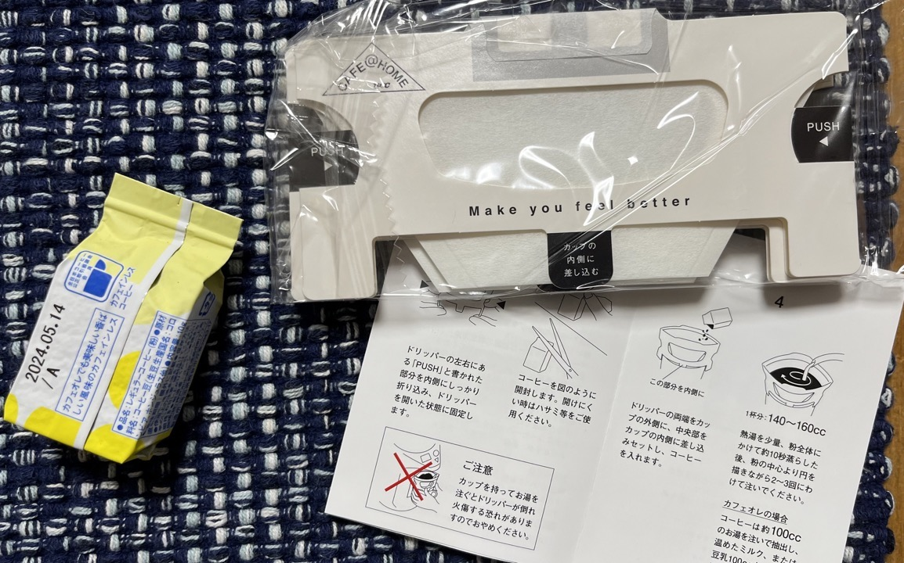
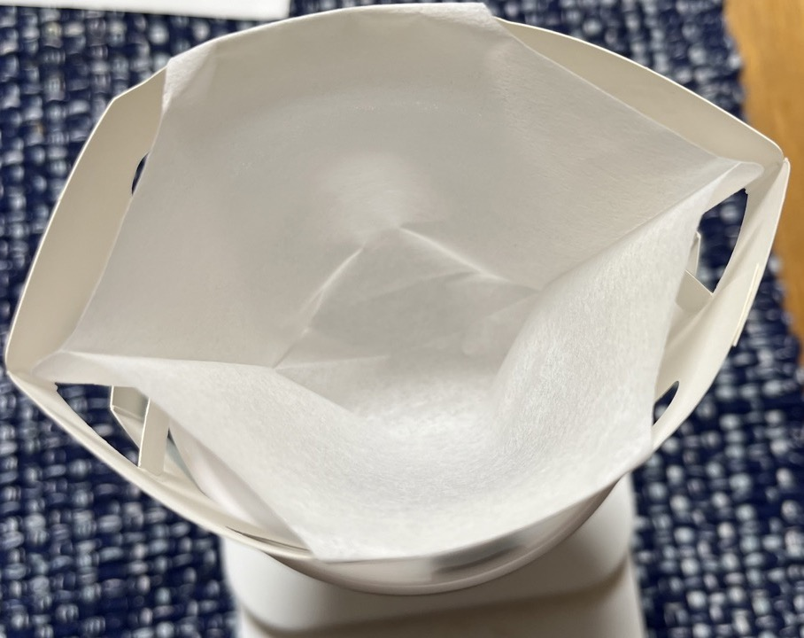
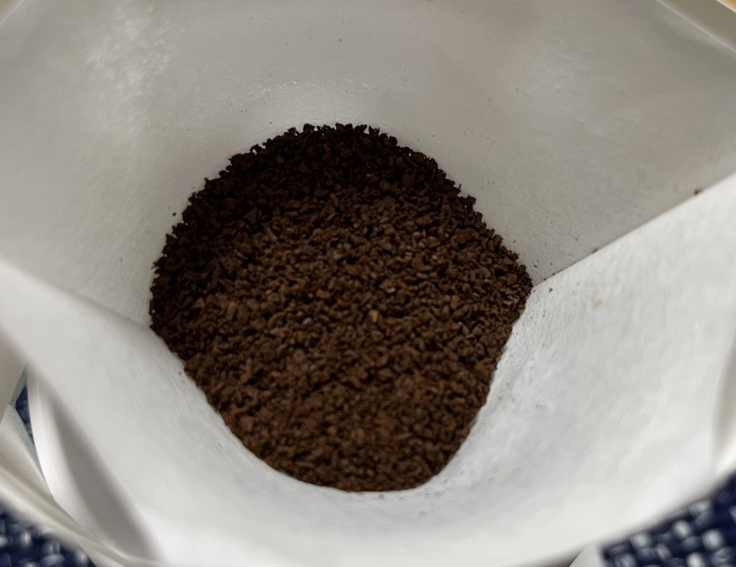
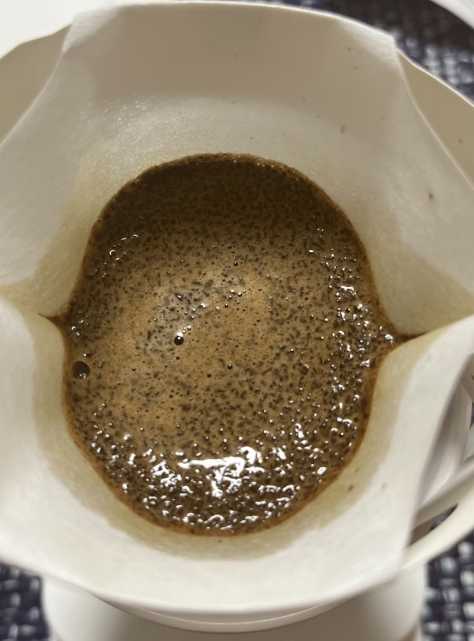
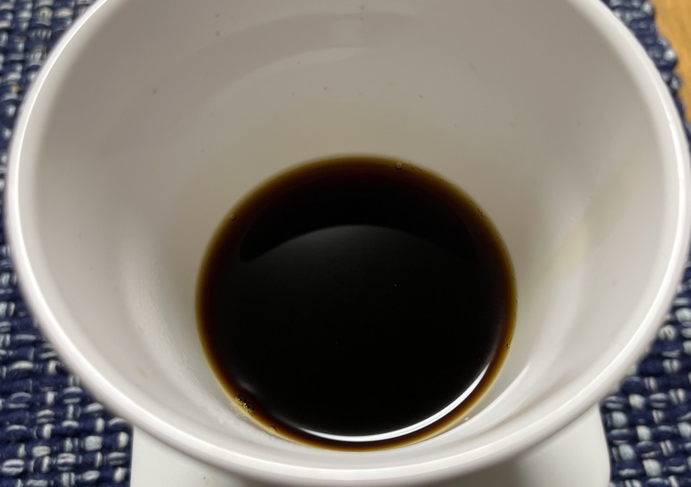

先日、[SCAJ](https://scajconference.jp/)というでかいコーヒーのイベントに行ってきました。
面白かったモノをいくらか買ってきたのですが、そのうちの一つがUCCのCAFE@HOMEです。

どうやらインターネットで調べた感じでは現在の形でのCAFE@HOME自体は5年くらい前に発売されたものでそんなに新しい商品という感じではなさそうなのですが、[今年の3月に同シリーズから新しいデカフェのものがでた](https://www.ucc.co.jp/company/news/2023/rel230314.html)ということで大きく宣伝していた、ということのようです。

CAFE@HOMEはレギュラーコーヒーの粉を1杯分ごとに真空パックすることで美味しくコーヒーを飲める、という趣旨のシリーズのようです。カップに乗せて使うタイプのフィルターも付属しているので(コーヒーを淹れる道具がない人でも)気軽に美味しいコーヒーを淹れられる、小洒落たデザインで贈り物にもぴったり、という感じですね。

私は現状普通のコーヒー豆は十分すぎるほどにあるので(ちょっと消費が追いついてないくらい、サブスク加入しているため月一で追加補給される)、今回は3種類のデカフェを2つずつ、合計6個のセットを購入しました。

内容はこんな感じ:

コーヒーの他、前述の様にフィルターが付属しているのと、説明書も入っていました。

開封してフィルターをセットするとこんな感じです:

一般的にコンビニやらスーパーやらで購入できるドリップバッグと比べるとしっかりとしたフィルターで、普通の台形フィルターに似た感じで使えそうな気がしました。真空パックで香りを閉じ込めている、というだけあって、安いドリップバッグのようにフィルター部分がカップの中のお湯に浸かるような構造ではないですね。

説明書にはフィルターをカップにセットし、コーヒーを手で開封して粉を入れる、という形で書いてありますし、実際カップにセットしないと流石に安定しなさそうなので手順としてはあっているとは思うのですが、粉末が入った袋が真空パックされているということで説明書のように立てに袋を割いてきれいにフィルターに粉を入れる、というのは少し難しいように感じました。私は粉を少しカップの中にこぼしました。基本的にハサミで切った方が良さそうです。

粉は中〜粗挽きくらいでしょうか。開けた瞬間良い香りがしたので、香りを閉じ込めている、というのが実際に感じられました。普段私が挽いているのよりはちょっと粗目かな、と感じました(普段はV60とかを使っているので、細めに挽いています)が、台形フィルター用の粉としては特別粗いということもないと思います。
ドリップバッグはあまり買ったことがないのですが、かすかな記憶に残るドリップバッグの粉よりも粗目に思えるので、そういう意味でも自信のようなものが感じられます。

お湯を注ぐと、まぁもちろんふくらむというほどのことはないです。

できあがりはこんな感じ。今回淹れた黄色い奴はカフェオレでも美味しい、ということなので牛乳を入れる予定で100mLのお湯で多分できあがりが80mL位だと思いますが、結構濃いめに見えますね。牛乳を入れても良い感じの色です。香りはまぁ、もちろん挽き立てに匹敵するとかそういうことは無いんですが、それでも牛乳を入れてもまだちゃんとコーヒーの味・香りがする感じで、悪くないと思います。

デカフェのコーヒーは正直そんなに美味しいものは多くない(香りがない、よりは、デカフェだな、という味がする)という印象がありますが、少なくとも牛乳を入れて飲んだ感じは割と悪くないです。

10g260円なので100g2600円と日常使いのコーヒーとしては高いですが、ドリッパー付きで手軽にコーヒーが淹れられるし、パッケージはおしゃれだし、という点も含めて、贈り物としてはアリだと思います。興味がある人は横浜か吉祥寺の店舗、または[COFFEE STYLE UCC ONLINE SHOP](https://coffeestyle.jp/products/cah0104059?_pos=7&_sid=2cae5a4d9&_ss=r)で買えるようです。
